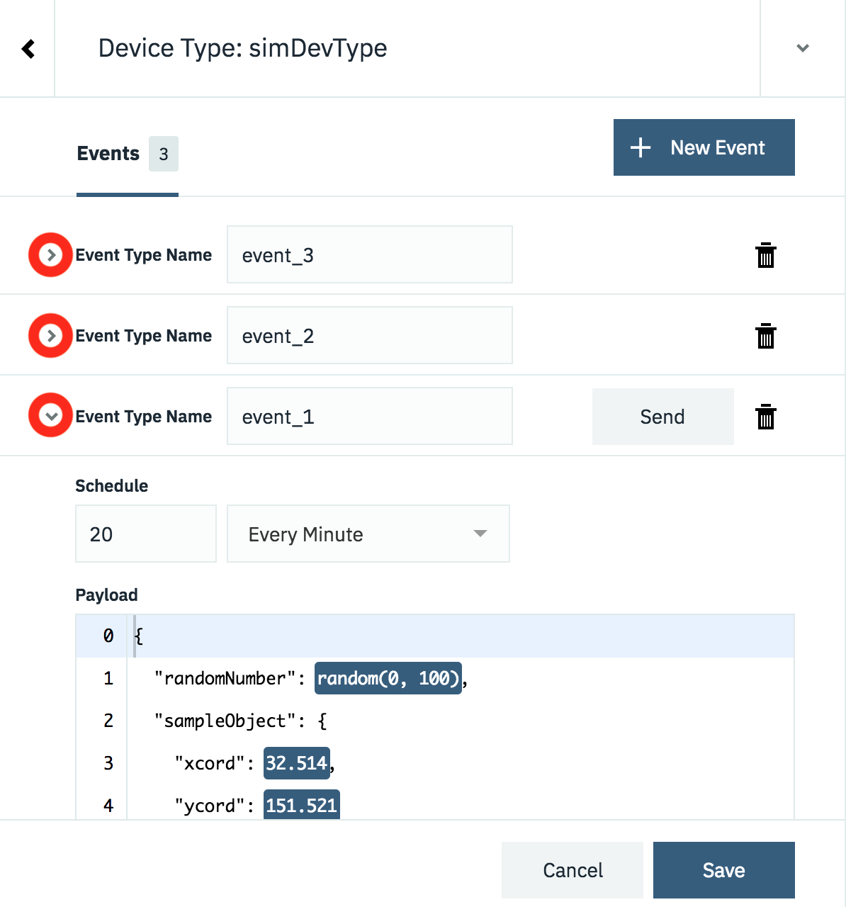
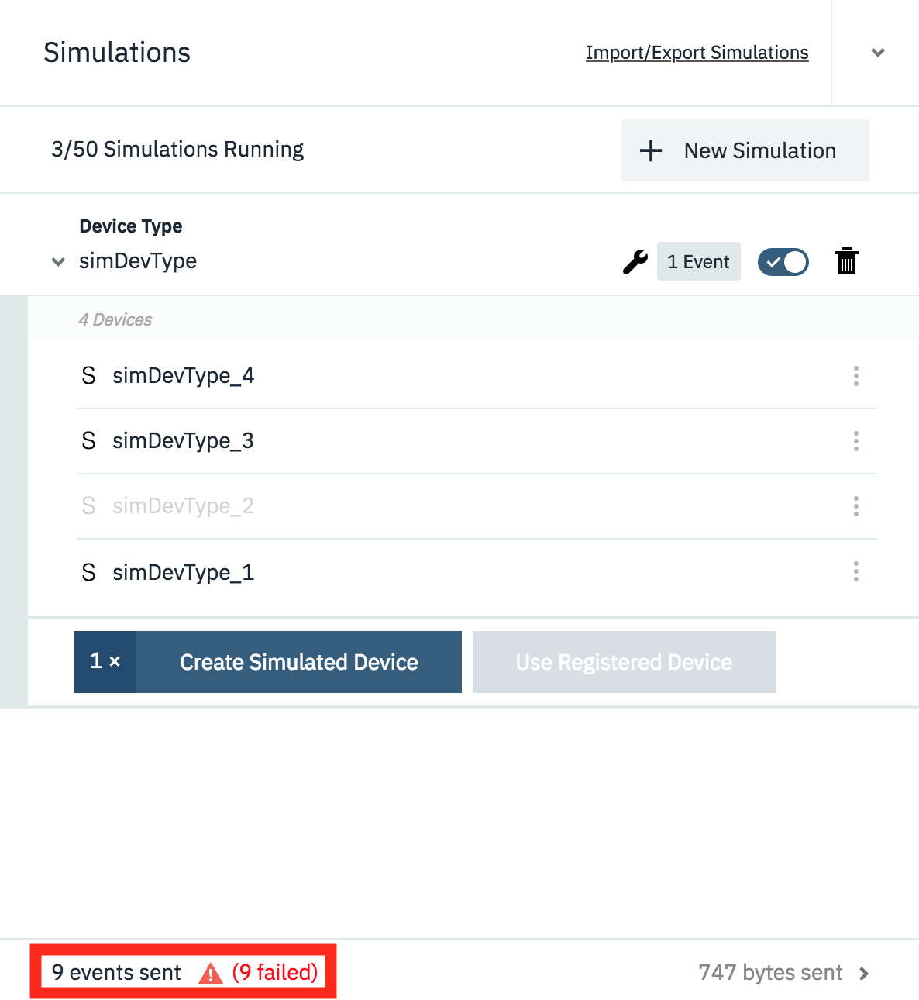
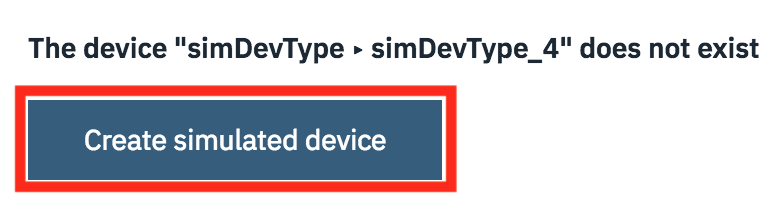

# The Watson IoT Platform Device Simulator

The IBM Watson Internet of Things Platform contains a device simulator that can be used to post data without a real device being connected.  The simulator can be used to create data for multiple devices and device types, it can also post data for a real, registered device.

The simulator is useful for testing when a real device is not available or for testing conditions which are difficult to replicate using a real device, such as fault conditions.

## Learning objectives

After completing this guide you will be able to:

- Enable the device simulator in your instance of the Watson IoT Platform
- Create simulated devices and be able to start and stop the devices
- Generate the required data from the device simulators

## Prerequisites

Before working through this guide you should have a basic knowledge of the Watson Internet of Things platform and understand the relationship between devices and device types.  You also need to have an instance of the Watson IoT Platform deployed on the IBM Cloud.

You can find out about the Watson IoT Platform [here](https://console.bluemix.net/docs/services/IoT/iotplatform_overview.html#about_iotplatform) and learn how to deploy an instance of the platform by following the guide [here](https://developer.ibm.com/technologies/iot/tutorials/how-to-create-an-internet-of-things-platform-starter-application/).

## Estimated time

You can complete this task in no more than 20 minutes.

## Steps

Once you have your Internet of Things instance running, launch the Watson IoT Platform console.  To launch the console, select the service from your IBM Cloud dashboard then select the **Launch** button on the Watson IoT Platform service page.  Once the IoT console is open, complete the steps below:

### 1. Enable the Device Simulator

By default, the device simulator is not enabled on the platform.  To enable it:

1. Switch to the settings section of the Watson IoT Platform console.
2. Navigate to the **Experimental Features** settings area.
3. Enable the Device Simulator.


You should see the device simulator panel appear at the bottom of the IoT console.


You can open the simulator by clicking on the panel and then close the simulator by using the twisty at the top of the simulator window


#### 2. Configuring a Device Simulator

Creating a simulator is a 2 part process:

1. Create a simulation by selecting or create a device type and then model the data that should be posted when the simulation is running.
2. Create one or more device simulator instances for that simulation.

To add your first simulation press the **Add First Simulation** button.  


Clicking into the **Select or create a device type...** field will show any existing device types.  You can choose one of the existing device types or you can enter a device type name here to create a new device type.


Once the device type has been selected or created you are presented with the panel to configure the data for the simulation.  


There are 3 areas, as shown in the image above:

#### 1. Events

The simulator provides the ability to define multiple different events that a simulated device can publish.  E.g. if you have a device that sends temperature data every 30 seconds and air quality data every 10 minutes, then you could set up 2 events.  1 for the temperature and 1 for the air quality.

By default a single event is created when a new simulation is created, but additional events can be created using the **+ New Event** button**

Each event has its own schedule and payload content, but all events run when the simulation is running.  It is not possible to enable and disable individual events.  If you want that functionality then you need to create multiple simulations.

As you add more events the list of events grows.  You can expand and collapse the individual events using the twisty.



#### 2. Event Type Name

When data is sent from a device to the platform it is sent as a device event message with an event type as one of the fields in the message.  Here you can define the event type that will be sent with the payload for this event

#### 3. Event Content and timing

When you expand the section for an event you can specify how often a message is sent and what content is sent as the payload.

The schedule allows you to select a certain number of messages to be sent each minute or each hour.  The messages are sent at regular intervals, so 2 messages per minute will result in a messages being sent every 30 seconds.

The payload section allows you to define the message format that will be sent.  You can define a static message, where every message will have exactly the same content:

``` json
{
  "sampleObject": {
    "xcord": 32.514,
    "ycord": 151.521
  }
}
```

or use one of the 2 options for adding variation to the data sent

- range(0,100), will generate a random number between the 2 parameters
- $counter, will be contain the total number of devices added in the simulator for this type.

``` json
{
  "randomNumber": range(0, 100),
  "total" : $counter,
  "sampleObject": {
    "xcord": 32.514,
    "ycord": 151.521
  }
}
```

When you have defined all the events, with the correct schedule and data content, press **save** to save the simulation.

### 3. Adding simulated Devices

Once you have the simulation defined you can create simulated devices for the simulation.  A device can be set to simulate an existing, configured, real device or register a new device on the platform.


To add a device press the **Create Simulated Device** button or if you want to simulate an existing device press the **Use Registered Device** button (this will only be enabled if there is an available registered device of the correct deviceType to simulate).  Once the device is added then the simulated device will immediately start sending data according to the simulation settings.

You can add as many devices as you desire (up to the displayed limit)


You can control the simulation at the top level using the Device type controls or you can manage each device by expanding the device menu.


Here you can start and stop individual devices, configure individual devices or delete a simulated device.  You are able to customise each device so they all differ from the simulation configuration.  However, if you modify the simulation configuration then you can choose to reset all devices back to the simulation configuration.

### 4. Monitoring simulated devices

You can see the state of simulated devices the same way you can monitor real devices using the devices section of the IoT console.


You can see when a simulator is active as it shows as a connected device, then expanding the device you can select the **Recent Events** section to see the individual events being received.

## Saving simulation configuration

The platform allows you to export your simulation configuration to the clipboard or download it as a JSON file.  You can then import a simulator configuration from the clipboard or file.  This allows you tp share a simulator configuration, so others can replication your simulator setup.


When importing a device configuration the deviceType and devices are not automatically created, so you need to create them in advance or use the troubleshooting option to have the devices and deviceTypes created:

To open up the troubleshooting section click in the event info section at the bottom of the simulator panel:



This will then show a log of events and offer to troubleshoot failing events:


Select the **Troubleshoot** button next to one of the failing events and you will have the option to diagnose the issue.  Press the **Run Diagnostics** button to get the simulator to determine the cause of the error:


The result of the diagnostics will be shown and if there are missing deviceTypes and devices the platform will offer to create the missing configuration:



You can repeat this for all the devices imported to the simulator.

To clear the simulator event log, you can go into the settings panel and disable then enable the simulator.  The configuration will not be lost, but the simulator will be restarted, clearing the event log.

## Limitations of the Device Simulator

The Simulator is still an experimental feature on the IoT Platform, so there are a few limitations.

- There is a limit to the number of concurrent simulated devices which can be run.  This is shown at the top of the simulation panel
- You cannot have multiple simulations running concurrently for the same device.
- The simulator will not work when user certificates have been added to the IoT platform configuration.  If you have certificates configured or even just uploaded then the simulator will fail to connect.  If you want to remove certificates, goto the settings section of your Watson IoT Platform console and follow the following steps:
  - Goto the **Connection Security** section then select **Open Connection Security Policy**.  Ensure no rules are configured to use certificates.  **TLS with Token Authentication** or **TLS Optional** should be selected for all rules.
  - Goto the **Messaging Server Certificates** section of the platform settings and ensure the Default Certificate is selected as the active certificate.  You can then select any imported certificates and then delete them.
  - Goto the **CA Certificates** section of the platform settings and delete any imported certificates.

## Summary

This guide has shown you how to enable the device simulator and setup simulators to create device data.  The device simulator is a great tool to be able to test error or failure conditions that are difficult to create using live data from a real device.

Remember to turn off simulators when not needed to ensure you do not use up free limits on the IBM Cloud or incur additional expense if on a paid plan.
