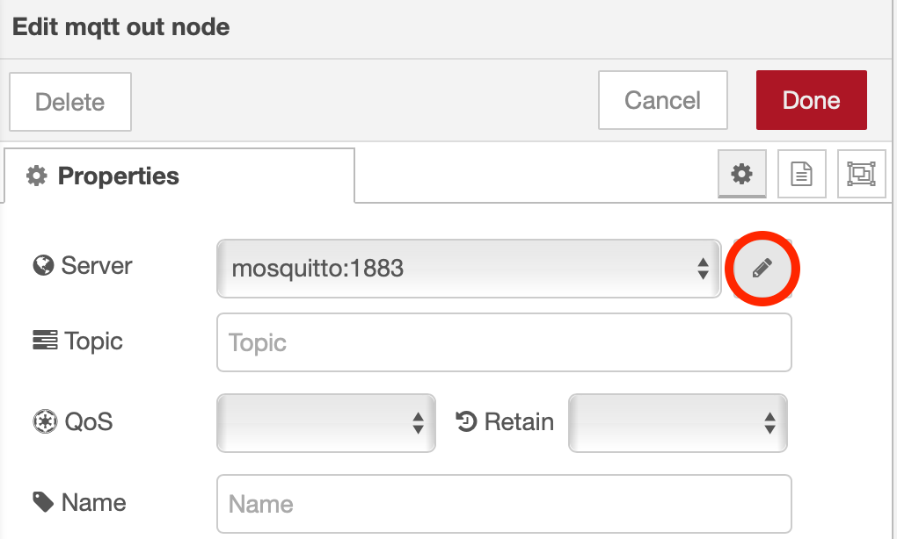
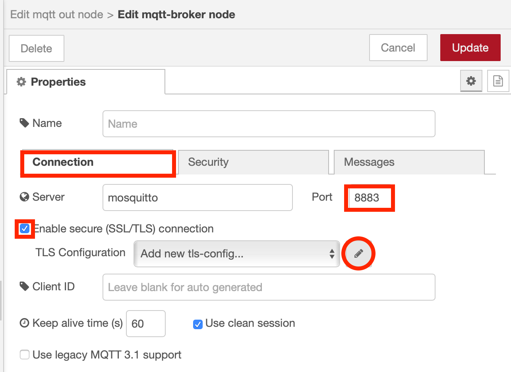
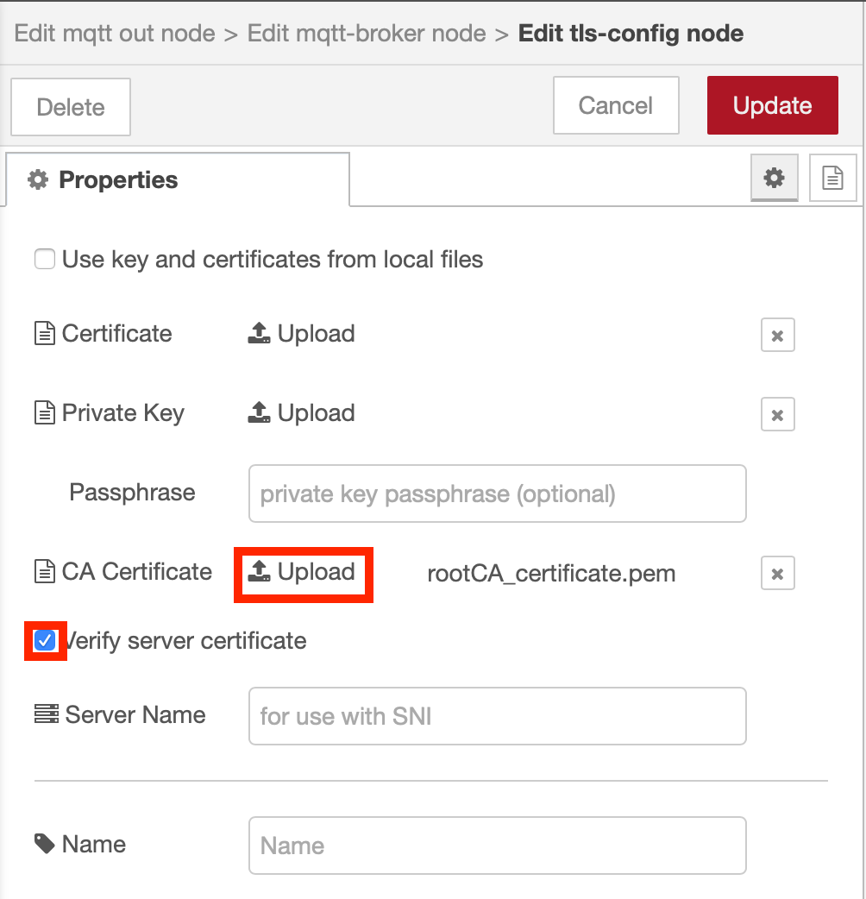

# Secure MQTT connectivity

To encrypt the MQTT traffic between clients and the broker we need to enable TLS connections.  To add TLS connectivity X.509 certificates are needed.  

For web traffic, where browsers need to validate servers there needs to be a series of trusted certificate authorities to establish trust.  In an IoT solution there is often a closed eco-system, where the brokers and clients are all controlled by a single organisation.  Having a closed eco-system does give the option have self-issued certificates and avoid the need to purchase certificates from a trusted certificate authority.  The OpenSSL application you installed as part of the prerequisites allows you to create and manipulate X.509 certificates.

In this section we will create a root certificate authority to sign certificates.  Then we will create a certificate for the Mosquitto broker and eventually create client certificates.

### Step 1 - Generating the Certificates

To simplify the creation of the certificates use the provided script files.  

Create a directory to work in.  I suggest making a **cert** directory where you have been working in the previous sections (I use a directory called mosquitto in my home directory).  Copy the files from the [mosquitto/certificates](https://github.com/binnes/esp8266Workshop/tree/brokerSwitch/docs/mosquitto/certificates) directory of the git repository into the **cert** directory then run the script after making the changes below:

Modify the top section of the appropriate script file (.bat file if you are working in a Windows command window, .sh file if you are working on MacOS or in a Linux terminal window):

- **OPENSSL_BIN** - needs to contain the openssl command.  The provided value should work for default installs.
- **COUNTRY_CODE** - is the country code where you are (for information purposes in cert - can leave at GB or you can find a list of valid ISO alpha-2 country codes [here](https://en.wikipedia.org/wiki/ISO_3166-1#Current_codes))
- **COUNTY_STATE** - is the county, state or district where you are (for information purposes in cert - can leave at DOR, which is for Dorset, an English county)
- **TOWN** - is the city, town or village where you are (for information purposes in cert - can leave at Bournemouth)
- **DEVICE_ID** - us the device id for your device, **dev01** is the default value in the file.

Do not make any modifications below the comment in the script file.

The other file you need to change is the **srvext.cfg** file.  This file defines the values used when generating the MQTT broker certificate.  The **[alt_names]** section defines the DNS names and/or IP address that can be used when connecting to the server.  If the client uses a value that is not defined in this section, then the TLS connection will fail to validate the server certificate.

The sample file shows how to define both DNS names and IP addresses.  As we are using a Docker network we get automatic name resolution using the **--name** of the container, in our case **mosquitto**, so this is the only entry needed to ensure the TLS connection can be created and the server certificate validated.

However, if you want to change the ESP8266 from using the cloud based broker to use your local Mosquitto broker then you need to ensure the hostname of the system where the Mosquitto container is running is included in the **[alt_names]** section.  To find the hostname of your computer use the command ```hostname```, which should work on all Operating Systems.  You want to use the value returned up to the first **.** character, then add **.local** to the end.

E.g. if hostname returned **win10** then ensure **win10.local** is in the **[alt_names]** section of the **srvext.cfg** file : ```DNS.3 = win10.local```

*Instructions for connecting the ESP8266 to the Mosquitto broker are provided in the next section*

!!! Warning
    The SSL library the ESP8266 uses will not validate the TLS connection using an IP address as the hostname.  The system hostname must be used.

Once you have saved your changes you can run the script to generate all the certificates:

- Linux, MacOS:  
    `chmod +x makeCertificates.sh`  
    `. ./makeCertificates.sh`
- Windows:  
    `makeCertificates.bat`

### What the script does - INFORMATION ONLY

The script starts by generating a root CA key and certificate.  This will then be used to sign a server certificate.

To generate the root certificate , the commands run by the script are:

```bash
openssl genrsa -aes256 -passout pass:password123 -out rootCA_key.pem 2048

openssl req -new -sha256 -x509 -days 3560 -subj "/C=GB/ST=DOR/L=Bournemouth/O=MOSQUITTO/OU=MOSQUITTO Corporate/CN=Mosquitto Root CA" -extensions v3_ca -set_serial 1 -passin pass:password123 -key rootCA_key.pem -out rootCA_certificate.pem -config ext.cfg

openssl x509 -outform der -in rootCA_certificate.pem -out rootCA_certificate.der

xxd -i rootCA_certificate.der rootCA_certificate.der.h
```

replacing:

- C=GB : GB is an ISO alpha-2 country code
- ST=DOR : DOR is an English county, replace with appropriate state/county/region
- L=Bournemouth : Bournemouth is an English town, replace with appropriate location
- O=MOSQUITTO : MOSQUITTO is the Organisation
- OU=MOSQUITTO Corporate : MOSQUITTO Corporate is the Organisation Unit
- CN=Mosquitto Root CA : Mosquitto Root CA is the certificate common name
- pass:password123 : password123 is the password that will protect the key - if you change this value do not forget what you entered, as you need it when using the key later.

This generates the key and protects it with a password.  A public certificate is then generated in pem format, which is then converted to der format.  Finally the xxd command creates a header file which allows the certificate to be embedded in code - this can be useful for devices that don't have a file system.

!!! Info
    The xxd command is not available on the Windows platform

After generation the Root Certificate Authority key and certificate, the script generates the key and certificate for the MQTT server.  It does this by generating a key, then creating a certificate request file.  The x509 takes the certificate request and the CA root certificate and key then generates the MQTT server certificate, which is signed by the CA root certificate.

The MQTT server certificate must includes the DNS name of the server.  This is used as part of the verification process at connection time, to ensure that the client is talking to the intended server.  The script generates the **srvext_custom.cfg** file with the correct DNS address for your instance of the Watson IoT platform.

To generate a certificate for the IoT platform the script runs the following commands:

```bash
openssl genrsa -aes256 -passout pass:password123 -out mqttServer_key.pem 2048

openssl req -new -sha256 -subj "/C=GB/ST=DOR/L=Bournemouth/O=z53u40/OU=z53u40/CN=z53u40.messaging.internetofthings.ibmcloud.com" -passin pass:password123 -key mqttServer_key.pem -out mqttServer_crt.csr

openssl x509 -days 3560 -in mqttServer_crt.csr -out mqttServer_crt.pem -req -sha256 -CA rootCA_certificate.pem -passin pass:password123 -CAkey rootCA_key.pem -extensions v3_req -extfile srvext.cfg -set_serial 11

openssl rsa -in mqttServer_key.pem -passin pass:password123 -out mqttServer_key_nopass.pem

openssl x509 -outform der -in mqttServer_crt.pem -out mqttServer_crt.der

xxd -i mqttServer_crt.der mqttServer_crt.der.h
```

again substituting values for C=, ST=, L=, O=, OU= and CN=, but this time it is important that the CN value is the URL of your instance of the IoT messaging URL, which is the Organisation ID followed by **.messaging.internetofthings.ibmcloud.com**, which should also match the **subjectAltName** field in the [srvext.cfg](https://github.com/binnes/esp8266Workshop/blob/master/certificates/srvext.cfg) file.

The commands above generate a new key for the server, creates a certificate request for the server, issues the certificate and signs it with the root CA key, saving it as a pem file.  The certificate is converted from pem to der format.  Usually the key file requires a password to access it, but for the Mosquitto broker we also create a version of the key file with the password removed.  Finally the xxd command creates a header file to embed the certificate in code.

### Step 2 - Configuring the Mosquitto broker to use certificates

To get the Mosquitto broker to use the certificates you generated in the last step you need to copy the appropriate files to the **config** directory (which is mapped into the running Mosquitto container), then you need to update the broker configuration file:

1. Create a new directory in the **config** folder, which is mapped to the **/mosquitto/config** directory in the running Mosquittp container.  ```mkdir config/cert``` on Linux or MacOS or ```mkdir config\cert``` if on windows
2. Copy the Root CA public key (**rootCA_certificate.pem**) and the mosquitto server public and private key (**mqttServer_crt.pem** and **mqttServer_key_nopass.pem**), from the folder where you ran the makeCertificates scripts, into the config/cert folder you created in the previous step
3. Edit the Mosquitto configuration file adding the following lines:

    ```plain
    port 8883
    cafile /mosquitto/config/cert/rootCA_certificate.pem
    certfile /mosquitto/config/cert/mqttServer_crt.pem
    keyfile /mosquitto/config/cert/mqttServer_key_nopass.pem
    ```

4. Stop and restart Mosquitto, changing the port when starting Mosquitto to use the secured port 8883 instead of the insecured port 1883:
    - Linux and Mac:

        ``` sh
        docker stop mosquitto
        docker rm mosquitto
        docker run -itd -p 8883:8883 -v `pwd`/config:/mosquitto/config -v `pwd`/data:/mosquitto/data -v `pwd`/log:/mosquitto/log --network mqtt --name mosquitto eclipse-mosquitto
        ```

        !!! Info
            Note the back quotes around pwd in the linux command.  This is not the same as the standard quote.  If in doubt use copy and paste to copy the line above

    - Windows Command prompt:

        ``` bat
        docker stop mosquitto
        docker rm mosquitto
        docker run -itd -p 8883:8883 -v %cd%\config:/mosquitto/config -v %cd%\data:/mosquitto/data -v %cd%\log:/mosquitto/log --network mqtt --name mosquitto eclipse-mosquitto
        ```

    - Windows Power shell

        ``` powershell
        docker stop mosquitto
        docker rm mosquitto
        docker run -itd -p 8883:8883 -v $PWD\config:/mosquitto/config -v $PWD\data:/mosquitto/data -v $PWD\log:/mosquitto/log --network mqtt --name mosquitto eclipse-mosquitto
        ```

### Step 3 - Configuring Node-RED to use a TLS connection to the broker

Now the broker is only accepting TLS connections the Node-RED mqtt nodes need reconfiguring to use TLS when connecting to the broker.

1. In the Node-RED editor [localhost:1880](http://localhost:1880){target=_blank} double click one of the mqtt nodes to open the configuration panel for the node.  Then press the pencil icon to edit the broker:
{style="width: 75%" .center}
2. On the **Connection** tab change the **Port** to 8883, tick the **Enable secure (SSL/TLS) connection** checkbox, then press the pencil icon to configure the TLS properties:
{style="width: 75%" .center}
3. Upload the rootCA_certificate.pem file as the CA Certificate then ensure Verify server certificate checkbox is ticked:
{style="width: 75%" .center}
4. Select the **Add** button then the **Update** button then the **Done** button to leave the node config panels then the **Deploy** button to make the modified flow live.  You should see the connection status is **connected**, showing the Node-RED nodes are using a secured connection to communicate with the MQTT broker

    !!! Info
        Remember, to make the connection the server name configured in the MQTT node Connection information (**mosquitto**) must match a hostname or IP address configured in the TLS certificate, which comes from the srvext.cfg file.

If you are connecting devices, such as the ESP8266, to the broker running in Docker then you need to use the hostname or IP address of the computer running the MQTT container and ensure it is configured in the srvext.cfg file.
