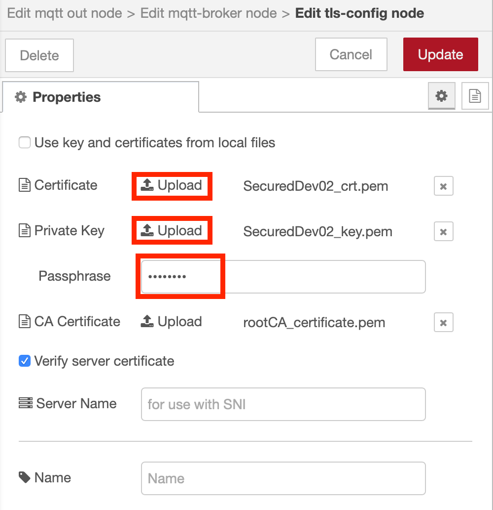

# Client Certificates

## Generating client certificates - INFORMATION ONLY

The script file you ran in the previous section has already generated the client certificates for you by running the commands shown below:

```bash
openssl genrsa -aes256 -passout pass:password123 -out SecuredDev01_key.pem 2048

openssl req -new -sha256 -subj "/C=GB/ST=DOR/L=Bournemouth/O=MOSQUITTO/OU=MOSQUITTO Corporate/CN=dev01" -passin pass:password123 -key SecuredDev01_key.pem -out SecuredDev01_crt.csr

openssl x509 -days 3650 -in SecuredDev01_crt.csr -out SecuredDev01_crt.pem -req -sha256 -CA rootCA_certificate.pem -passin pass:password123 -CAkey rootCA_key.pem -set_serial 131

openssl rsa -outform der -in SecuredDev01_key.pem -passin pass:password123 -out SecuredDev01_key.key

openssl rsa -in SecuredDev01_key.pem -passin pass:password123 -out SecuredDev01_key_nopass.pem

openssl x509 -outform der -in SecuredDev01_crt.pem -out SecuredDev01_crt.der
```

You will notice that the client certificate contains the client ID in the CN property of the certificate subject field.  This is how the certificate identifies the client to the server.

There are 2 client devices created in the make certificate script.  Only a single device can connect using a client ID, so we need to have unique certificates for each connection to the broker.

## Configuring the MQTT broker to accept client certificates

The broker can be configured with a number of different options to support client certificates:

- **require_certificate** : when set to **true** the client must provide a valid certificate, signed by a CA certificated configured using the **cafile** or **capath** properties
- **use_identity_as_username** : when set to **true** the password authentication method is not used and the connection username is taken from the CN property within the client certificate
- **use_subject_as_username** : is similar to **use_identity_as_username**, but instead of the CN property, the entire subject is used as the username
- **use_username_as_clientid** : when set to **true** it will set the client id to be the username.  This option causes clients connecting with no username to be rejected.

The username and client ID can be used to implement access control on topics, so tying them into the authentication process is beneficial.

!!! Info
    All certificates signed by a trusted CA will be accepted as valid client certificates.  However, to manage if a certificate is compromised, the broker can use a certificate revocation list to revoke access to clients using specific client certificates - see the **crlfile** [configuration property](https://mosquitto.org/man/mosquitto-conf-5.html){target=_blank}

Edit the mosquitto.conf configuration file.  The full configuration should now look like this (only the last 2 lines should need adding if you have been following along):

``` text
persistence true
persistence_location /mosquitto/data/
log_dest file /mosquitto/log/mosquitto.log
password_file /mosquitto/config/passwd
allow_anonymous false
use_username_as_clientid true
port 8883
cafile /mosquitto/config/cert/rootCA_certificate.pem
certfile /mosquitto/config/cert/mqttServer_crt.pem
keyfile /mosquitto/config/cert/mqttServer_key_nopass.pem
require_certificate true
use_identity_as_username true
```

Once the configuration has been updated you need to restart the broker to make the changes live.  Use command ```docker restart mosquitto```

You should notice your Node-RED nodes are no longer connected to the broker, as they are currently not providing a client certificate.

## Updating the Node-RED application to use client certificates

To allow the Node-RED application to connect to the MQTT broker, it needs to use the client certificates that were created in the last section.  Node-RED will be configured to connect as client dev02.

To add the certificate double click on either MQTT node, then click on the pencil icon to edit the MQTT connection then on the pencil icon to edit the TLS configuration.

Upload the **SecuredDev02_crt.pem** file as the Certificate.

Upload the **SecuredDev02_key.pem** file as the Private Key.  The script that created the client certificate uses password **password123**, so this needs to be entered as the Private Key Passphrase.

{style="width: 75%" .center}

Press the **Update** buttons then the **Done** button to leave the configuration panels.  Then press the **Deploy** button to make the changes live.

Your MQTT nodes should once again be connected.

!!! Info
    Note, the connection is no longer using the **Username** and **Password** properties configured on the Security tab of the MQTT server configuration panel within the MQTT node config.  The username and client ID are now being set from the CN property within the client certificate.

## Updating the ESP8266 Application to use Client Certificates with the Mosquitto Broker

In this section you you will learn how to access the broker over a local network connection.  However, network connectivity does add some additional requirements, especially where TLS and secure connections are used.

### Name Resolution

To allow the external device to be able to connect to your broker it needs to be able to find the system running Docker over the network.  To do this a technology called mDNS (multicast DNS), also referred to as ZeroConf or Bonjour, will be used.  This simply allows machines on a local network to communicate to be able to discover each other.  You simply use the **.local** domain to use this service.

MacOS and the latest version of Windows 10 have this built in.  Some Linux distributions also have this service enabled by default.

- Older versions of Windows need additional software installed to enabled mDNS.  The easiest way to add the service is to install [Bonjour Print Services for Windows](https://support.apple.com/kb/dl999)
- Some Linux distributions may need an additional package installed to enable mDNS.  Linux uses [avahi](https://www.avahi.org) to add mDNS services to Linux.  There is usually an **avahi** or **avahi-daemon** package available to add the required software.

### Enable the ESP8266 to work with a local Mosquitto broker

If you want to use the Mosquitto broker with the ESP8266 application developed in the workshop, then some additional code is needed to enable the use of client certificates, but first the certificates need to be uploaded to the device.

To be able to connect and verify the server certificate:

- the computer running the Mosquitto container must be reachable over the WiFi network the ESP8266 will connect to
- the computer running to Mosquitto container must be using a hostname configured in the **MQTT_HOST** definition in the ESP8266 application.  The SSL library on the ESP8266 doesn't allow you to connect using an IP address, so you need to use a hostname, which can be challenging in a home environment
- the value assigned to **MQTT_HOST** must be defined in the server certificate **[alt_names]** section of the srvext.cfg file when the certificates were generated.

You may also need to modify the firewall of you computer to ensure that external traffic can get to port 8883 to communicate with the broker.

!!! Warning
    If you need to regenerate certificates ensure that the set of certificates used are consistent.  Each time the script is run the root CA certificate is regenerated, so any certificates signed with a previous root CA certificate will not be valid with the new root CA certificate, and any certificate with the new root CA certificate will not be valid against a previous root CA certificate

### Step 1 - Upload the certificate and key to the ESP8266 device

You need to add the private key (SecuredDev01_key_nopass.pem) and the certificate (SecuredDev01_crt.pem) to the data folder inside the sketch folder then run the data uploader tool (*Tools* -> *ESP8266 LittleFS Data Upload*) to install the certificates on the device filesystem.  The SSL library on the ESP does not provide a mechanism to enter a password for the key, so the version of the key without the password needs to be provided.  Remember to close the Serial Monitor window before running the data upload tool.

### Step 2 - Modify the application to use the client certificate and key

Now you can modify the code to load the certificates and add them to the connection:

Modify the CA_CERT_FILE definition and add two more #define statements containing the names of the key and certificate:

```C++
#define CA_CERT_FILE "/rootCA_certificate.pem"
#define KEY_FILE "/SecuredDev01_key_nopass.pem"
#define CERT_FILE "/SecuredDev01_crt.pem"
```

Add two more variable declarations to hold the additional certificates:

```C++
BearSSL::X509List *clientCert;
BearSSL::PrivateKey *clientKey;
```

then update the code within the setup() function to load the additional key and certificate:

```C++
  char *client_cert = nullptr;
  char *client_key = nullptr;

  // Get cert(s) from file system
  LittleFS.begin();
  File ca = LittleFS.open(CA_CERT_FILE, "r");
  if(!ca) {
    Serial.println("Couldn't load CA cert");
  } else {
    size_t certSize = ca.size();
    ca_cert = (char *)malloc(certSize);
    if (certSize != ca.readBytes(ca_cert, certSize)) {
      Serial.println("Loading CA cert failed");
    } else {
      Serial.println("Loaded CA cert");
      rootCert = new BearSSL::X509List(ca_cert);
      wifiClient.setTrustAnchors(rootCert);
    }
    free(ca_cert);
    ca.close();
  }
  
  File key = LittleFS.open(KEY_FILE, "r");
  if(!key) {
    Serial.println("Couldn't load key");
  } else {
    size_t keySize = key.size();
    client_key = (char *)malloc(keySize);
    if (keySize != key.readBytes(client_key, keySize)) {
      Serial.println("Loading key failed");
    } else {
      Serial.println("Loaded key");
      clientKey = new BearSSL::PrivateKey(client_key);
    }
    free(client_key);
    key.close();
  }
  
  File cert = LittleFS.open(CERT_FILE, "r");
  if(!cert) {
    Serial.println("Couldn't load cert");
  } else {
    size_t certSize = cert.size();
    client_cert = (char *)malloc(certSize);
    if (certSize != cert.readBytes(client_cert, certSize)) {
      Serial.println("Loading client cert failed");
    } else {
      Serial.println("Loaded client cert");
      clientCert = new BearSSL::X509List(client_cert);
    }
    free(client_cert);
    cert.close();
  }
  
  wifiClient.setClientRSACert(clientCert, clientKey);
```

### Step 3 - Update the broker hostname

To allow the ESP8266 to find the broker you need to use the hostname of the system running Docker.  When you generated the certificates in the previous section you used the ```hostname``` command, then added the .local domain to form a DNS entry in the server certificate using the **srvext.cfg** file.  

This will use mDNS on your local home network to enable the ESP8266 to discover the Mosquitto broker.  It also allows the TLS connection to verify the server certificate, as the hostname connecting to will match the entry in the certificate.

You need to modify the ESP8266 application to use the hostname, by updating the #define near to top of the application.  If the hostname returned from the ```hostname``` command was **win10** or **win10.acme.inc**, then MQTT_HOST should be defined as:

```C
#define MQTT_HOST "win10.local"
```

### Step 4 - Run the application

Save, compile and upload the sketch to the device and verify the device connects.

Password Authentication is not being used with the configuration being used, so the **connect()** function call can be changed to omit the user and password information:

- with password authentication : `if (mqtt.connect(MQTT_CLIENT_ID, MQTT_USER, MQTT_TOKEN)) {`
- without password authentication : `if (mqtt.connect(MQTT_CLIENT_ID)) {`

### Solution Code

The finished application should look like this, when the Mosquitto broker is running with on a laptop with hostname win10 - change this value to match your hostname :

```C++
#include "LittleFS.h"
#include <ESP8266WiFi.h>
#include <time.h>
#include <Adafruit_NeoPixel.h>
#include <DHT.h>
#include <ArduinoJson.h>
#include <PubSubClient.h>
#include <math.h>

// --------------------------------------------------------------------------------------------
//        UPDATE CONFIGURATION TO MATCH YOUR ENVIRONMENT
// --------------------------------------------------------------------------------------------

// MQTT connection details
#define MQTT_HOST "win10.local"
#define MQTT_PORT 8883
#define MQTT_CLIENT_ID "dev01"
#define MQTT_TOPIC "dev01/status"
#define MQTT_TOPIC_DISPLAY "dev01/display"
#define MQTT_TOPIC_INTERVAL "dev01/interval"
#define CA_CERT_FILE "/rootCA_certificate.pem"
#define KEY_FILE "/SecuredDev01_key_nopass.pem"
#define CERT_FILE "/SecuredDev01_crt.pem"

// Add GPIO pins used to connect devices
#define RGB_PIN 5 // GPIO pin the data line of RGB LED is connected to
#define DHT_PIN 4 // GPIO pin the data line of the DHT sensor is connected to

// Specify DHT11 (Blue) or DHT22 (White) sensor
//#define DHTTYPE DHT22
#define DHTTYPE DHT11
#define NEOPIXEL_TYPE NEO_RGB + NEO_KHZ800

// Temperatures to set LED by (assume temp in C)
//#define ALARM_COLD 0.0
//#define ALARM_HOT 30.0
//#define WARN_COLD 10.0
//#define WARN_HOT 25.0

//Timezone info
#define TZ_OFFSET 0  //Hours timezone offset to GMT (without daylight saving time)
#define TZ_DST    60  //Minutes timezone offset for Daylight saving

// Add WiFi connection information
char ssid[] = "SSID";     //  your network SSID (name)
char pass[] = "WiFi_password";  // your network password

// Size of buffer for JSON parsing
#define DATA_BUFFER_SIZE 60

// Model parameters from part4 - to implement the model on the ESP8266
// Replace these parameters with the model parameters from your Jupyter Notebook
#define MODEL_INTERCEPT -31.529189619522715
#define MODEL_TEMP_COEF 1.3247
#define MODEL_HUM_COEF 9.2584

// --------------------------------------------------------------------------------------------
//        SHOULD NOT NEED TO CHANGE ANYTHING BELOW THIS LINE
// --------------------------------------------------------------------------------------------

Adafruit_NeoPixel pixel = Adafruit_NeoPixel(1, RGB_PIN, NEOPIXEL_TYPE);
DHT dht(DHT_PIN, DHTTYPE);

// MQTT objects
void callback(char* topic, byte* payload, unsigned int length);
BearSSL::WiFiClientSecure wifiClient;
PubSubClient mqtt(MQTT_HOST, MQTT_PORT, callback, wifiClient);

BearSSL::X509List *rootCert;
BearSSL::X509List *clientCert;
BearSSL::PrivateKey *clientKey;

// variables to hold data
StaticJsonDocument<100> jsonDoc;
JsonObject payload = jsonDoc.to<JsonObject>();
JsonObject status = payload.createNestedObject("d");
StaticJsonDocument<100> jsonReceiveDoc;
static char msg[DATA_BUFFER_SIZE];


float h = 0.0; // humidity
float t = 0.0; // temperature
unsigned char r = 0; // LED RED value
unsigned char g = 0; // LED Green value
unsigned char b = 0; // LED Blue value
int32_t ReportingInterval = 10;  // Reporting Interval seconds

float applyModel(float h, float t) {
  // apply regression formula w1 + w2x + w3y 
  float regression = MODEL_INTERCEPT + MODEL_HUM_COEF * h + MODEL_TEMP_COEF * t;
  // return sigmoid logistic function on regression result
  return  1/(1 + exp(0.0 - (double)regression));
}

void callback(char* topic, byte* payload, unsigned int length) {
  // handle message arrived
  Serial.print("Message arrived [");
  Serial.print(topic);
  Serial.print("] : ");
  
  payload[length] = 0; // ensure valid content is zero terminated so can treat as c-string
  Serial.println((char *)payload);
  DeserializationError err = deserializeJson(jsonReceiveDoc, (char *)payload);
  if (err) {
    Serial.print(F("deserializeJson() failed with code ")); 
    Serial.println(err.c_str());
  } else {
    JsonObject cmdData = jsonReceiveDoc.as<JsonObject>();
    if (0 == strcmp(topic, MQTT_TOPIC_DISPLAY)) {
      //valid message received
      r = cmdData["r"].as<unsigned char>(); // this form allows you specify the type of the data you want from the JSON object
      g = cmdData["g"];
      b = cmdData["b"];
      jsonReceiveDoc.clear();
      pixel.setPixelColor(0, r, g, b);
      pixel.show();
    } else if (0 == strcmp(topic, MQTT_TOPIC_INTERVAL)) {
      //valid message received
      ReportingInterval = cmdData["Interval"].as<int32_t>(); // this form allows you specify the type of the data you want from the JSON object
      Serial.print("Reporting Interval has been changed:");
      Serial.println(ReportingInterval);
      jsonReceiveDoc.clear();
    } else {
      Serial.println("Unknown command received");
    }
  }
}

void setup() {
  char *ca_cert = nullptr;
  char *client_cert = nullptr;
  char *client_key = nullptr;
  
  // Start serial console
  Serial.begin(115200);
  Serial.setTimeout(2000);
  while (!Serial) { }
  Serial.println();
  Serial.println("ESP8266 Sensor Application");

  // Start WiFi connection
  WiFi.mode(WIFI_STA);
  WiFi.begin(ssid, pass);
  while (WiFi.status() != WL_CONNECTED) {
    delay(500);
    Serial.print(".");
  }
  Serial.println("");
  Serial.println("WiFi Connected");

  // Start connected devices
  dht.begin();
  pixel.begin();
  
  // Get cert(s) from file system
  LittleFS.begin();
  File ca = LittleFS.open(CA_CERT_FILE, "r");
  if(!ca) {
    Serial.println("Couldn't load CA cert");
  } else {
    size_t certSize = ca.size();
    ca_cert = (char *)malloc(certSize);
    if (certSize != ca.readBytes(ca_cert, certSize)) {
      Serial.println("Loading CA cert failed");
    } else {
      Serial.println("Loaded CA cert");
      rootCert = new BearSSL::X509List(ca_cert);
      wifiClient.setTrustAnchors(rootCert);
    }
    free(ca_cert);
    ca.close();
  }
  
  File key = LittleFS.open(KEY_FILE, "r");
  if(!key) {
    Serial.println("Couldn't load key");
  } else {
    size_t keySize = key.size();
    client_key = (char *)malloc(keySize);
    if (keySize != key.readBytes(client_key, keySize)) {
      Serial.println("Loading key failed");
    } else {
      Serial.println("Loaded key");
      clientKey = new BearSSL::PrivateKey(client_key);
    }
    free(client_key);
    key.close();
  }
  
  File cert = LittleFS.open(CERT_FILE, "r");
  if(!cert) {
    Serial.println("Couldn't load cert");
  } else {
    size_t certSize = cert.size();
    client_cert = (char *)malloc(certSize);
    if (certSize != cert.readBytes(client_cert, certSize)) {
      Serial.println("Loading client cert failed");
    } else {
      Serial.println("Loaded client cert");
      clientCert = new BearSSL::X509List(client_cert);
    }
    free(client_cert);
    cert.close();
  }
  
  wifiClient.setClientRSACert(clientCert, clientKey);
  
  // Set time from NTP servers
  configTime(TZ_OFFSET * 3600, TZ_DST * 60, "1.pool.ntp.org", "0.pool.ntp.org");
  Serial.println("\nWaiting for time");
  unsigned timeout = 30000;
  unsigned start = millis();
  while (millis() - start < timeout) {
      time_t now = time(nullptr);
      if (now > (2018 - 1970) * 365 * 24 * 3600) {
          break;
      }
      delay(100);
  }
  delay(1000); // Wait for time to fully sync
  Serial.println("Time sync'd");
  time_t now = time(nullptr);
  Serial.println(ctime(&now));
  
  // Connect to MQTT
   while(! mqtt.connected()){
//    if (mqtt.connect(MQTT_CLIENT_ID, MQTT_USER, MQTT_TOKEN)) { // Password Authentication
    if (mqtt.connect(MQTT_CLIENT_ID)) { // No Password Authentication
      Serial.println("MQTT Connected");
      mqtt.subscribe(MQTT_TOPIC_DISPLAY);
      mqtt.subscribe(MQTT_TOPIC_INTERVAL);
    } else {
      Serial.print("last SSL Error = ");
      Serial.print(wifiClient.getLastSSLError(msg, 50));
      Serial.print(" : ");
      Serial.println(msg);
      Serial.println("MQTT Failed to connect! ... retrying");
      delay(500);
    }
  }
}


void loop() {
  mqtt.loop();
  while (!mqtt.connected()) {
    Serial.print("Attempting MQTT connection...");
    // Attempt to connect
//    if (mqtt.connect(MQTT_CLIENT_ID, MQTT_USER, MQTT_TOKEN)) { // Token Authentication
    if (mqtt.connect(MQTT_CLIENT_ID)) { // No Token Authentication
      Serial.println("MQTT Connected");
      mqtt.subscribe(MQTT_TOPIC_DISPLAY);
      mqtt.subscribe(MQTT_TOPIC_INTERVAL);
      mqtt.loop();
    } else {
      Serial.print("last SSL Error = ");
      Serial.print(wifiClient.getLastSSLError(msg, 50));
      Serial.print(" : ");
      Serial.println(msg);
      Serial.println("MQTT Failed to connect!");
      delay(5000);
    }
  }

  h = dht.readHumidity();
  t = dht.readTemperature(); // uncomment this line for Celsius
  // t = dht.readTemperature(true); // uncomment this line for Fahrenheit

  // Check if any reads failed and exit early (to try again).
  if (isnan(h) || isnan(t)) {
    Serial.println("Failed to read from DHT sensor!");
  } else {
    /* Control of the LED is now handles by the incoming command
    // Set RGB LED Colour based on temp
    b = (t < ALARM_COLD) ? 255 : ((t < WARN_COLD) ? 150 : 0);
    r = (t >= ALARM_HOT) ? 255 : ((t > WARN_HOT) ? 150 : 0);
    g = (t > ALARM_COLD) ? ((t <= WARN_HOT) ? 255 : ((t < ALARM_HOT) ? 150 : 0)) : 0;
    pixel.setPixelColor(0, r, g, b);
    pixel.show();
    */

    // Apply the model to the sensor readings
    float modelPrediction = applyModel(h, t);

    // Print Message to console in JSON format
    status["tmp"] = t;
    status["hmdty"] = h;
    Serial.print("Model output = ");
    Serial.println(modelPrediction);
    status["class"] = modelPrediction < 0.5 ? 0 : 1;
    serializeJson(jsonDoc, msg, DATA_BUFFER_SIZE);
    Serial.println(msg);
    if (!mqtt.publish(MQTT_TOPIC, msg)) {
      Serial.println("MQTT Publish failed");
    }
  }

  Serial.print("ReportingInterval :");
  Serial.print(ReportingInterval);
  Serial.println();
  // Pause - but keep polling MQTT for incoming messages
  for (int32_t i = 0; i < ReportingInterval; i++) {
    mqtt.loop();
    delay(1000);
  }
}
```
