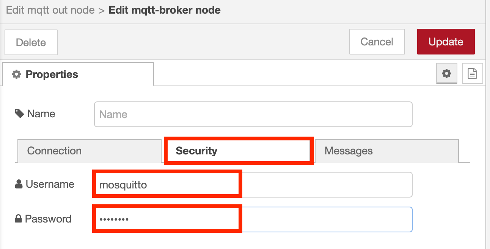

# Mosquitto User Management

When a client connects to the Mosquitto MQTT broker you can configure the broker to require the client to provide a valid username and password to authenticate to the broker.

Mosquitto provides a tool to manage the password, but as we have not installed mosquitto locally we will need to use the password tool from the Docker container.

Docker allows you to run commands within a running container using the ```docker exec``` command.  Before moving on you need to have the mosquitto container running, so use ```docker ps``` to verify you have mosquitto running, if not start the container using the command at the end of the [Mosquitto setup](README.md){target=_blank} section.

To get a command prompt inside the mosquitto container use command ```docker exec -it mosquitto /bin/sh```.  This starts the command shell application from within the container named **mosquitto**.

Using the interactive command prompt from within the container you can run commands inside the container, so now have access to the mosquitto_passwd utility to manage mosquitto passwords.  To verify you have access to the command run ```mosquitto_passwd --help``` to print out the command help.

!!! Info
    When starting the mosquitto container the **-v** parameter is used to map a directory on the local filesystem into the container.  The command we are using to start the container maps the config, data and log directories in the current directory into the container inside the **/mosquitto** directory.  These directories are the only directories that survive when the container is restarted.

The first thing we need to do is create a new mosquitto account inside a new password file.  However, we need to ensure the file is located in one of the container directories mapped to storage on the host system that will not be lost if the container is restarted, so we will use the **/mosquitto/conf** directory.

## Create the password file

The first time a user is created the password file also needs to be created, so the **-c** parameter is added to the command.  Once the file is created this parameter should not be specified or any existing file will be overwritten and previously defined users will be lost.

We will create a new user called **mosquitto** with password of **password**.  From the command prompt within the mosquitto container run command:

``` bash
mosquitto_passwd -c /mosquitto/config/passwd mosquitto
```

you will then be prompted to enter the password.  Enter the password ```password``` then you will be asked to verify the password, so enter ```password``` again.

to define additional users you can repeat the command again, but ensure you remove the **-c** parameter, or the password file will be overwritten, loosing previously defined users.

e.g. to add a test user:

``` bash
mosquitto_passwd /mosquitto/config/passwd test
```

## Scripted or non-interactive ways to add a new user

If you want to use the mosquitto_passwd command without being prompted, then you can add the **-b** parameter, then also specify the password on the command line:

``` bash
mosquitto_passwd -b /mosquitto/config/passwd dev01 devpwd
```

!!! Warning
    Specifying a password on the command line is considered bad practice, as the password will be visible on any system monitoring tools showing commands being currently run, such as the linux **ps** command.

You can also call the mosquitto_passwd command without having to first launch the command shell from within the container by specifying the command in the docker exec command.  Leave the interactive command prompt within the container by entering the ```exit``` command.

Ensure you are at your local system prompt (not within the container) then enter the following command:

``` bash
docker exec -it mosquitto /usr/bin/mosquitto_passwd -b /mosquitto/config/passwd dev01 passw0rd
```

This will run the mosquitto_passwd inside the running container named **mosquitto**.  The -b parameter is for batch mode so we can specify the password on the command line.  The password file location (**/mosquitto/config/passwd**) is specified within the container filesystem, not your local system filesystem.

Also note this is using the same username as the last command run from the interactive prompt within the container (**dev01**).  This is how you change a password for an existing user.  The command creates a new user if a user doesn't exist, otherwise it updates the existing user.

## Configuring Mosquitto to use the password file

The mosquitto broker needs some additional configuration to use the password file.  You are also able to specify if a user must exist in the password file before they can connect, of if anonymous users are also allowed to connect to the broker.

To add the additional configuration you need to add some additional content to the config file created within the config directory on your local system.  Add the following lines to the **mosquitto.conf** file in the config directory:

``` text
password_file /mosquitto/config/passwd
allow_anonymous false
use_username_as_clientid true
```

Once you have updated the config file you need to restart the Mosquitto broker.  You can do this by restarting the container:

``` bash
docker restart mosquitto
```

If you switch back to Node-RED web interface you should now notice the MQTT nodes are no longer connected.  This is because the Mosquitto broker was restarted, breaking the connecting and the nodes can no longer reconnect as they are not using a username and password and the Mosquitto broker is now configured to block anonymous clients - all connections now need to present an username and password that is present in the passwd file.

To enable the connection double click one of the MQTT nodes in Node-RED to open the config panel select the pencil icon next to the Server field then select the Security tab.  Here you will see a Username and Password filed for the connection.  Enter details for one of the users you created using the mosquitto_passwd command earlier in this section, such as mosquitto / password



Select the **Update** then **Done** buttons to save the config, then hit the Deploy button to make the changes live.  You should once again have the Node-RED MQTT nodes connected.

## Summary

This section looked at configuring the Mosquitto broker to require a client to logon to the broker using a username and password that was created using the mosquitto_pwd tool.  In a future section we will cover using client certificates to authenticate clients.

It is also worth noting that it is possible to configure Mosquitto to use plugins to take user information from other repositories, such as a database.  See the [Mosquittp documentation](https://mosquitto.org/man/mosquitto-conf-5.html) for details and other configuration options.
