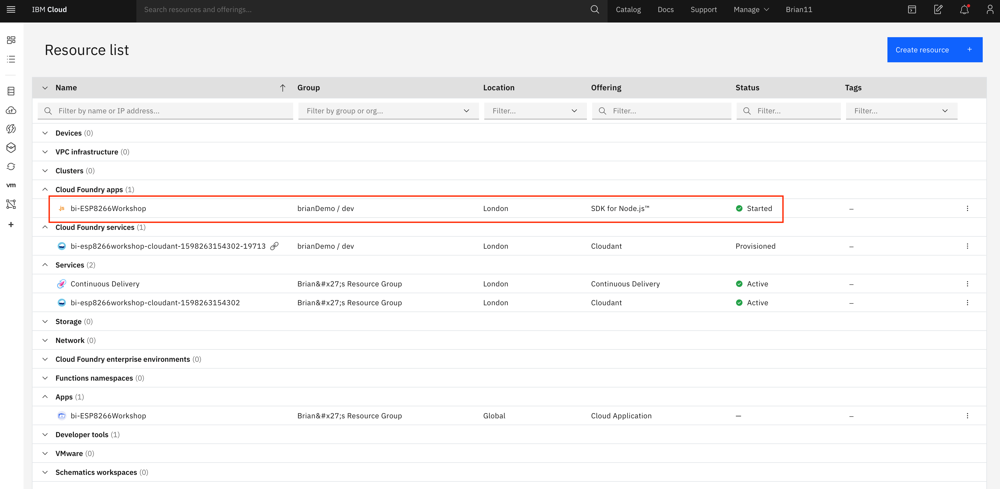

# Deploying an application to the IBM Cloud

## Lab Objectives

In this lab you will learn how to deploy a starter application to the IBM Cloud.  You will learn:

- How to access the cloud and set the desired location to work in
- Access the catalog of services and select a Starter Application to deploy
- Deploy a Starter Application to the IBM Cloud
- Access the Starter Application source code and update the application
- Become familiar with the DevOps tooling available in the IBM Cloud

## Introduction

Before finishing part 1 you should deploy the Internet of Things Platform on the IBM Cloud as we will be using it in Part 2.

Before starting these steps it is assumed you have completed the steps in the [prerequisite section](PREREQ.md) and have an active IBM Cloud account.

<!-- Allow spaces inside emphasis markers (MD037) -->
<!-- markdownlint-disable MD037 -->
## **Internet of Things Platform ** on the IBM Cloud
<!-- markdownlint-enable MD037 -->

The IBM Watson IoT Platform solution provides a set of IBM Cloud services as a single IBM-managed Software as a Service (SaaS) offering that enables you to collect and analyze IoT data.

In this workshop your ESP8266 device will be sending data to the IBM IoT Platform, so you need to deploy an instance of the IoT Platform service in your cloud account.

### Step 1 - Accessing the cloud and selecting an appropriate space

[Login](https://cloud.ibm.com/login) to your cloud account.

If you haven't previously used any of the Cloud Foundry locations you may need to create a **space** to be able to work in the chosen location.  To do this from the top menu select *Manage* -> *Account* -> *Cloud Foundry Orgs* then click on your mail address to configure your organisation.  If there are no spaces showing, or you have a paid account and want to work in a new region, then click to **Add a space** then select the region and provide a name for the space.

If you are working in a lite account you are restricted to a single Cloud Foundry space and are unable to create additional spaces in different regions unless you upgrade your account.

Lite accounts have resource restrictions, so to be able to deploy the starter application you may need to delete any resources already deployed.

### Step 2 - Deploy a Starter Application

- open up the Catalog using the top menu, then select **Web and Applications** from the left menu
- select the **Software** tab
- select the **Node-RED App**

- in the screen presented press the **Create app** button
- in the Create app screen optionally enter an App name (or you can simple accept the name provided) and select a region to deploy the Cloudant NoSQL database to - ideally this should be the same region you have your Cloud Foundry space in.
- press the **Create** button to create the App definition

- wait until the Cloudant service has been deployed
- press the **Create Service +** button, then select the Internet of Things section and press the **Next** button
- select the Internet of Things Platform then press the **Next** button
- choose the closest region, ensure the Lite pricing plan is selected then press Create to add the Internet of Things Platform to your application
- press **Deploy you app**

- ensure IBM Cloud Foundry is the deployment target (this is the only option for lite accounts)
- press **New** to create an IBM Cloud API key, accept the defaults in the popup and press **OK**
- select the Memory allocation per instance to 256 MB
- ensure the host name is valid, if not modify it until any errors are cleared
- select the region closest to you to deploy the toolchain
- press **Create** to generate the toolchain for your application

The Starter Application is now deploying by running the newly created toolchain.

Please leave this to deploy - now is a good time to go for a break.

### Step 3 - Check deployment status

- open the main menu (Top left of web console UI)
- select Resource list
- select your application from the Cloud Foundry apps section to launch the application overview page

On the overview page you should see:

- the app is awake, which shows the deployment was successful and the application is running
- the link to open the application
- the connections to the Cloudant database and IoT platform services
- link to access toolchain

You now have the cloud application deployed, so you are now ready to move to the [next section](../part2/README.md) of the workshop to setup secured communications between the ESP8266 device and the IBM Cloud IOT service
