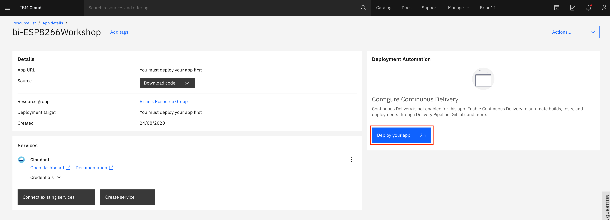
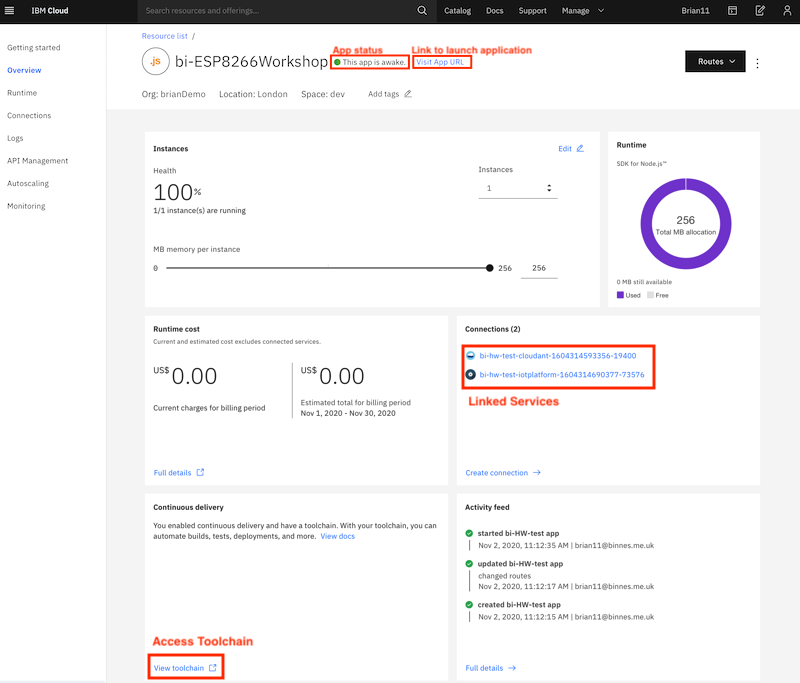

# Deploying an application to the IBM Cloud

## Lab Objectives

In this lab you will learn how to deploy a starter application to the IBM Cloud.  You will learn:

- How to access the cloud and set the desired location to work in
- Access the catalog of services and select a Starter Application to deploy
- Deploy a Starter Application to the IBM Cloud
- Access the Starter Application source code and update the application
- Become familiar with the DevOps tooling available in the IBM Cloud

## Introduction

To turn a standalone application running on the ESP8266 into an Internet of Things solution we need to enable the ESP8266 to communicate with *the internet*.  This can be achieved with an application or service running in the cloud.  

In part 2 of the workshop we will be working on the cloud application and using a common Internet of Things protocol, called MQTT, to enable the communication between the application running on the ESP8266 and the IBM Cloud.

Before finishing part 1 you should deploy a starter application on the IBM Cloud as we will be using it in Part 2, as it can take a few minutes to deploy.

Before starting these steps it is assumed you have completed the steps in the [prerequisite section](PREREQ.md) and have an active IBM Cloud account.

## Deploy a starter application and services on the IBM Cloud

For the server side application we will be using a low-code development environment called Node-RED on the IBM Cloud.  Node-RED is an open source project and can run anywhere a Node.js environment can run, so from a small, single board computer such as a Raspberry Pi up to large enterprise systems and cloud environments.

In addition to the Node-RED starter application, which also provides a NoSQL database, we will use a messaging service called **cloudAMQP**, which support the MQTT protocol.

### Step 1 - Accessing the cloud and selecting an appropriate space

The Node-RED starter application we are going to deploy uses the Cloud Foundry runtime on the IBM Cloud.  Cloud Foundry provides a mechanism to organise workloads running on the cloud using a feature called a **space**.  

A space lives in a specific geographic region and permissions and security options needed to manage applications are handled at a space level in Cloud Foundry, but we won't be covering this in this workshop.  You just need to know that applications are deployed into a Cloud Foundry space, so before trying to deploy an application you need to verify you have a space available.

If you are using the Lite account on IBM Cloud, then you are limited to working in a single region and can only have a single space configured in your account.

Complete the following steps to verify you have a Cloud Foundry space to work in:

1. [Login](https://cloud.ibm.com/login) to your cloud account.
2. If you haven't previously used any of the Cloud Foundry locations you may need to create a **space** to be able to work in the chosen location.  To do this from the top menu select *Manage* -> *Account* -> *Cloud Foundry Orgs* then click on your mail address to configure your organisation.  If there are no spaces showing, or you have a paid account and want to work in a new region, then click to **Add a space** then select the region and provide a name for the space.

If you are working in a lite account you are restricted to a single Cloud Foundry space and are unable to create additional spaces in different regions unless you upgrade your account.

Lite accounts have resource restrictions, so to be able to deploy the starter application you may need to delete any resources already deployed.

### Step 2 - Deploy a Starter Application

- open up the Catalog using the top menu
- in the search bar enter **Node-RED App** and hit the ENTER key
- select the **Node-RED App** tile

- in the screen presented press the **Get Started** button
- in the Create app screen optionally enter an App name (or you can simple accept the name provided) and select a region to deploy the Cloudant NoSQL database to - ideally this should be the same region you have your Cloud Foundry space in.
- press the **Create** button to create the App definition

- wait until the Cloudant service has been deployed
- press **Deploy you app**

- ensure IBM Cloud Foundry is the deployment target (this is the only option for lite accounts)
- press **New** to create an IBM Cloud API key, accept the defaults in the popup and press **OK**
- select the Memory allocation per instance to 256 MB
- ensure the host name is valid, if not modify it until any errors are cleared
- select the region closest to you to deploy the toolchain
- press **Create** to generate the toolchain for your application

The Starter Application is now deploying by running the newly created toolchain.

Please leave this to deploy - now is a good time to go for a break.

### Step 3 - Check deployment status

- open the main menu (Top left of web console UI)
- select Resource list
- select your application from the Cloud Foundry apps section to launch the application overview page

On the overview page you should see:

- the app is awake, which shows the deployment was successful and the application is running
- the link to open the application
- the connections to the Cloudant database service
- link to access toolchain

### Step 4 - Deploy the CloudAMQP service

The last item we need on the IBM Cloud is the MQTT service for the ESP8266 application to communicate with.  We will use the CloudAMQP services from the IBM Cloud catalog.

- Select the Catalog from the top menu
- search for **CloudAMQP**
- select the CloudAMQP service

- ensure you have the Lite plan selected then hit the create button

You now have the cloud application deployed, so you are now ready to move to the [next section](../part2/README.md) of the workshop to setup secured communications between the ESP8266 device and the IBM Cloud
