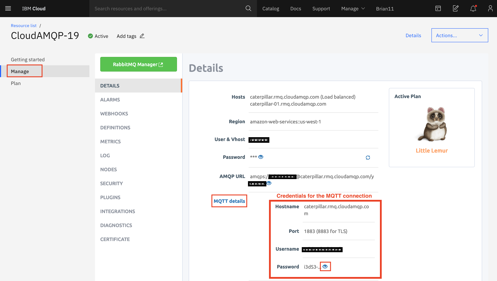
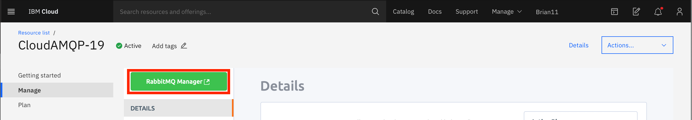
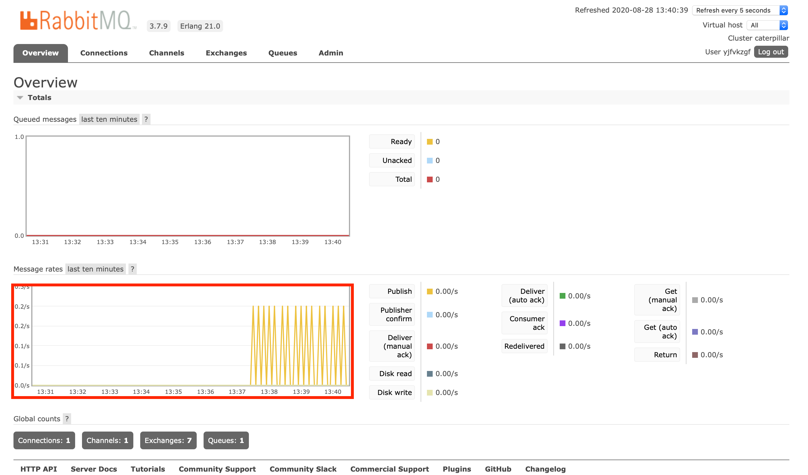

# Connecting a device to the Internet using MQTT

## Lab Objectives

In this lab you will learn how to add MQTT messaging to an application.  You will learn:

- How to connect to a MQTT broker using unsecured connection
- How to use MQTT to connect to the broker service

## Introduction

In the previous lab you built the stand alone sensor application.  Now we want to make it an Internet of Things application by adding in MQTT to send the data to the CloudAMQP service.

We will start by using an unsecured MQTT connection, then in the next section we will secure the connection.

### Step 1 - The MQTT configuration

Before we start writing code we need to gather the information needed to be able to connect to the MQTT service.  We also need to decide what topics the application will use.

To get the connection credentials for the CloudAMQP service:

- Goto the IBM Cloud web console and select Resource list from the top menu
- Expand the Services section and select the CloudAMQP service
- In the Manage section click on the MQTT details to reveal the connection details for the service
- to see the password you need to click on the eye icon



For this workshop the following topics will be used:

- **env/status** : will be used to publish environmental data by the ESP8266
- **dev01/display** : will be used to send a command to device dev01 to change the LED colour
- **dev01/interval** : will be used to send a command to device dev01 to change the reporting interval

### Step 2 - Enhancing the application to send data to the IoT platform

In the Arduino IDE you need to add the MQTT code, but before adding the MQTT code you need to install the library.  In the library manager (*Sketch* -> *Include Library* -> *Manage Libraries...*) search for and install the PubSubClient.  Then add the include to the top of the application, below the existing include files

```#include <PubSubClient.h>```

Now add some #define statements to contain that the MQTT code will use.  Add these under the comment **UPDATE CONFIGURATION TO MATCH YOUR ENVIRONMENT**:

```C++
// --------------------------------------------------------------------------------------------
//        UPDATE CONFIGURATION TO MATCH YOUR ENVIRONMENT
// --------------------------------------------------------------------------------------------

// MQTT connection details
#define MQTT_HOST "******.******.cloudamqp.com" // This is the Hostname from the AMQP MQTT Details
#define MQTT_PORT 1883 // This is used for unsecured traffic and can be found from the AMQP MQTT Details
#define MQTT_DEVICEID "dev01" // This is a string representing a specific device, it is just a string
#define MQTT_USER "********:********" // This is the Username from the AMQP MQTT Details
#define MQTT_TOKEN "**********************" // This is the Password from the AMQP Details
#define MQTT_TOPIC "env/status"
#define MQTT_TOPIC_DISPLAY "dev01/display"
```

You need to change the values (indicated above with **\*** characters) to match your configuration using the connection values from the AMQP MQTT details information:

After the configuration block and under the pixel and dht variable declarations you need to add the the following:

```C++
// MQTT objects
void callback(char* topic, byte* payload, unsigned int length);
WiFiClient wifiClient;
PubSubClient mqtt(MQTT_HOST, MQTT_PORT, callback, wifiClient);
```

Above the setup() function add the implementation of the callback function.  This is called whenever a MQTT message is sent to the device.  For now it just prints a message to the serial console:

```C++
void callback(char* topic, byte* payload, unsigned int length) {
  // handle message arrived
  Serial.print("Message arrived [");
  Serial.print(topic);
  Serial.print("] : ");
  
  payload[length] = 0; // ensure valid content is zero terminated so can treat as c-string
  Serial.println((char *)payload);
}
```

at the end of the setup() function add the following code to connect the MQTT client to the IoT Platform:

```C++
  // Connect to MQTT
  if (mqtt.connect(MQTT_DEVICEID, MQTT_USER, MQTT_TOKEN)) {
    Serial.println("MQTT Connected");
    mqtt.subscribe(MQTT_TOPIC_DISPLAY);

  } else {
    Serial.println("MQTT Failed to connect!");
    ESP.reset();
  }
```

at the top of the loop() function add the following code to verify the mqtt connection is still valid and call the mqtt.loop() function to process any outstanding messages:

```C++
  mqtt.loop();
  while (!mqtt.connected()) {
    Serial.print("Attempting MQTT connection...");
    // Attempt to connect
    if (mqtt.connect(MQTT_DEVICEID, MQTT_USER, MQTT_TOKEN)) {
      Serial.println("MQTT Connected");
      mqtt.subscribe(MQTT_TOPIC_DISPLAY);
      mqtt.loop();
    } else {
      Serial.println("MQTT Failed to connect!");
      delay(5000);
    }
  }
```

Lastly add the code to send the data to the IoT Platform.  We already have the data formatted as a JSON string, so we can now add the following code after it is printed to the console in the **loop()** function:

```C++
    Serial.println(msg);
    if (!mqtt.publish(MQTT_TOPIC, msg)) {
      Serial.println("MQTT Publish failed");
    }
```

Finally, replace the 10 second ```delay(10000)``` to call the mqtt **loop()** function, so the program processes incoming messages:

```C++
  // Pause - but keep polling MQTT for incoming messages
  for (int i = 0; i < 10; i++) {
    mqtt.loop();
    delay(1000);
  }
```

### Step 3 - Run the application

Compile and upload the code to your ESP8266 and you should see the ```WiFi Connected```, followed by ```Attempting MQTT connection...MQTT Connected```. Every 10 second interval you see the DHT sensor data printed on the console.  

The ESP8266 should also be publishing MQTT messages to the cloudAMQP service.  To verify this:

- switch to your browser window showing the IBM Cloud web console
- from the Resource list, select the cloudAMQP service then select the RabbitMQ Manager

    {style="width: 80%" .center}

- The RabbitMQ console should be showing messages arriving

    {style="width: 80%" .center}

### Step 4 - How it works

1. The #define statements construct the required parameters to connect and use MQTT
2. When you initialise the PubSubClient you need to pass in the hostname, the port (1883 for unsecured connections), a callback function and a network connection.  The callback function is called whenever incoming messages are received.
3. Call **connect()** to connect with the platform, passing in the device ID, a user, which is always the value *use-token-auth* and the token you chose when registering the device.
4. The **subscribe()** function registers the connection to receive messages published on the given topic.
5. The **loop()** method must be regularly called to keep the connection alive and get incoming messages.
6. The **publish()** function sends data on the provided topic

    !!!Note
        On some MQTT Client libraries this function only queues the message for sending, it is actually sent in the **loop()** function

7. You can verify the connection status with the **connected()** function.

### Solution code

The complete ESP8266 application is shown below (you will need to change the configuration section to match your environment):

```C++
#include <ESP8266WiFi.h>
#include <Adafruit_NeoPixel.h>
#include <DHT.h>
#include <ArduinoJson.h>
#include <PubSubClient.h>

// --------------------------------------------------------------------------------------------
//        UPDATE CONFIGURATION TO MATCH YOUR ENVIRONMENT
// --------------------------------------------------------------------------------------------

// MQTT connection details
#define MQTT_HOST "hostname.rmq.cloudamqp.com"
#define MQTT_PORT 1883
#define MQTT_DEVICEID "dev01"
#define MQTT_USER "abcdezgf:abcdezgf"
#define MQTT_TOKEN "abxyz-jhdjdhfjkskhdjfSQNeH2pq9s_UlGy"
#define MQTT_TOPIC "env/status"
#define MQTT_TOPIC_DISPLAY "dev01/display"

// Add GPIO pins used to connect devices
#define RGB_PIN 5 // GPIO pin the data line of RGB LED is connected to
#define DHT_PIN 4 // GPIO pin the data line of the DHT sensor is connected to

// Specify DHT11 (Blue) or DHT22 (White) sensor
#define DHTTYPE DHT11
#define NEOPIXEL_TYPE NEO_RGB + NEO_KHZ800

// Temperatures to set LED by (assume temp in C)
#define ALARM_COLD 0.0
#define ALARM_HOT 30.0
#define WARN_COLD 10.0
#define WARN_HOT 25.0


// Add WiFi connection information
char ssid[] = "SSID";     //  your network SSID (name)
char pass[] = "WiFi_password";  // your network password


// --------------------------------------------------------------------------------------------
//        SHOULD NOT NEED TO CHANGE ANYTHING BELOW THIS LINE
// --------------------------------------------------------------------------------------------
Adafruit_NeoPixel pixel = Adafruit_NeoPixel(1, RGB_PIN, NEOPIXEL_TYPE);
DHT dht(DHT_PIN, DHTTYPE);


// MQTT objects
void callback(char* topic, byte* payload, unsigned int length);
WiFiClient wifiClient;
PubSubClient mqtt(MQTT_HOST, MQTT_PORT, callback, wifiClient);

// variables to hold data
StaticJsonDocument<100> jsonDoc;
JsonObject payload = jsonDoc.to<JsonObject>();
JsonObject status = payload.createNestedObject("d");
static char msg[50];

float h = 0.0;
float t = 0.0;

unsigned char r = 0;
unsigned char g = 0;
unsigned char b = 0;

void callback(char* topic, byte* payload, unsigned int length) {
  // handle message arrived
  Serial.print("Message arrived [");
  Serial.print(topic);
  Serial.print("] : ");
  
  payload[length] = 0; // ensure valid content is zero terminated so can treat as c-string
  Serial.println((char *)payload);
}

void setup() {
 // Start serial console
  Serial.begin(115200);
  Serial.setTimeout(2000);
  while (!Serial) { }
  Serial.println();
  Serial.println("ESP8266 Sensor Application");

  // Start WiFi connection
  WiFi.mode(WIFI_STA);
  WiFi.begin(ssid, pass);
  while (WiFi.status() != WL_CONNECTED) {
    delay(500);
    Serial.print(".");
  }
  Serial.println("");
  Serial.println("WiFi Connected");

  // Start connected devices
  dht.begin();
  pixel.begin();

  // Connect to MQTT
  if (mqtt.connect(MQTT_DEVICEID, MQTT_USER, MQTT_TOKEN)) {
    Serial.println("MQTT Connected");
    mqtt.subscribe(MQTT_TOPIC_DISPLAY);

  } else {
    Serial.println("MQTT Failed to connect!");
    ESP.reset();
  }
}

void loop() {
  mqtt.loop();
  while (!mqtt.connected()) {
    Serial.print("Attempting MQTT connection...");
    // Attempt to connect
    if (mqtt.connect(MQTT_DEVICEID, MQTT_USER, MQTT_TOKEN)) {
      Serial.println("MQTT Connected");
      mqtt.subscribe(MQTT_TOPIC_DISPLAY);
      mqtt.loop();
    } else {
      Serial.println("MQTT Failed to connect!");
      delay(5000);
    }
  }
  h = dht.readHumidity();
  t = dht.readTemperature(); // uncomment this line for centigrade
  // t = dht.readTemperature(true); // uncomment this line for Fahrenheit

  // Check if any reads failed and exit early (to try again).
  if (isnan(h) || isnan(t)) {
    Serial.println("Failed to read from DHT sensor!");
  } else {
    // Set RGB LED Colour based on temp
    b = (t < ALARM_COLD) ? 255 : ((t < WARN_COLD) ? 150 : 0);
    r = (t >= ALARM_HOT) ? 255 : ((t > WARN_HOT) ? 150 : 0);
    g = (t > ALARM_COLD) ? ((t <= WARN_HOT) ? 255 : ((t < ALARM_HOT) ? 150 : 0)) : 0;
    pixel.setPixelColor(0, r, g, b);
    pixel.show();

    // Publish data to MQTT
    status["temp"] = t;
    status["humidity"] = h;
    serializeJson(jsonDoc, msg, 50);
    Serial.println(msg);
    if (!mqtt.publish(MQTT_TOPIC, msg)) {
      Serial.println("MQTT Publish failed");
    }
  }

  // Pause - but keep polling MQTT for incoming messages
  for (int i = 0; i < 10; i++) {
    mqtt.loop();
    delay(1000);
  }
}
```
