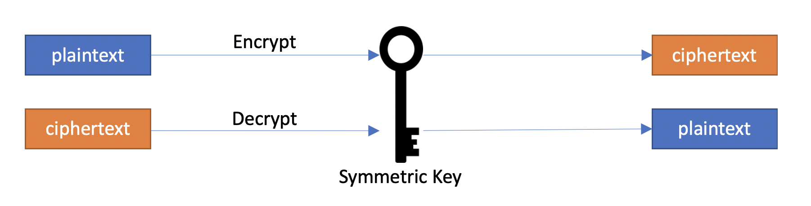
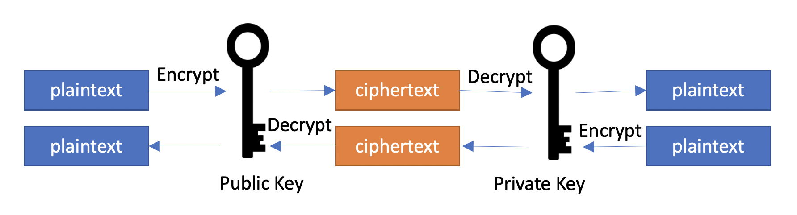
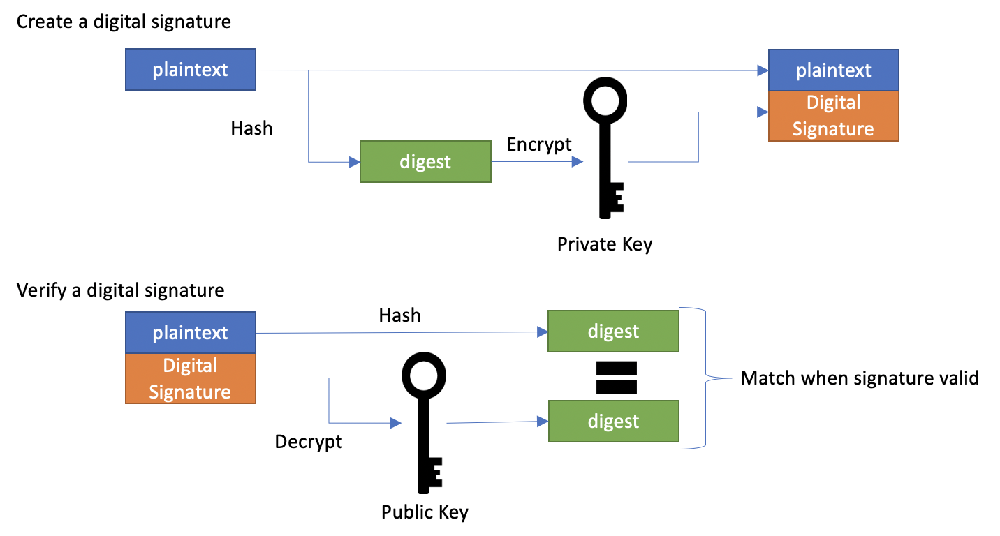
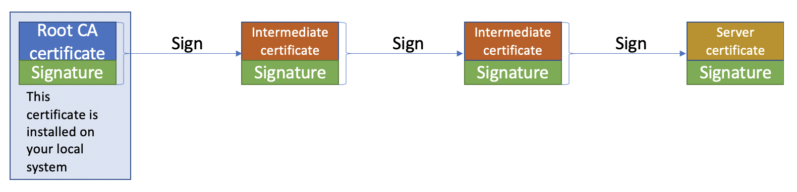
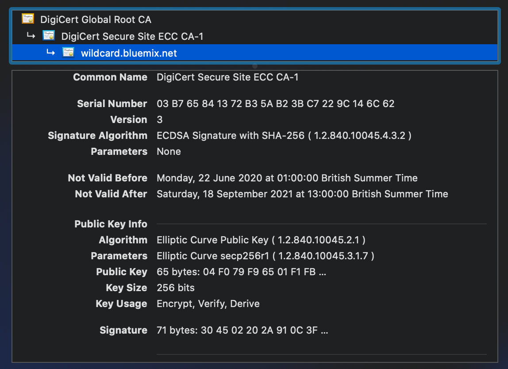
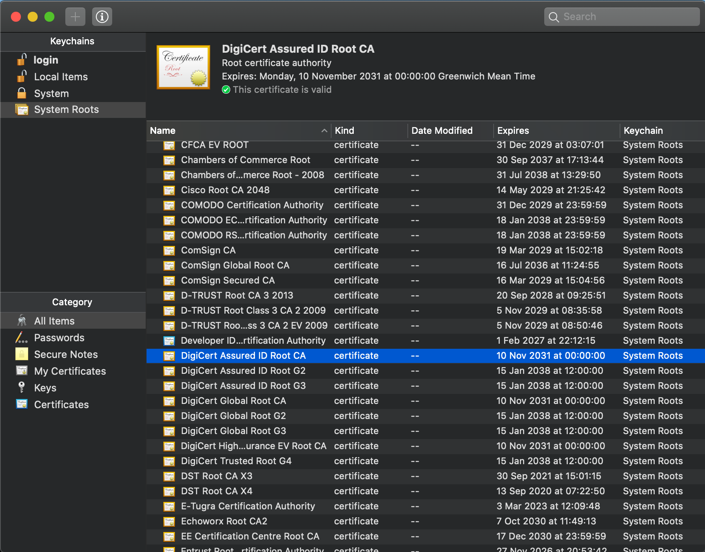

# Security for IoT and Internet traffic

Any device that uses the Internet for communication needs to have some level of protection.  Even if you think the data being sent isn't sensitive and doesn't need to be secured, there have been numerous instances where hackers have used insecure IoT devices to launch cyber attacks.

Also you may not be aware how the sensor data is being used, so whilst it may not appear to be sensitive data, but if a hacker interfered with the data it may impact the business, as other business process may be triggered by the IoT data.

## What do we mean by security

Security for internet applications is huge topic, which we cannot cover in depth in this workshop, but we will look at some of the basics and what we can do to secure an IoT solution.

The first questions to consider is "what is security?".  Security is a very loaded term, so lets look at some of the concerns:

### Privacy

Data sent over the internet can often contain sensitive information, such as a password or personal information, which must not be visible to anyone able to monitor network traffic.

### Trust

When using the Internet you want to be able to trust the connection and be assured that the server actually belongs to the organisation you think it does.  When doing online banking or shopping online you want to be able to verify who you are communicating with.

### Data Integrity

You want to be assured that data you send is received unaltered and similarly data you receive is what was actually sent.  There is no one able to capture and alter data as it crosses the Internet.

## Encryption

Encryption technology allows data to be encrypted, so when sent across the Internet ensuring only those with access to the secrets, or keys, needed to decrypt the data can get access to the original data.

There are numerous ways to encrypt data and we will look at 2 different technologies that are used to secure internet traffic.

### Symmetric Encryption

Symmetric encryption algorithms take data and use a secret, or key, to generate an encrypted representation of the data where the content can no longer be seen.

!!! Info
    The unencrypted data is referred to as plaintext and the encrypted representation is called ciphertext

Symmetric encryption uses the same secret, or key, to decrypt the ciphertext back into the plaintext version of the data.

Some common symmetric encryption algorithms you may encounter are : AES, Blowfish, RC4, DES, 3DES

### Asymmetric Encryption

Asymmetric encryption does the same as Symmetric encryption, where plaintext is converted to ciphertext.  But with asymmetric encryption, the key used to encrypt data is not the same as the key needed to decrypt the data.

Asymmetric encryption uses a pair of related keys, where a message encrypted by one key can only be decrypted by the other key.  One of the keys is kept secure, as the private key, but the other key is made public and distributed to anyone that may want to communicate with the owner of the private key.

Another advantage with asymmetric encryption is whoever is using the public key knows that they are communicating with whoever has the private key.  As private keys are never distributed, then asymmetric encryption gives whoever is using the public key a level of confidence about the identity of the private key holder.

Some command asymmetric encryption algorithms you may encounter are : RSA and Elliptic curve

### Asymmetric versus symmetric encryption

- Symmetric encryption is a relatively inexpensive computational operation compared to asymmetric encryption, so is faster, especially on lower powered devices
- Symmetric encryption requires both parties to have a common, shared secret or key.  Keeping the shared key secure is one of the big issues with symmetric encryption
- Asymmetric encryption allows 2 parties to communicate securely without having a shared key, as the public key can just be sent at the start of the conversation, then used to encrypt future traffic.  The private key is never shared, so is less likely to be compromised

## Digital Signatures

A digital signature allows data to remain unencrypted, but has a "signature" associated with it.  The signature does 2 things:

- Ensures the document hasn't been modified after being signed
- Captures the identity of the signer of the document

A digital signature relies on asymmetric encryption and a hashing algorithm.  The hashing algorithm is a way to produce a fixed length output based on an input of any length.  The output is often called the digest.

The hashing algorithm will always generate the same output for a given input, however, it is a 1 way operation.  There is no way to regenerate the original input from the output.  A hashing algorithm must also ensure that the original document cannot be altered and still produce the same hash output.

To digitally sign a document the digest is generated by the hashing algorithm, then the digest is encrypted using the private key of the signer.  This is then associated with the document.

To verify the signature you simply pass the document through the same hash algorithm to generate the digest.  Then using the public key of the signer you decrypt the digital signature.  The decrypted signature should contain a digest that matches the digest you generated, which shows the document hasn't been altered since being signed.

You are also assured of the identity of the document signer, as they had to have the private key to be able to encrypt the document digest.

## Certificates

Certificates are used with Internet Security, often called an SSL certificate.  They are X.509 certificates.  X.509 is a standard for public key certificates and is the most commonly used way to distribute public keys used with asymmetric encryption.

X.509 certificates can be used for many purposes, such as identifying a web server, client certificate to authenticate to a server or digital signing  and contains a number of pieces of information, including:

- Issues name
- Validity period (from and to dates)
- Subject name
- Public key
- Extension data
- Digital signature from the certificate issuer
- Details of the encryption algorithms used to generate the keys and sign the certificate

The exact content depends on the purpose of the certificate.  

Once of the key concepts with X.509 certificates is they help establish trust, so to be able to trust a certificate then you need to trust the certificate issuer.

To help secure web traffic on the web there are certain 'trusted' bodies called Certificate Authorities (CA) that are trusted to issue certificates.  Modern operating systems and some browsers have a collection of root certificate authority certificates, which are then used to verify certificates used when accessing web sites.  

Certificate Authorities have a set of practices which are meant to ensure that only validated people can request certificates, so I can't request a certificate to set up a web site claiming to be my bank or any other company I do not work for.

Certificates used by web sites form a chain of trust, that ends up at one of the root certificate authority certificates my browser can access, so all the digital signature can be checked to ensure the certificates haven't been tampered with since being issued and that the issuer is valid, as the signature had to be made using the private key, only accessible to them.

Most browsers allow you to inspect the certificates used to validate a web site.  Looking at the IBM Cloud web site, you see The Root Certificate Authority is **DigiCert Global Root CA** and they use an intermediate certificate **DigiCert Secure Site ECC CA-1** which then signed the **wildcard.bluemix.net** certificate (Bluemix was the previous name for IBM Cloud).

{style="width: 60%" .center}

You can also look at the Root CA certificates installed on your operating system:

- Linux : Different linux distributions use different locations, but Debian based systems store the Root CA certificates in /etc/ssl/certs.
- MacOS : Use the Keychain Access application in the Utilities folder under Applications.  Select System Roots to see the installed Root CA certificates
- Windows : Run the certlm.msc application then select the Trusted Root Certification Authorities then Certificates

    !!! Note
        Some browsers on don't use the OS Root CA store, but use their own collection of certificates, which are managed as part of the browser installation.

You should be able to find the DigiCert Global Root CA certificate

{style="width: 80%" .center}

### Validating a server

To get a browser to validate a server there are a number of things that are checked, which include:

- Certificate chain signatures are all checked and the root certificate in the chain is trusted as it is a certificate in the local Root CA store
- The certificate is in date (current date time is after the start date and before the end date defined within the certificate)
- The address the browser is connecting to matches to 1 entry within the DNS data within the server certificate - this is part of a certificate extension used for server certificates.

## SSL / TLS

In additional to validating the server, another important requirement when communicating over the Internet is encryption.  We don't want to send unencrypted data over the Internet.  

SSL (Secure Sockets Layer) was introduced to provide a mechanism for the server and client to agree on how to encrypt traffic.  As SSL evolved it transitioned into TLS (Transport Level Security),  both achieve the same goal, but the low level details are different.  However, the SSL name has stuck and most people still use SSL, but they are referring to TLS.

SSL and TLS define the process to allow a browser and server to establish a secure communication channel.  This is called the **handshake**.  Once the handshake completes the client and server have established a shared key to use to encrypt traffic for the rest of the connection.

### The TLS handshake

The TLS handshake is used to:

- verify the identity of the server, and optionally the client if client certificates are used.  This uses X.509 certificates and asymmetric encryption
- agree on the encryption algorithms to use.  There are multiple algorithms that can be used for asymmetric encryption, symmetric encryption and hashing algorithms.  Collectively these are called a cipher suite.
- create a shared secret to act as the key for the symmetric encryption which will be used after the handshake

The exact handshake process changed between TLS v1.2 and v1.3 to make it quicker by reducing the number of exchanges between client and server, but whilst still achieving the same outcome.

This section provided a general look at how web traffic is secured with TLS and the associated standards and protocols.  In the next section we will focus specifically on security for Internet of Things traffic.