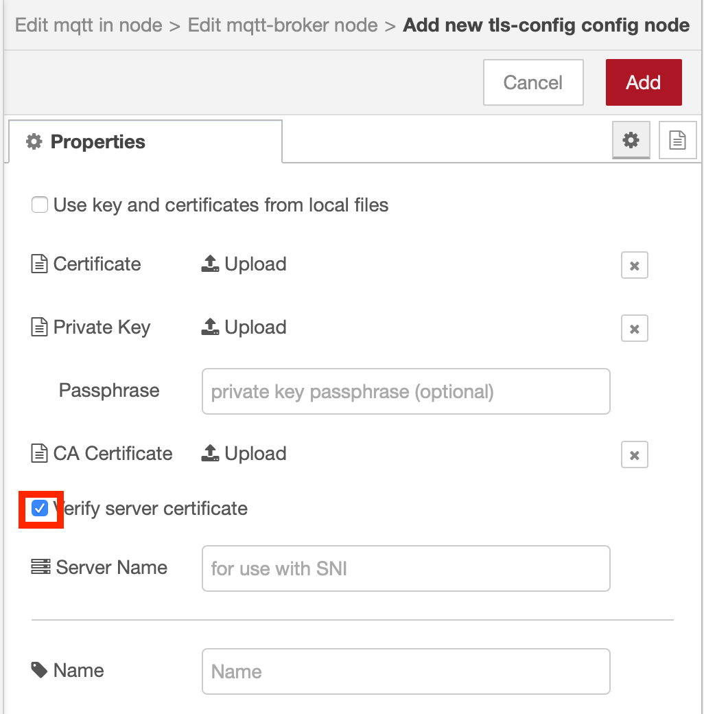
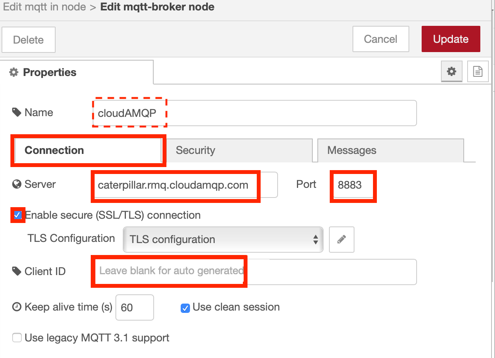
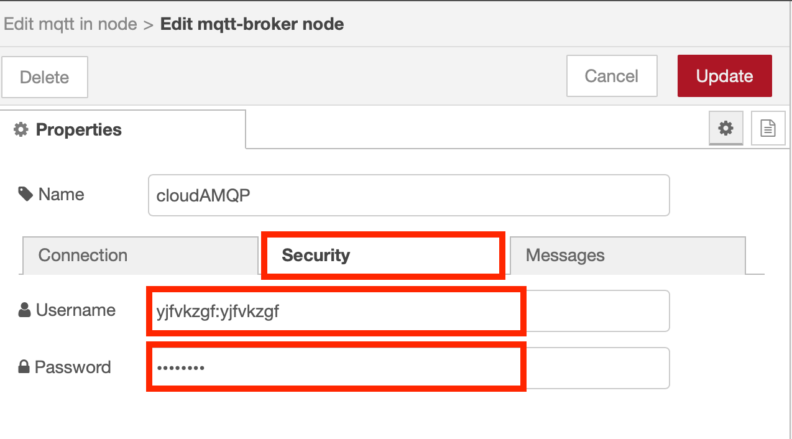
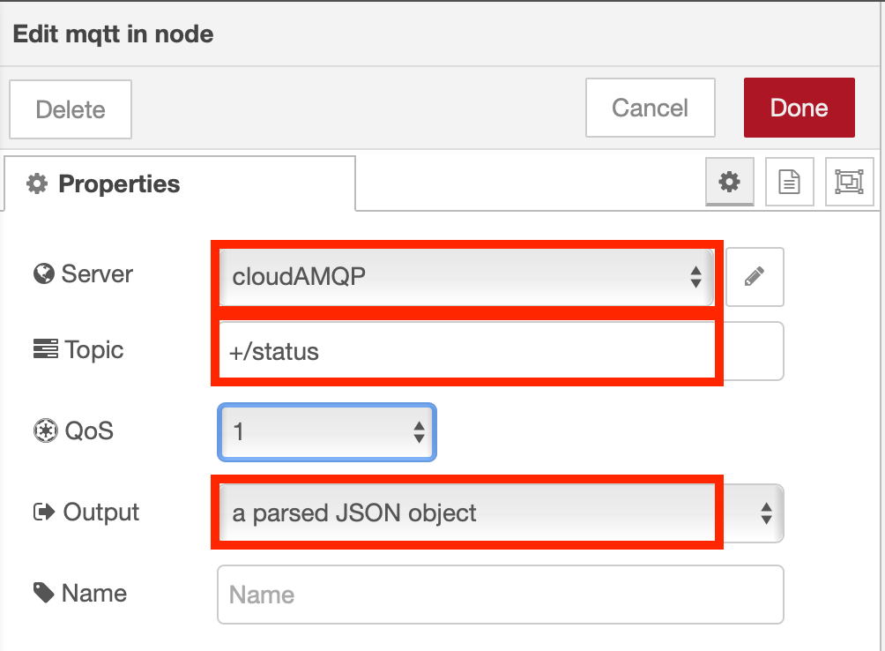
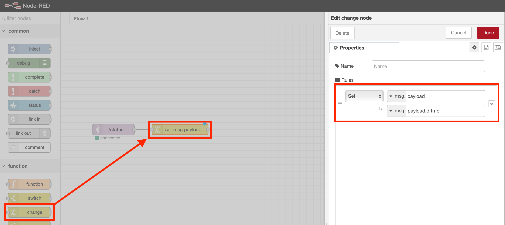
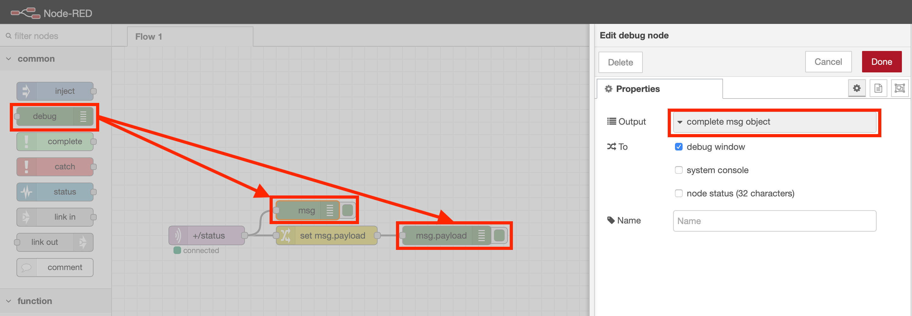
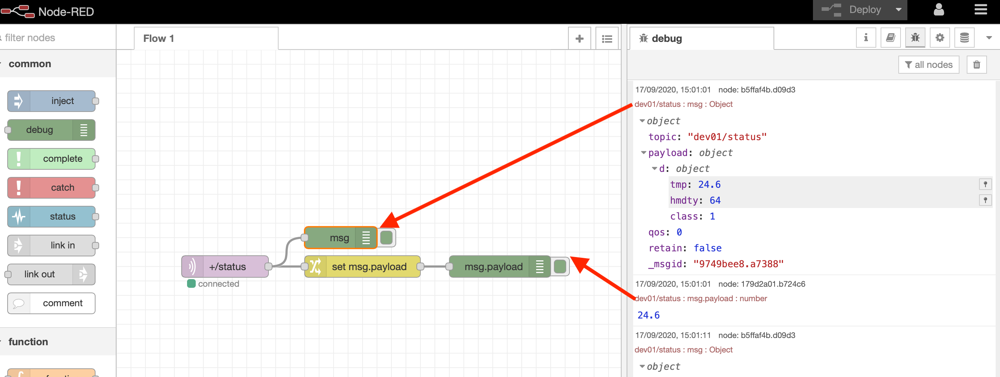

# Receive Device Environmental Sensor Data in Node-RED

## Lab Objectives

In this lab you will build a flow that receives Device environmental temperature and humidity sensor data.  You will learn:

- How to create a new Node-RED flow and configure MQTT Nodes
- How to output the Device environmental temperature and humidity data.
- How to work with JSON data and observe the sensor results in the Debug sidebar.

## Introduction

In just a few nodes, Node-RED can receive the data that was transmitted from the device over MQTT to the cloudAMQP MQTT Broker.  This simple exercise will be the foundation for the next several sections that plot the data in a dashboard, trigger Real Time threshold alerts, store the data in Cloud Storage and allow for data analytics and anomaly detection.

In part 2 you connected the ESP8266 application to the cloudAMQP broker using an MQTT client.  In this section you will connect a Node-RED application to the cloudAMQP broker.

## Create the Node-RED flow to receive device events

The Node-RED application will connect to the cloudAMQP MQTT Broker using the same credentials as the ESP8266 Device.  For paid plans of the cloudAMQP service there are additional options to secure connections, such as client certificates, but these are not available to the free, lite plan we are using.

If you want to experiment with client certificates then see the section on the [Mosquitto Broker](../mosquitto/README.md){target=_blank} in the Additional Resources section.

To configure the MQTT connection you will need :

- cloudAMQP service MQTT Hostname
- cloudAMQP service MQTT Username
- cloudAMQP service MQTT Password

Refer back to the [Adding MQTT](../part2/MQTT.html#step-1-the-mqtt-configuration) section in part 2 of the workshop if you need to remind yourself how to obtain this information.

### Step 1 - Configure an MQTT in Node

- From the Input category of the left Node-RED palette, select an **mqtt in node** and drag it onto your Node-RED flow.
- Double-click on the MQTT node. An **Edit mqtt in node** sidebar will open.
- Click the pencil icon next to the Server property to configure the MQTT server properties - this will open the **mqtt-broker node** sidebar
  - You can optionally name the configuration to make it easier to identify of you need to modify in future
  - Enter the MQTT Hostname in the Server field (from the cloudAMQP MQTT details panel)
  - Enter **8883** as the Port
  - Leave the Client ID blank
  - Enable secure (SSL/TLS) connection then select the pencil next to the TLS configuration to open the **Edit tls-config node** sidebar
    - Enable Verify server certificate
    - Select **Add** to close the **Edit tls-config node** {style="width: 80%" .center}
  - You have finished on the connection tab {style="width: 80%" .center}
  - Switch to the Security tab and enter the Username and Password for the cloudAMQP MQTT connection {style="width: 80%" .center}
  - press the Update button to return to the **Edit mqtt in node** sidepanel
- Set the topic field to **+/status**.  The wildcard **+** is used to select status events from all devices.
- Select the output as **a parsed JSON object** {style="width: 80%" .center}
- Press Done to close the config sidepanel

### Step 2 - Extract the Temperature from the JSON Object

- Recall that the environmental sensor data was transmitted in a JSON object

 ```{ "d": {"tmp":X, "hmdty":Y }}```

- Node-RED passes data from node to node in a *msg.payload* JSON object.
- The **Change** node can be used to extract a particular value so that it can be directly output or manipulated (for instance in a Dashboard chart which we will take advantage of in the next section).
- From the Function category of the left Node-RED palette, select a **Change** node and drag it onto your Node-RED flow
- Double-click on the Change node. An **Edit change node** sidebar will open
- Configure the "to" AZ dropdown to msg. and set it to *payload.d.tmp*
- Click on the red **Done** button
- Wire the node to the MQTT in node by clicking and dragging the connector on the right of the MQTT in node to the connector on the left of the change node
 {style="width: 80%" .center}

## Step 3 - Node-RED Debug Nodes

- Debug nodes can be used to print out JSON object values and help you validate your program.
- From the Output category of the left Node-RED palette, drag two **debug nodes** onto your Node-RED flow (7).
- Double-click on one of them. An **Edit debug node** sidebar will open.
- Configure the Output to print the *complete msg object* (8).
- Click on the red **Done** button.
- Wire the 2 nodes as shown
 {style="width: 80%" .center}

### Step 4 - Wire the Node-RED nodes together

- Click on the red **Deploy** button in the upper right corner.
  - The **mqtt in** node should show status **Connected**
  - Observe the DHT sensor data in the **debug** tab of the Node-RED right sidebar.  You can expand the twisties to expose the JSON object information. Hover over a debug message in the right sidebar and the node that generated the message will be outlined in orange.
  {style="width: 80%" .center}
