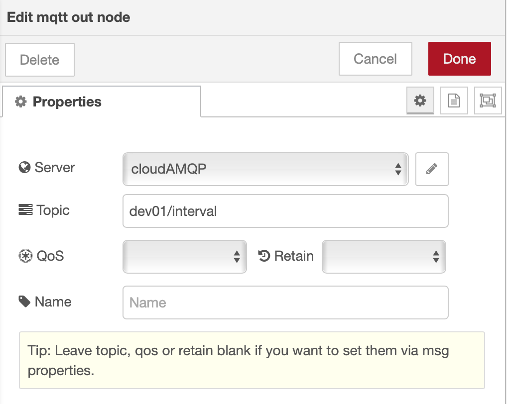

# Control your Device reporting interval via a Node-RED Dashboard Form

## Lab Objectives

In this lab you will modify the ESP8266 Arduino program to receive MQTT commands from the IBM Cloud and build a Node-RED Dashboard Form to dynamically change the reporting interval of the ESP8266 DHT environmental sensor data.  You will learn:

- How to build a Node-RED Dashboard Form
- How to send MQTT commands from the IBM Cloud to your ESP8266
- How to receive MQTT commands within your ESP8266 Arduino program / sketch.
- How to work with JSON data on the ESP8266

## Introduction

Remote management and control of IoT Devices is critical to managing the flow of sensor data to the Cloud. The IoT Device might only need to check in occasionally during quiet periods of inactivity. Waking up the device and requesting that it report sensor data more frequently during active time periods is better for power management, bandwidth consumption and cloud storage.

This section will build a Node-RED Dashboard Form where you can enter a new reporting interval.  A MQTT command will be published from the IBM Cloud to the ESP8266 device. The ESP8266 will receive the interval update and adjust how often it transmits the DHT environmental sensor data.

### Step 1 - Import the Node-RED Dashboard Reporting Interval Form Flow

- Open the “Get the Code” github URL listed below, mark or Ctrl-A to select all of the text, and copy the text for the flow to your Clipboard. Recall from a previous section, click on the Node-RED Menu, then Import, then Clipboard. Paste the text of the flow into the Import nodes dialog and press the red Import button.

Node-RED Dashboard Reporting Interval Form Flow [Get the Code:](flows/NRD-ReportingInterval-Form.json)

- Turn to the *Set ESP8266 Interval* flow tab.
- Fix the configuration of the **mqtt in** node
- Click the **Deploy** button on the top of menu bar to deploy the Node-RED flow.


### Step 2 - Node-RED Dashboard Form node

- The Node-RED Dashboard **Form** node can be customized to query user input fields - text, numbers, email addresses, passwords, checkboxes and switches.  Sophisticated forms can be constructed in one Node-RED Dashboard Form node.
- After entering the form data, the user can press **Submit** or **Cancel** buttons.
- When the **Submit** button is pressed the flow constructs a ```msg.payload``` JSON Object with the values entered.
- Double-click on the Dashboard Form node (1). An **Edit form node** sidebar will open.
- This form only has one element (2). It asks in a field labelled *Reporting Interval* for a numeric value. This value will be stored in a variable named *Seconds*
- You might experiment by adding additional elements (3) that could prompt for Text, Numbers, validated email addresses, Passwords (which will be masked when input as * ), Checkmarks or Switches.


- Press the Cancel button when you have finished experimenting with the form node.

### Step 3 - Description of the Set ESP8266 Interval flow

- The *Set ESP8266 Interval* flow contains just 5 nodes.
- The Dashboard **Form** node queries the user for a new interval value.
- The result is passed in a ```msg.payload.Seconds``` JSON Object to a **Switch** node which tests if the number entered is equal to or greater than Zero.
- The ```msg.payload``` is reformatted in a **Change** node using the JSONata Expression editor into a JSON Object ```{"Interval":msg.payload.Seconds}```
- The resulting JSON Object is passed to an **mqtt out** node.
- The topic configured in the **mqtt out** node specifies the device to receive the command.

### Step 4 - Send MQTT Commands using the **MQTT Out** Node

- Double-click on the IBM IoT node (4). An **Edit mqtt out node** sidebar will open.
- The **mqtt out** node is configured to send a **Device Command** (5) to your ESP8266 Device Id by using the appropriate topic.  The target device is identified as part of the topic
- The **Command Type** will be named *interval* and is also set in the topic
- Press the red Done button.



### Step 5 - Reprogram the ESP8266 to subscribe to MQTT Commands

- Open the “Get the Code” github URL listed below, mark or Ctrl-A to select all of the text, and copy the text for the replacement ESP8266 program.

IoT Workshop Arduino Program : [Get the Code](https://raw.githubusercontent.com/binnes/esp8266Workshop/master/IoTWorkshop.ino/IoTWorkshop.ino.ino)

- Return to the Arduino IDE
- Record your Watson IoT connection details from the top of your version of the existing IoTWorkshop.ino you created in Part 2.
- Replace the source code with the above.
- This version registers a callback and subscribes to MQTT Device Commands.
- The program loops but polls for MQTT incoming Commands.
- If a Interval command is sent, it updates how long it should sleep before sending the next DHT environmental sensor data.
- Merge in your Watson IoT connection details.
- Compile and Flash this updated program to the ESP8266

### Step 6 - Node-RED Dashboard Reporting Interval Form

- Turn to the Node-RED Dashboard browser tab, click on the menu tab in the upper left corner, and select the ESP8266 Interval tab.
- On the ESP8266 Interval dashboard, click on the form and enter a new value.
- Click on the **SUBMIT** button.
- The button will trigger the flow to send the new value to the ESP8266 over MQTT.


### Step 7 - Arduino Serial Monitor

- Launch the Serial Monitor from the Arduino IDE - *Tools -> Serial Monitor*
- Watch the Reporting Interval loop
- Change the reporting frequency in the Node-RED Dashboard Form.
- In this screenshot the Reporting Interval was changed from 10 to 5 to 2 and the frequency that the environmental data was sent increased.


