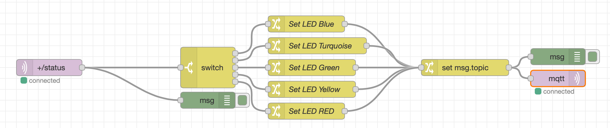

# Control your Device LED Colors via Node-RED

## Lab Objectives

In this lab you will modify / control your Device program to receive MQTT commands from the IBM Cloud and build a Node-RED flow to dynamically change the LED color of the device depending on Alert thresholds.  You will learn:

- How to send MQTT commands from the IBM Cloud to your device
- How to receive MQTT commands within your device program / sketch
- How to work with JSON data on the device

## Introduction

Remote management and control of IoT Devices is critical to managing the flow of sensor data to the Cloud. Hard coded values in the IoT Device should be replaced by dynamically controlled logic in the Cloud.

This section will build a Node-RED flow where you can change the LED color and temperature thresholds.  A MQTT command will be published from the IBM Cloud to the device. The device will receive the display update and set the LED color.

### Step 1 - Import the Node-RED Dashboard Reporting Interval Form Flow

- Open the “Get the Code” github URL listed below, mark or Ctrl-A to select all of the text, and copy the text for the flow to your Clipboard. Recall from a previous section, click on the Node-RED Menu, then Import, then Clipboard. Paste the text of the flow into the Import nodes dialog and press the red Import button.

Node-RED Set LED Threshold Flow : [Get the Code](https://binnes.github.io/esp8266Workshop/part3/flows/NR-SetLED-Threshold.json){target=_blank}

- Fix the **mqtt in** and **mqtt out** node configuration
- Click the **Deploy** button on the top of menu bar to deploy the Node-RED flow.

{style="width: 80%" .center}

### Step 2 - Node-RED Set LED flow

- The Node-RED flow receives the DHT environmental sensor data from the **mqtt in** node.
- A **Switch** node checks the temperature and depending on the value, chooses the Threshold color.
- Several **Change** nodes set the RGB color values.
- A **Change** node sets the topic value.  This is generated from the incoming topic using [JSONata](http://jsonata.org)
- The RGB values are sent using a MQTT *display* device command to the device.

### Step 3 - Temperature Threshold

- Double-click on the Switch node. An **Edit switch node** sidebar will open.
- The **Switch** node checks the temperature and depending on the value, chooses the Threshold color.

{style="width: 50%" .center}

- Press the Cancel button when you have finished reviewing the switch node.

### Step 4 - Send MQTT Commands using **mqtt out** Node

- Double-click on the **mqtt out** node. An **Edit mqtt out node** sidebar will open.
- The **mqtt out** node has no topic configured as it is sent in with the incoming message.
  {style="width: 50%" .center}
- Press the red Done button to close the **mqtt out** sidebar.
- Double-click the set msg.topic change node to open the **Edit change node** sidebar
- click the **...** after the to input box to open the JSONata editor
- See how the topic is created by extracting the device type and client id from the incoming topic
- The **Command Type** will be named *display*.
  {style="width: 50%" .center}
- Press the red Done button and then the red Done button again to close the side bars.

### Step 5 - Inspect ESP8266 program which handles Display Device Commands

- Return to the Arduino IDE
- The prior section already deployed the updated program to your ESP8266 and included the code to handle *display* commands to set the RGB LED colors.
- Inspect the section of code that sets the LED colors.
