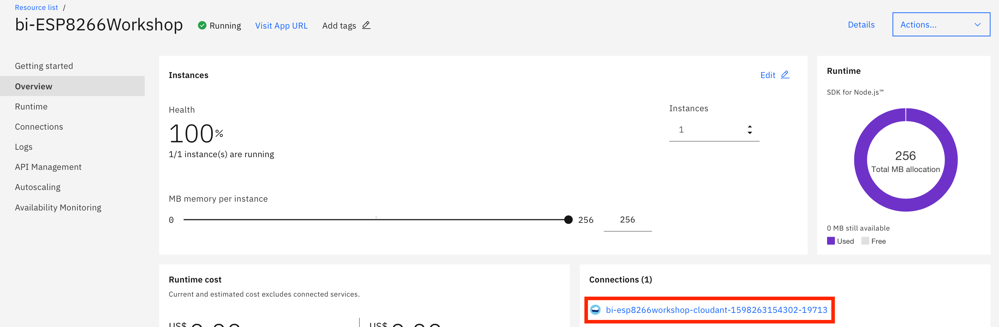
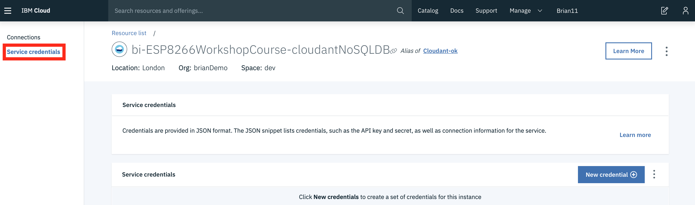
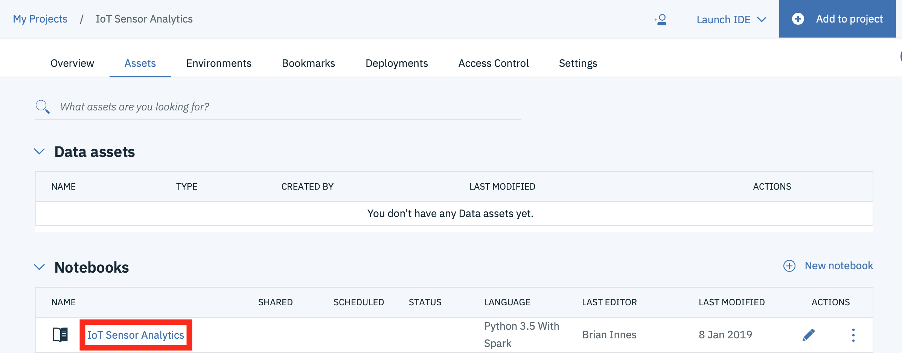
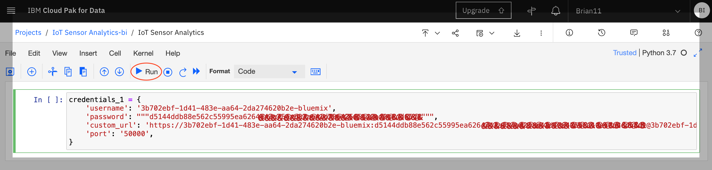
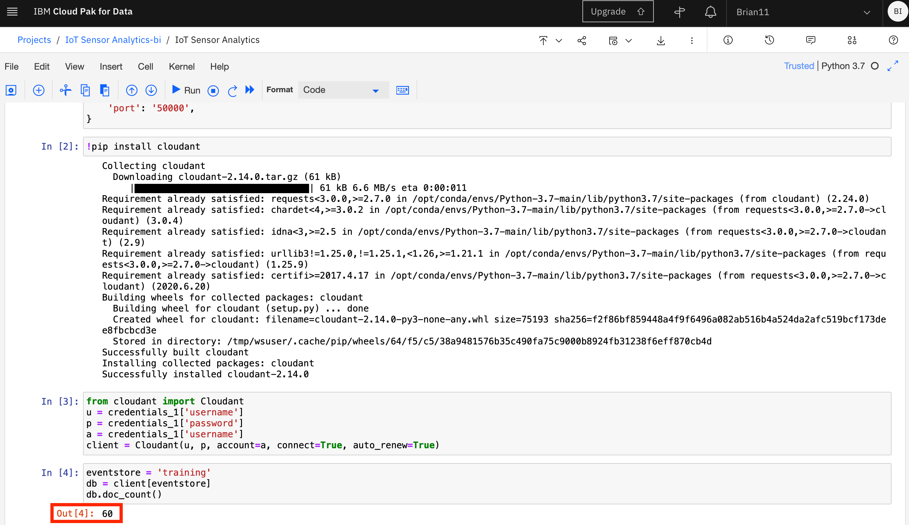

# Run a Jupyter Notebook in Watson Studio

## Lab Objectives

In this lab you will read IoT data into a Watson Studio Project Jupyter Notebook and perform some analytics.  You will learn:

- How to use Jupyter Notebooks
- How to read data from a Cloudant DB into Spark
- How to manipulate the data within the notebook environment
- How to create a model to be able to classify the IoT data to determine what is happening.

## Introduction

Jupyter Notebooks are a web-based computational environment for interactive data science and scientific computing. A Jupyter Notebook document is a JSON document, following a versioned schema, and containing an ordered list of input/output cells which can contain code, text (using Markdown), mathematics, plots and rich media, usually ending with the ".ipynb" extension. A Jupyter kernel is a program responsible for handling various types of request (code execution, code completions, inspection), and providing a reply.

The steps below will build up the Jupyter notebook, there is a solution notebook at the end to use if you need assistance to complete any step.

There are a number of ways of getting data into a Jupyter notebook.  The User interface provides a way to upload files and create connections to data providerts. For this example we will connect to the Cloudant data where the training data was stored using a Cloudant python library.

## Step 1 - Cloudant Credentials

Before we can read the ESP8266 IoT temperature and humidity data into a Jupyter notebook we need to create credentials for the Cloudant database where the training data is stored.

- Open a new browser tab.
- Return to the [IBM Cloud dashboard](https://cloud.ibm.com/login) and your IoT Starter application. **Click** on the cloudantNoSQLDB service connection (1). 
- Read about the Cloudant Storage service and click on the **Service credentials** menu item in the left menu bar. 

- Click on **New credential** 

- Give your credential a name: **Credentials-DSX**
- Click on **Add**
- Expand the **View credentials** twistie
- The Cloudant hostname, user and password credentials will be displayed.
- Keep this browser tab open or copy the credentials to your text editor, as you will use these credentials in the next Step.

### Step 2 - Loading Cloudant data into the Jupyter notebook

- Return to the Watson Studio browser tab and open the **IoT Sensor Analytics** notebook. 

- Make certain you are in **Edit** mode by clicking on the Pencil icon if it is showing. 

- Copy the following code into the first cell in the notebook, replacing **\<Cloudant Username>**, **\<Cloudant Password>** and **\<Cloudant URL>** with values obtained in the previous step

```python
credentials_1 = {
    'username': '<Cloudant Username>',
    'password': """<Cloudant Password>""",
    'custom_url': '<Cloudant URL>',
    'port': '50000',
}

```
- Once you have updated the credentials and URL then you can run the cell by pressing the Run button.  This will execute the code in the cell and create a new cell.



- in the next cell add code to import the cloudant package and run the cell

```python
!pip install cloudant
```

- The next cell will create the connection to Cloudant, so enter the code and run the cell.  Note this uses the credential information created in the first cell.  This shows that data is retained within the Jupyter environment, so you can access variables created in previous cells.

```python
from cloudant import Cloudant
u = credentials_1['username']
p = credentials_1['password']
a = credentials_1['username']
client = Cloudant(u, p, account=a, connect=True, auto_renew=True)
```

- then open the training database and get the number of documents available in the database.  When you run this cell you should see the number of documents in the training database output below the cell

```python
eventstore = 'training'
db = client[eventstore]
db.doc_count()
```



!!!Info
    If you want to clear out the data created by previously run steps then you can use the **Kernel** menu option to clear out and restart the notebook, or clear out and run all steps:

    

    If you clear output then you can select the first cell and press run, which will run the cell then move to the next cell in the notebook.  Keep pressing run to run each cell in turn, ensure you wait for each cell to complete (At the left side of the cell the indicator **[*]** turns to **[n]**, where n is a number) before running the next step.

## Step 3 - Work with the training data

Within the notebook you are able to manipulate the data. You usually need to examine the training data and maybe clean it up before creating the model.

- Read a subset of the records available -- if the event store holds many thousands of entries, there may be insufficient memory available to load them all
- The include_docs=True is necessary, otherwise all that is returned is the list of document ids.

```python
loadlimit = 1000
alldocs =  db.all_docs(limit=loadlimit, include_docs= True)
len(alldocs['rows'])
```

- Look at the first event/observation document, and select the features within the "doc" key that you want to include in modelling

```python
alldocs['rows'][0]
```

- In this case, the features of interest are temperature,humidity - the timestamp ts is going to be useful for spotting trends, time-based anomalies etc.  The class property provides the expected classification given the temperature and humidity readings, which will be used to train the model.
- Iterate the returned documents into an array of events with common schema

```python
events = []
for r in alldocs['rows']:
    doc = r["doc"]
    obs = [doc['time'],doc['temp'],doc['humidity'],doc['class']]
    events.append(obs)
```

- The events are now loaded in a form that can be converted into a dataframe, which will be used for subsequent steps

```python
import pandas as pd
df = pd.DataFrame(data=events,columns=["timestamp","temperature","humidity","class"])
display(df)
```

- Let's take a look as some of the features over time. We'll use MatPlotLib for visualisation

```python
import matplotlib.pyplot as plt
```

- visualise temperature over time

```python
plt.scatter(df['timestamp'],df['temperature'])
```

- visualise humidity over time

```python
plt.scatter(df['timestamp'],df['humidity'])
```

## Step 4 - Creating the binary classifier model

Once you are confident you have the correct training data available you can proceed to creating the model.

- we will use the popular [scikit-learn](https://scikit-learn.org/stable/){target=_blank} and [pandas](https://pandas.pydata.org){target=_blank} packages to build the model

```python
from sklearn import linear_model
import random
from scipy.special import expit
```

- separate the sensor readings from the classification (class)

```python
aX = []
aY = []
for i, row in df.iterrows():
    t= row["temperature"]
    h= row["humidity"]
    c= row["class"]
    obs = [t,h]
    aX.append(obs)
    aY.append([c])
```

- build a dataframe containing the training data and display the data frames

```python
import pandas as pd
X = pd.DataFrame(data=aX,columns=["temperature","humidity"])
y = pd.DataFrame(data=aY,columns=["class"])
display(y)
display(X)
```

- First we split the training data into 2 groups of 2 subsets.  75% of the data will be used to train the model and 25% will be used to test the model

```python
# split X and y into training and testing sets
from sklearn.model_selection import train_test_split

#fraction of input data to hold for testing -- excluded from the training
testsplit = 0.25

X_train,X_test,y_train,y_test = train_test_split(X,y,test_size=testsplit,random_state=0)
```

- look at the data to be used to train the model

```python
X_train
```

- Use the default Logistic Regression function to train based on the input observations

```python
from sklearn.linear_model import LogisticRegression
# instantiate the model (using the default parameters)
logreg = LogisticRegression()

# fit the model with data
logreg.fit(X_train,y_train)
```

!!! Info
    You can ignore the warning generated by the above cell

## Step 5 - Test the model

Once you have built the model you will want to verify how accurate the model is, so there are a number of ways we can do this.  The first one is to use an evaluator to get a measure of how good the model is.  A value of 1.0 represents 100% accuracy over the training data.

- calculate the class from the 25% of the training data that were set aside to test the model

```python
# generate the predictions from the test subset
y_pred=logreg.predict(X_test)
```

- Run a comparison between the actual values for the class, and the calculated values - this will generate a "confusion matrix" which shows how well the model can predict classes, and when it gets it wrong (false positives, false negatives)

```python
from sklearn import metrics
cnf_matrix = metrics.confusion_matrix(y_test, y_pred)
cnf_matrix
```

- output the model scores.  1.0 is 100% accurate

```python
print("Accuracy:",metrics.accuracy_score(y_test, y_pred))
print("Precision:",metrics.precision_score(y_test, y_pred))
print("Recall:",metrics.recall_score(y_test, y_pred))
```

- you can access the help for the logistic regression function

```python
help(logreg)
```

- Output the parameters of the trained model, so you can implement it on the ESP8266.  Initially the coefficients.  As the temperature was the first column in the training data, the first coefficient is the temperature coefficient and the second value is the humidity

```python
logreg.coef_
```

- Output the intercept value

```python
logreg.intercept_
```

These values will be used in the next section to implement the trained model on the ESP8266.

## Sample solution

There is a sample solution for this part provided in the [notebooks](https://github.com/binnes/esp8266Workshop/tree/master/docs/part4/notebooks){target=_blank} folder.  If you have an issue and want to see the solution then within the IoT Sensor Analytics project select to add a new notebook.  Select to create a notebook from file and give the notebook a name - here **IoT Sensor Analytics - solution** has been used.  This assumes you have the file locally on your machine.  Select choose file and locate the **IoT Sensor Analytics.ipynb** file.  Finally ensure you have the Default Python 3.7 XS runtime selected then press **Create Notebook**
  

Alternatively, you can select to import from URL and set the URL to : [https://raw.githubusercontent.com/binnes/esp8266Workshop/master/docs/part4/notebooks/IoT%20Sensor%20Analytics.ipynb](https://raw.githubusercontent.com/binnes/esp8266Workshop/master/docs/part4/notebooks/IoT%20Sensor%20Analytics.ipynb)
