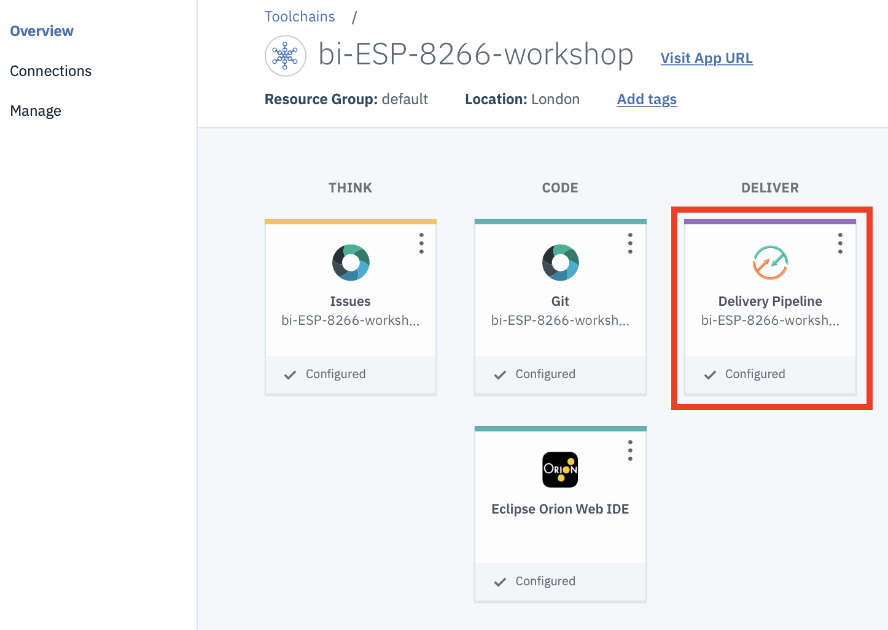
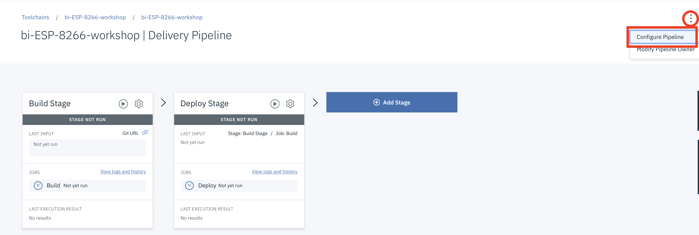
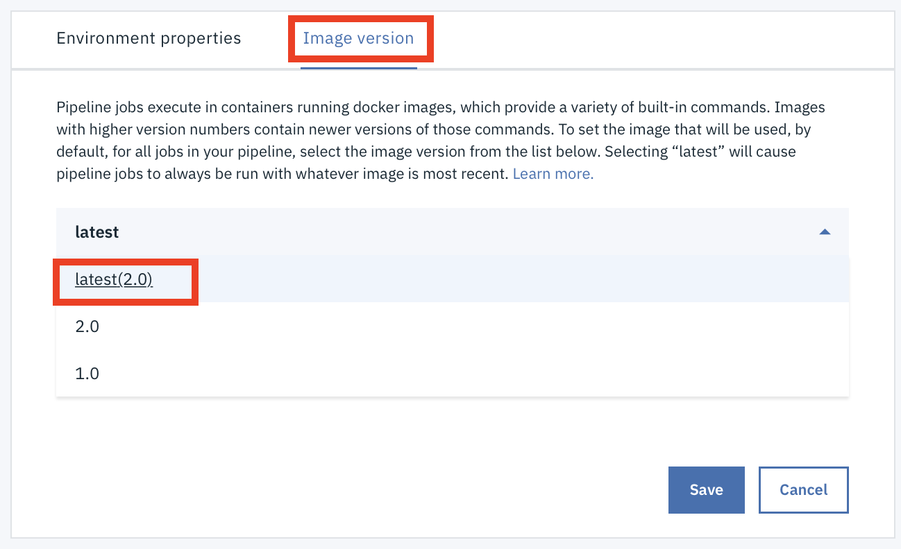
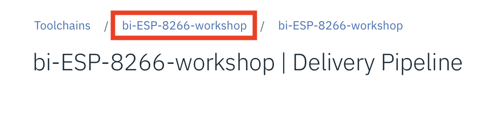
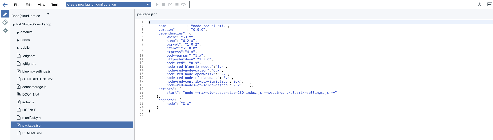
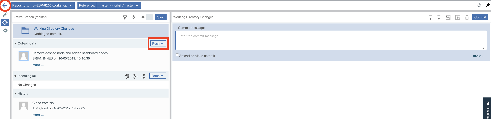
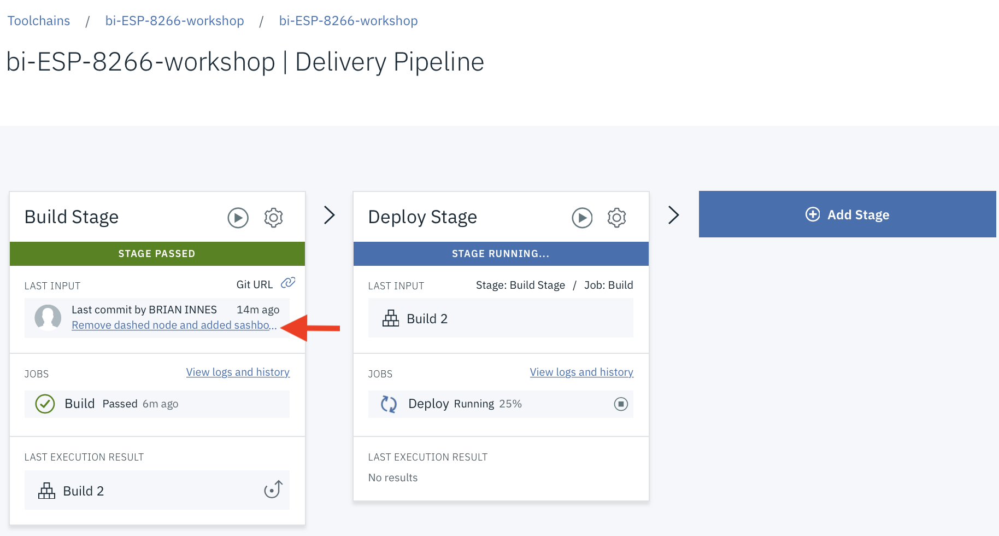

*Quick links :*
[Home](/README.md) - [**Part 1**](../part1/README.md) - [Part 2](../part2/README.md) - [Part 3](../part3/README.md) - [Part 4](../part4/README.md)
***
**Part 1** - [Setup](PREREQ.md) - [First App](FIRSTAPP.md) - [WIFI](WIFI.md) - [LED](LED.md) - [DHT](DHT.md) - [**Cloud**](IOTCLOUD.md)
***

# Deploying an application to the IBM Cloud

## Lab Objectives

In this lab you will learn how to deploy a starter application to the IBM Cloud.  You will learn:

- How to access the cloud and set the desired location to work in
- Access the catalog of services and select a Starter Kit to deploy
- Deploy a Starter Kit to the IBM Cloud
- Access the Starter Kit source code and update the starter application
- Become familiar with the DevOps tooling available in the IBM Cloud

## Introduction

Before finishing part 1 you should deploy the starter application that we will be using in Part 2, as this can take a few minutes to deploy and become available.

Before starting these steps it is assumed you have completed the steps in the [prerequisite section](PREREQ.md) and have an active IBM Cloud account.

### Step 1 - Accessing the cloud and selecting an appropriate space

[Login](https://cloud.ibm.com) to your cloud account and make sure you are working in one of the US South, United Kingdom or Germany locations, as these locations have all the required services we will be using for the rest of the workshop.

If you haven't previously used any of the locations you will need to create a **space** to be able to work in the chosen location.  To do this from the top menu select *Manage* -> *Account* -> *Cloud Foundry Orgs* then click on your mail address to configure your organisation.  Click to **Add a space** then select the region and provide a name for the space.

### Step 2 - Deploy a Starter Kit

Open up the Catalog using the top menu, then select Starter Kits from the left menu, then select the Internet of Things Platform Starter.  In the screen presented enter a name for your application - this needs to be a name that is unique to your application, so a good naming convention is to use your initials followed by a name that describes the purpose of the app or the solution name.  This will also form part of the URL for the application.

Next select the location and space you want to deploy the application into . Leave the Selected plan information at the default values then select the **Create** button.

The Starter Kit is now deploying a JavaScript application running Node-RED, a low code development environment, an instance of Cloudant NoSQL database and an instance of the Watson Internet of Things Platform.

Please leave this to deploy - now is a good time to go for a break.

### Step 3 - Enable Continuous Delivery

Once your application is deployed and running you need to enable the Continuous Delivery service, which will allow you to modify the Node-RED settings and runtime:


1. Switch to the Overview page of your deployed application
2. Press the **Enable** button in the continuous delivery section
3. Select the correct region and resource group you want to deploy the toolchain to, if the default values are not correct, then press the **Create** button at the bottom of the page to create the toolchain

    

4. You may be prompted to create a new API key, press the **Create** key to create the keys, or if you already have a key you want to use you can enter it. Then press the **Create** button at the bottom of the page to create to toolchain

    

5. Once the toolchain has been created select the Delivery Pipeline then select the dropdown menu (**⋮**) and then **Configure Pipeline**

    
    

6. Select the **Image version** section then ensure that the latest version of the images is selected for use, select Save if you changed the image version

    

7. Return to Toolchain overview, but clicking on breadcrumb train at top of page, you want the first time your toolchain name appears after Toolchains

    

You now have the application deployed and access to the source code and a devops pipeline configured to automatically build and redeploy the application whenever a change is pushed to the master branch of the git repository

### Step 4 - Modify the Node-RED configuration

In the next set of instructions you will access the browser based editor included with the Continuous Delivery toolchain to make changes to the Node-RED application

1. Select the **Eclipse Orion Web IDE** from the toolchain
2. Select **package.json** from the list of files

    

3. Modify the file, remove the sqldb-dashdb nodes and add the dashboard nodes.  The modified file should look like:

    ```JSON
    {
        "name"         : "iot-bluemix",
        "version"      : "0.6.0",
        "dependencies": {
            "when": "~3.x",
            "mongodb": "~1.4.x",
            "nano": "6.2.x",
            "bcrypt": "1.0.2",
            "cfenv":"~1.0.0",
            "express":"4.x",
            "body-parser":"1.x",
            "http-shutdown":"1.2.0",
            "node-red": "0.x",
            "node-red-bluemix-nodes":"1.x",
            "node-red-node-watson":"0.x",
            "node-red-node-openwhisk":"0.x",
            "node-red-node-cf-cloudant":"0.x",
            "node-red-contrib-scx-ibmiotapp":"0.x",
            "node-red-contrib-ibm-wiotp-device-ops":"0.x",
            "node-red-contrib-iot-virtual-device":"0.x",
            "node-red-contrib-ibmpush":"0.x",
            "node-red-contrib-bluemix-hdfs":"0.x",
            "node-red-dashboard":"2.x"
        },
        "scripts": {
            "start": "node --max-old-space-size=192 index.js --settings ./bluemix-settings.js -v"
        },
        "engines": {
            "node": "8.x"
        }
    }
    ```

4. Save the file using the shortcut (Ctrl or Cmd S) or use the menu **File → Save** option.
5. Switch to the Git section of the IDE, using the side menu icon.  Then enter a commit message for the change, verify the changed code is correct then hit the **Commit** button to commit the change to the local git branch
6. To make the change live you need to push the change to the master branch on the git server.  Press the **Push** button to send the committed changes from your local branch to the server master branch

    

7. Once you pushed the changes, the delivery pipeline will automatically notice the change and run the build and deploy stages of the delivery pipeline.  To see this:

    - select the arrow on the top menu (circled in the above image) to return to the toolchain
    - select delivery pipeline

    You should see the stages run.  You can see the last commit message in the build stage.  Once the pipeline has completed, your changes will be running

    

You now have the cloud application deployed, so you are now ready to move to the [next section](../part2/README.md) of the workshop to setup secured communications between the ESP8266 device and the IBM Cloud IOT service

***
*Quick links :*  
**Part 1** - [Setup](PREREQ.md) - [First App](FIRSTAPP.md) - [WIFI](WIFI.md) - [LED](LED.md) - [DHT](DHT.md) - [**Cloud**](IOTCLOUD.md)
***
[Home](/README.md) - [**Part 1**](../part1/README.md) - [Part 2](../part2/README.md) - [Part 3](../part3/README.md) - [Part 4](../part4/README.md)
