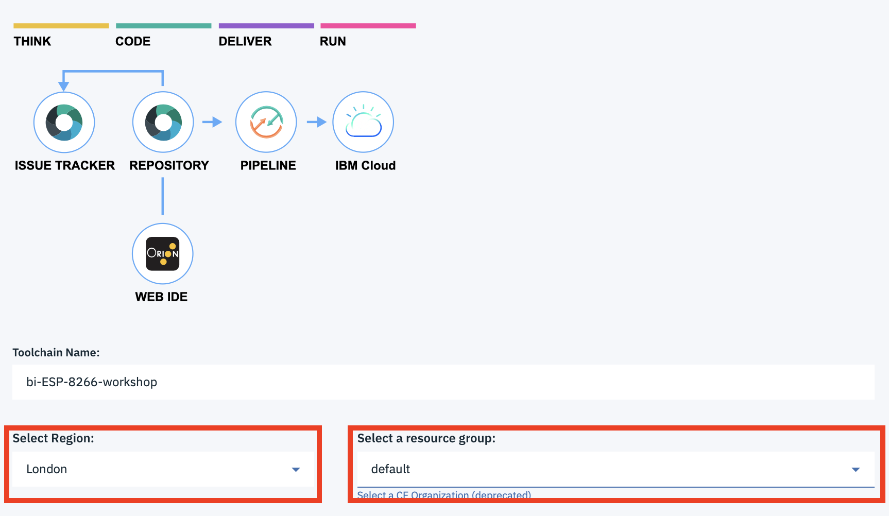
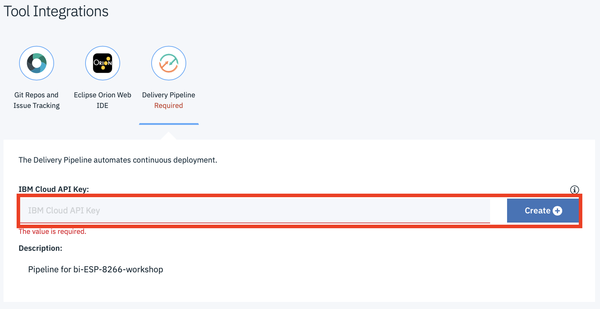
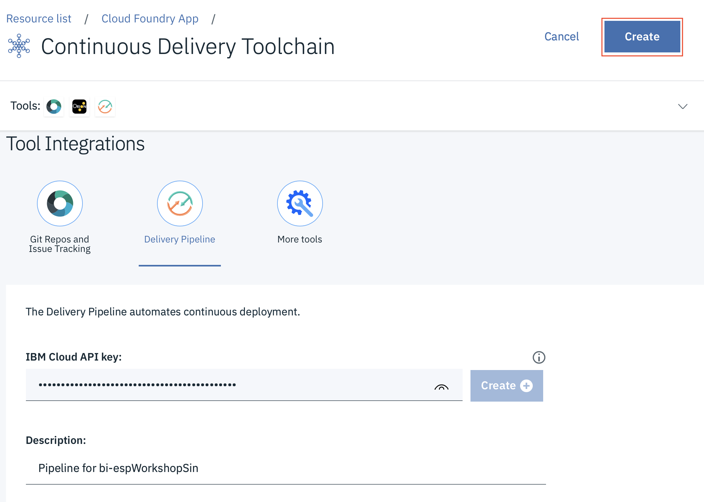
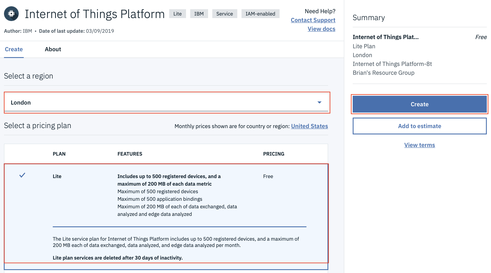

*Quick links :*
[Home](/README.md) - [**Part 1**](../part1/README.md) - [Part 2](../part2/README.md) - [Part 3](../part3/README.md) - [Part 4](../part4/README.md)
***
**Part 1** - [Setup](PREREQ.md) - [First App](FIRSTAPP.md) - [WIFI](WIFI.md) - [LED](LED.md) - [DHT](DHT.md) - [**Cloud**](IOTCLOUD.md)
***

# Deploying an application to the IBM Cloud

## Lab Objectives

In this lab you will learn how to deploy a starter application to the IBM Cloud.  You will learn:

- How to access the cloud and set the desired location to work in
- Access the catalog of services and select a Starter Kit to deploy
- Deploy a Starter Kit to the IBM Cloud
- Access the Starter Kit source code and update the starter application
- Become familiar with the DevOps tooling available in the IBM Cloud

## Introduction

Before finishing part 1 you should deploy the starter application that we will be using in Part 2, as this can take a few minutes to deploy and become available.

Before starting these steps it is assumed you have completed the steps in the [prerequisite section](PREREQ.md) and have an active IBM Cloud account.

### Step 1 - Accessing the cloud and selecting an appropriate space

[Login](https://cloud.ibm.com) to your cloud account and make sure you are working in one of the US South, United Kingdom or Germany locations, as these locations have all the required services we will be using for the rest of the workshop.

If you haven't previously used any of the locations you will need to create a **space** to be able to work in the chosen location.  To do this from the top menu select *Manage* -> *Account* -> *Cloud Foundry Orgs* then click on your mail address to configure your organisation.  Click to **Add a space** then select the region and provide a name for the space.

### Step 2 - Deploy a Starter Kit

- 0pen up the Catalog using the top menu, then select Starter Kits from the left menu
- select the Node-RED Starter
- in the screen presented choose the region your space is in (must be London, Frankfurt or Dallas)
- ensure the Lite plan is selected
- enter a name for your application - this needs to be a name that is unique to your application, so a good naming convention is to use your initials followed by a name that describes the purpose of the app or the solution name.  This will also form part of the URL for the application.
- verify the org and space you want to deploy the application into
- leave the Selected plan information at the default values then select the **Create** button.

The Starter Kit is now deploying a JavaScript application running Node-RED, a low code development environment and an instance of Cloudant NoSQL database.

Please leave this to deploy - now is a good time to go for a break.

### Step 3 - Enable Continuous Delivery

Once your application is deployed and running you need to enable the Continuous Delivery service, which will allow you to modify the Node-RED settings and runtime:

1. Switch to the Overview page of your deployed application
2. Press the **Enable** button in the continuous delivery section
3. Select the correct region and resource group you want to deploy the toolchain to, if the default values are not correct, then select the **Delivery Pipeline** section

    

4. Select **Create** to generate the IBM Cloud API key, press **Create** again to generate the key.

    

5. Select **Create** to create the toolchain

    

### Step 4 - Add the Internet of Things Platform service to your application

1. Select **Catalog** from the top menu
2. Select **Internet of Things** from the side menu
3. Select **Internet of Things Platform**
4. Ensure the same region is selected as the application is deployed in and the Lite plan is selected then hit the **Create button**
    
5. Change to the Connections section and press **Create connection**
6. Select your app (may need to select the CLOUD FOUNDRY SPACE to get the app to be populated on the page) then press **CONNECT**
7. Press **Connect & restage app**
8. Select the Dashboard from the main menu (Top left of web console UI)
9. Select Cloud Foundry Apps then select your application to return to your application overview page

You now have the cloud application deployed, so you are now ready to move to the [next section](../part2/README.md) of the workshop to setup secured communications between the ESP8266 device and the IBM Cloud IOT service

***
*Quick links :*  
**Part 1** - [Setup](PREREQ.md) - [First App](FIRSTAPP.md) - [WIFI](WIFI.md) - [LED](LED.md) - [DHT](DHT.md) - [**Cloud**](IOTCLOUD.md)
***
[Home](/README.md) - [**Part 1**](../part1/README.md) - [Part 2](../part2/README.md) - [Part 3](../part3/README.md) - [Part 4](../part4/README.md)
