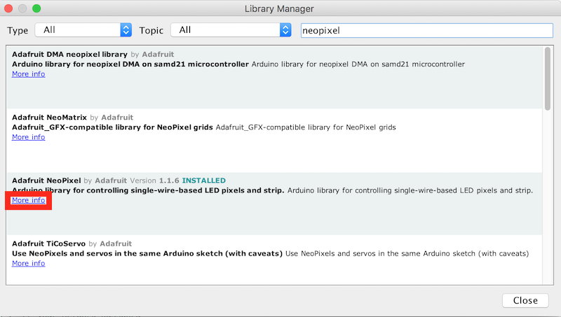

*Quick links :*
[Home](/README.md) - [**Part 1**](../part1/README.md) - [Part 2](../part2/README.md) - [Part 3](../part3/README.md) - [Part 4](../part4/README.md)
***
**Part 1** - [Setup](PREREQ.md) - [First App](FIRSTAPP.md) - [WIFI](WIFI.md) - [**LED**](LED.md) - [DHT](DHT.md) - [Cloud](IOTCLOUD.md)
***

# Controlling the RGB LED from the ESP8266

## Lab Objectives

In this Lab you will connect the NeoPixel LED and learn how to control it from the ESP8266.  You will learn:

- The electrical connections of the LED and how to connect to the ESP8266
- The library used to control the neopixel
- How to add new libraries to the Arduino IDE
- How to use the neopixel Library and access documentation for additional features

## Introduction

During the last practical we used the ESPWiFi library that was installed as part of the plugin but now we want to control a neopixel RGB LED that we will connect to the ESP8266.  One of the advantages of using Arduino is that there are many libraries available, so most common hardware will usually have an Arduino library available, so you won't need to implement the low-level control protocol for a device.

You need to be careful to ensure that any library you choose supports the hardware you are running on.  Initially the Arduino platform was created around AVR microprocessors and many libraries were written to directly interact with AVR processors, so are incompatible when targeting a different processor.  Looking at the Arduino ESP8266 documentation there is a [list of libraries](http://arduino-esp8266.readthedocs.io/en/latest/libraries.html#other-libraries-not-included-with-the-ide) known to work with ESP8266.

### Step 1 - Adding a Library to the Arduino IDE

Looking at the list, there is a compatible NeoPixel library available for the neopixel.  To install a library into the Arduino IDE you can use the Library Manager.  From the menu select *Sketch* -> *Include Library* -> *Manage Libraries...* to bring up the Library Manager.  In the search box enter NeoPixel to find libraries matching the search.  You can see there are a number of libraries available, but you want to find the Adafruit NeoPixel by Adafruit, then select the entry and click install to install the library. Once the library in installed click **close** to close the Library Manager.

### Step 2 - Connecting the Neopixel to the ESP8266 board

Now you need to connect the NeoPixel to the ESP8266.  Before you start making any connections please disconnect the device from your laptop/workstation so there is no power getting to the device.  You should never make any connection changes when the device is powered on.

Before making the connections we need to identify the 4 connecting pins coming out of the LED.  If you examine the rim of the pixel cover you will see that one side is flattened (this should be the opposite side from the shortest pin) - this pin next to the flattened side is the **Data Out** pin.  We will not be using this pin, as we only have a single pixel.  You can chain pixels together connecting the **Data Out** pin to the **Data In** pin of the next pixel in the chain.

The shortest pin on the Pixel is the **Data In**
The longest pin on the Pixel is **Ground**
The remaining pin is **+'ve voltage**, which should be 5v, but it works with 3.3v that the ESP8266 board provides.

So, with the shortest pin on the left and the flat side on the right the pinout is (left to right):

- Data In (shortest pin)
- +'ve Voltage
- Gnd (longest pin)
- Data Out (no connection)

You need to connect the Data In, +'ve voltage and ground to the ESP8266 board as shown in the diagram.  Take care to ensure that the connections are as shown, as connecting the wrong pins can damage the ESP8266 board and/or the LED:


### Step 3 - Load an example sketch

Once you have the connections made you can connect the board to your laptop.  Load the example sketch **strandtest** *File* -> *Examples* -> *AdaFruit Neopixel* -> *strandtest*.  You need to make a couple of changes to the example sketch:

1. Change the PIN number to 5.  D1 on the NodeMCU board maps to GPIO5 on the ESP8266 processor - see the [pinout](https://circuits4you.com/2017/12/31/nodemcu-pinout/)
2. Set the number of pixels to 1 in the strip definition line
3. In the loop function comment out the 4 lines starting with **theatreChase** as these cause rapid flashing when only a single LED is connected, which is not pleasant to look at.

When you save the file you should be prompted to save it as a new file (you cannot override example files, so need to save them to another location to be able to modify them).

Compile and upload the sketch to see the LED change colours.

The top of your code should look like this:

```cpp
#include <Adafruit_NeoPixel.h>
#ifdef __AVR__
  #include <avr/power.h>
#endif

#define PIN 5

// Parameter 1 = number of pixels in strip
// Parameter 2 = Arduino pin number (most are valid)
// Parameter 3 = pixel type flags, add together as needed:
//   NEO_KHZ800  800 KHz bitstream (most NeoPixel products w/WS2812 LEDs)
//   NEO_KHZ400  400 KHz (classic 'v1' (not v2) FLORA pixels, WS2811 drivers)
//   NEO_GRB     Pixels are wired for GRB bitstream (most NeoPixel products)
//   NEO_RGB     Pixels are wired for RGB bitstream (v1 FLORA pixels, not v2)
//   NEO_RGBW    Pixels are wired for RGBW bitstream (NeoPixel RGBW products)
Adafruit_NeoPixel strip = Adafruit_NeoPixel(1, PIN, NEO_GRB + NEO_KHZ800);

// IMPORTANT: To reduce NeoPixel burnout risk, add 1000 uF capacitor across
// pixel power leads, add 300 - 500 Ohm resistor on first pixel's data input
// and minimize distance between Arduino and first pixel.  Avoid connecting
// on a live circuit...if you must, connect GND first.

void setup() {
  // This is for Trinket 5V 16MHz, you can remove these three lines if you are not using a Trinket
  #if defined (__AVR_ATtiny85__)
    if (F_CPU == 16000000) clock_prescale_set(clock_div_1);
  #endif
  // End of trinket special code


  strip.begin();
  strip.show(); // Initialize all pixels to 'off'
}

void loop() {
  // Some example procedures showing how to display to the pixels:
  colorWipe(strip.Color(255, 0, 0), 50); // Red
  colorWipe(strip.Color(0, 255, 0), 50); // Green
  colorWipe(strip.Color(0, 0, 255), 50); // Blue
//colorWipe(strip.Color(0, 0, 0, 255), 50); // White RGBW
  // Send a theater pixel chase in...
  //theaterChase(strip.Color(127, 127, 127), 50); // White
  //theaterChase(strip.Color(127, 0, 0), 50); // Red
  //theaterChase(strip.Color(0, 0, 127), 50); // Blue

  rainbow(20);
  rainbowCycle(20);
  //theaterChaseRainbow(50);
}
```

### Step 4 -  Understanding how use the neopixel library

To add the NeoPixel to your own application you need to do the following:

1. Create an instance of a Neopixel `Adafruit_NeoPixel strip = Adafruit_NeoPixel(1, LED_PIN, NEO_GRB + NEO_KHZ800);`
    - The first parameter is the number of pixels in the chain
    - the second parameter is the GPIO number the pixel(s) are connected to
    - The third parameter allows you to identify what type of pixel is connected.  There are a number of different types of pixel.  Some include a white LED to give a better white light.  Some expect the green data to be sent first whilst others require the red data to be sent first.  There are also different communication speeds used.
2. Before using any commands to alter the pixels you need to initialise the pixel library using the **begin()** call.  `strip.begin();`  This is usually done in the **setup()** function.
3. Set the pixels to the desired colours (note: this doesn't change the pixel colours immediately)
    - There are a number of calls in the neopixel library to be able to set the colour of a pixel.  The first parameter always is the number of the pixel you want to set in the chain (starting with 0 as the first pixel):
        - `setPixelColor(uint16_t n, uint8_t r, uint8_t g, uint8_t b)`
        - `setPixelColor(uint16_t n, uint8_t r, uint8_t g, uint8_t b, uint8_t w)`
        - `setPixelColor(uint16_t n, uint32_t c)`
    - There are 2 ways to specify a colour to the **setPixelColor()** call.  You can pass in the red, green, blue and optionally white values (0 - 255) for each of the LEDs within the pixel or use the **Color()** function to create a single 32bit integer value representing a colour.  This can be useful for passing to and returning from other function calls, as shown in the example sketch:
        - `Color(uint8_t r, uint8_t g, uint8_t b)`
        - `Color(uint8_t r, uint8_t g, uint8_t b, uint8_t w)`
4. Call the **show()** function to send the colour changes to the pixel(s) : `strip.show();`.  This is the function that actually updates the pixels based on the previous setPixelColor function calls.

For any library installed with the Arduino Library Manager you can get to the documentation for the library using the **More info** link in the Library Manager:



***
*Quick links :*  
**Part 1** - [Setup](PREREQ.md) - [First App](FIRSTAPP.md) - [WIFI](WIFI.md) - [**LED**](LED.md) - [DHT](DHT.md) - [Cloud](IOTCLOUD.md)
***
[Home](/README.md) - [**Part 1**](../part1/README.md) - [Part 2](../part2/README.md) - [Part 3](../part3/README.md) - [Part 4](../part4/README.md)
