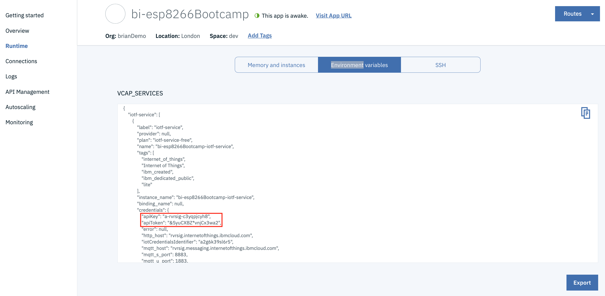
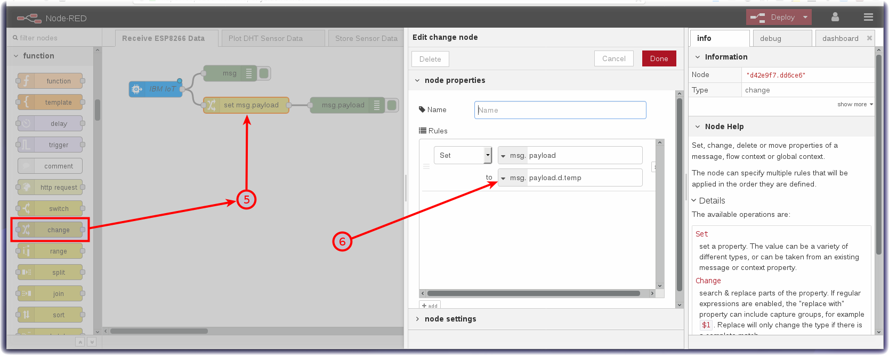
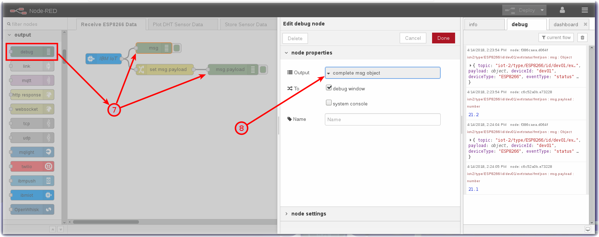
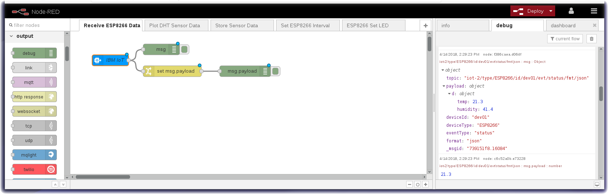

*Quick links :*
[Home](/README.md) - [Part 1](../part1/README.md) - [Part 2](../part2/README.md) - [**Part 3**](../part3/README.md) - [Part 4](../part4/README.md)
***
**Part 3** - [Intro to Node-RED](NODERED.md) - [**Receive Sensor Data**](DHTDATA.md) - [Plot Data](DASHBOARD.md) - [Store Data](CLOUDANT.md) - [Historical Data](HISTORY.md) - [Control Interval](INTERVAL.md) - [Control LED](LED.md)
***

# Receive Device Environmental Sensor Data in Node-RED

## Lab Objectives

In this lab you will build a flow that receives Device environmental temperature and humidity sensor data.  You will learn:

- How to create a new Node-RED flow and configure MQTT Nodes
- How to output the Device environmental temperature and humidity data.
- How to work with JSON data and observe the sensor results in the Debug sidebar.

## Introduction

In just a few nodes, Node-RED can receive the data that was transmitted from the device over MQTT to Watson IoT Platform.  This simple exercise will be the foundation for the next several sections that plot the data in a dashboard, trigger Real Time threshold alerts, store the data in Cloud Storage and allow for data analytics and anomaly detection.

## MQTT Application connections

In part 2 you connected the ESP8266 application to the IoT platform using an MQTT client.  In this section you will connect a Node-RED application to the IoT platform.

The IoT platform uses the open source MQTT protocol to allow devices an applications to connect to the IoT platform, however, it adds some additional security and restrictions over those defined by the MQTT standard.  

### Connection types

In part 2 you defined a device type and created a device on the platform to represent your ESP8266 board.  The connection was created as a device.  

In this section you will connect the Node-RED application as an application connection.  Application connections have greater access than a device connection.  Device connections can only produce events and consume commands as the registered device.  Gateways are a special type of device connection with additional privileges that can act on behalf of other devices if they are authorised.

Application connections can consume events from all devices, publish events on behalf of a devices and send commands to devices.

The client ID sent as part of the connection request must include a client ID, which is of a fixed format :

- Application : **a:*orgId*:*appId***
- Scalable application : **A:*orgId*:*appId***
- Device : **d:*orgId*:*deviceType*:*deviceId***
- Gateway : **g:*orgId*:*typeId*:*deviceId***

### Topics

The IoT platform restricts the topic space used by MQTT.  If you attempt to use an invalid topic your connection will be terminated.  The valid topics are specified in the [IoT platform documentation](https://www.ibm.com/support/knowledgecenter/SSQP8H/iot/platform/applications/mqtt.html) but for this section the 2 topics you need to know about are:

- Subscribing to device events : **iot-2/type/*device_type*/id/*device_id*/evt/*event_id*/fmt/*format_string***
- Publishing device commands : **iot-2/type/*device_type*/id/*device_id*/cmd/*command_id*/fmt/*format_string***

where *device_type*, *device_id*, *event_id*, *command_id* and *format_string* are set accordingly.

When subscribing to topics the wildcard character **+** can be used to subscribe to all events of from any device type, device, event type or format.

### Authentication

In part 2 you needed to register your device to get the token to authenticate against.  With an application you need to use and API key and API token to authenticate.

When the IoT platform is bound to a CloudFoundry application on the IBM Cloud a API key and token are automatically generated and can be seen in the Runtime environment variable section of the application view on the IBM Cloud web user interface 

You can use the automatically generated values or create your own from the App section of the IoT Platform web console 

If generating your own key you must take a note of the token as, like the device token, once the screen showing the token is closed it is not recoverable.

The API Key is used as the username when connecting and the API Token is the password.

### Custom Certificates

If you have a custom server certificate configured on the IoT platform then you must use the SNI (Server Name Indication) extension to the TLS protocol to specify the server name in the connection parameters or the IoT platorm will not use your custom certificate.

## Create the Node-RED flow to receive device events

### Step 1 - Configure an MQTT in Node

- From the Input category of the left Node-RED palette, select an **mqtt in node** and drag it onto your Node-RED flow.
- Double-click on the MQTT node. An **Edit mqtt in node** sidebar will open.
- Click the pencil icon next to the Server property to configure the MQTT server properties - this will open the **mqtt-broker node** sidebar
  - Enter the server name in the Server field (*orgId*.messaging.internetofthings.ibmcloud.com)
  - Enter 8883 as the Port
  - Enter the Client ID (a:*orgId*:*appId*).  The appID can be any unique string
  - Enable secure (SSL/TLS) connection then select the pencil next to the TLS configuration to open the **Edit tls-config node** sidebar
    - Upload the rootCA_certificate.pem file you created in part 2 that is enabled on your server as the CA Certificate
    - Enable Verify server certificate
    - Enter the Server Name (*orgId*.messaging.internetofthings.ibmcloud.com).  This sets the SNI extension on the TLS connection
    - Select Update to close the **Edit tls-config node** 
  - You have finished on the connection tab 
  - Switch to the Security tab and enter the Username and Password - get these from the application runtime environment variables tab of your IBM Cloud application 
  - press the Update button to return to the **Edit mqtt in node** sidepanel
- Set the topic field to **iot-2/type/+/id/+/evt/+/fmt/json**.  The wildcard **+** is used to select all events from all devices and all events.  The topic requires that the event contains JSON data.
- Select the output as **a parsed JSON object** 
- Press Done to close the config sidepanel

### Step 2 - Extract the Temperature from the JSON Object

- Recall that the environmental sensor data was transmitted in a JSON object

 ```{ "d": {"temp":X, "humidity":Y }}```

- Node-RED passes data from node to node in a *msg.payload* JSON object.
- The **Change** node can be used to extract a particular value so that it can be directly output or manipulated (for instance in a Dashboard chart which we will take advantage of in the next section).
- From the Function category of the left Node-RED palette, select a **Change** node and drag it onto your Node-RED flow
- Double-click on the Change node. An **Edit change node** sidebar will open
- Configure the "to" AZ dropdown to msg. and set it to *payload.d.temp*
- Click on the red **Done** button
- Wire the node to the MQTT in node by clicking and dragging the connector on the right of the MQTT in node to the connector on the left of the change node
 

## Step 3 - Node-RED Debug Nodes

- Debug nodes can be used to print out JSON object values and help you validate your program.
- From the Output category of the left Node-RED palette, drag two **debug nodes** onto your Node-RED flow (7).
- Double-click on one of them. An **Edit debug node** sidebar will open.
- Configure the Output to print the *complete msg object* (8).
- Click on the red **Done** button.
- Wire the 2 nodes as shown
 

### Step 4 - Wire the Node-RED nodes together

- Click on the red **Deploy** button in the upper right corner.
  - The **mqtt in** node should show status **Connected**
  - Observe the DHT sensor data in the **debug** tab of the Node-RED right sidebar.  You can expand the twisties to expose the JSON object information. Hover over a debug message in the right sidebar and the node that generated the message will be outlined in orange.
  

***
**Part 3** - [Intro to Node-RED](NODERED.md) - [**Receive Sensor Data**](DHTDATA.md) - [Plot Data](DASHBOARD.md) - [Store Data](CLOUDANT.md) - [Historical Data](HISTORY.md) - [Control Interval](INTERVAL.md) - [Control LED](LED.md)
***
*Quick links :*
[Home](/README.md) - [Part 1](../part1/README.md) - [Part 2](../part2/README.md) - [**Part 3**](../part3/README.md) - [Part 4](../part4/README.md)
