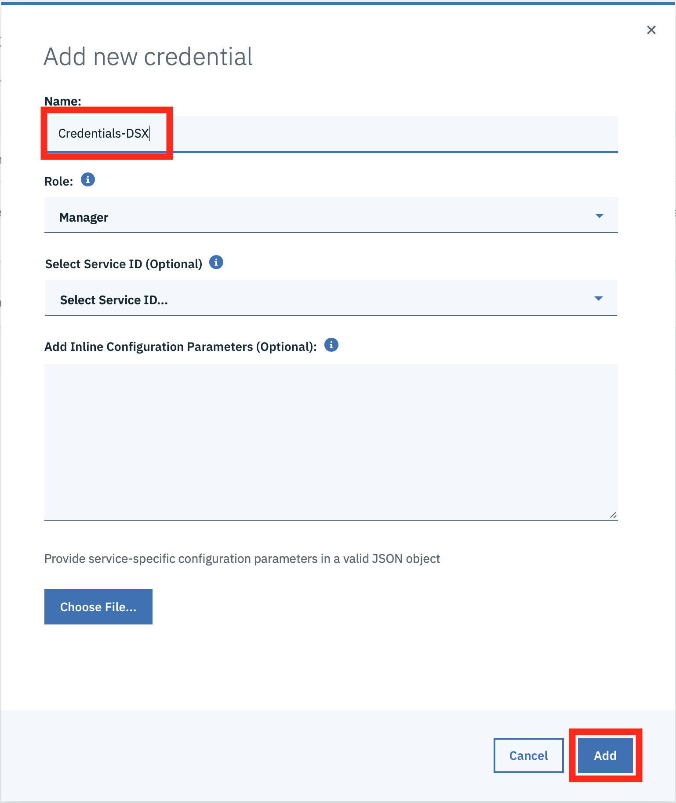
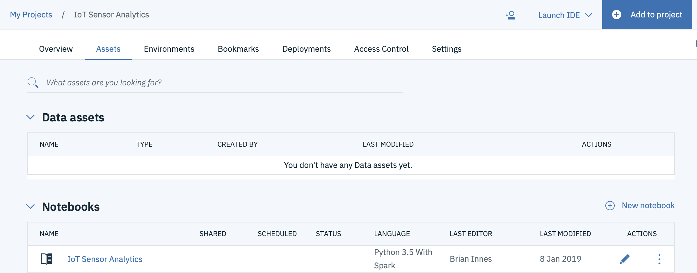
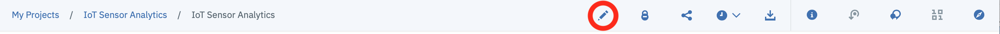
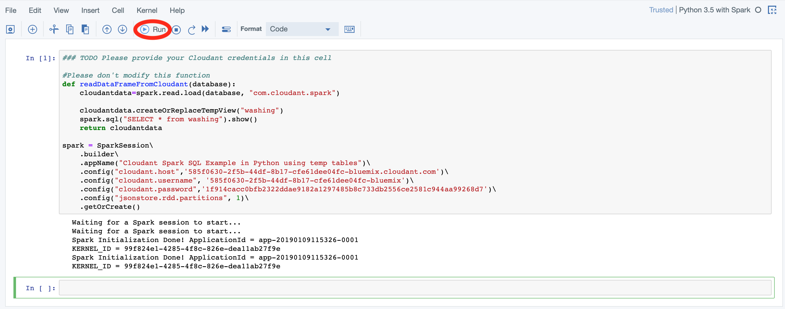
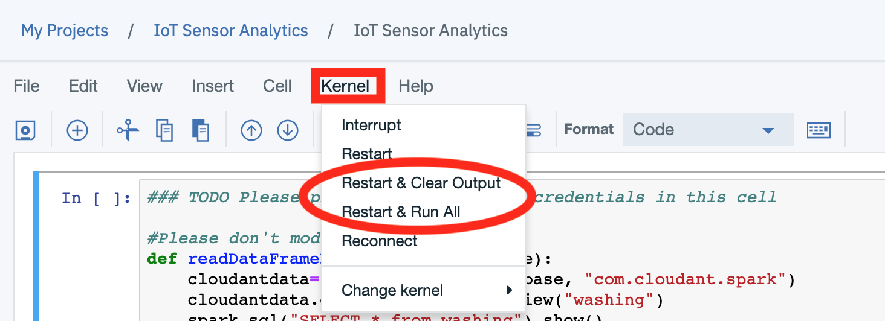
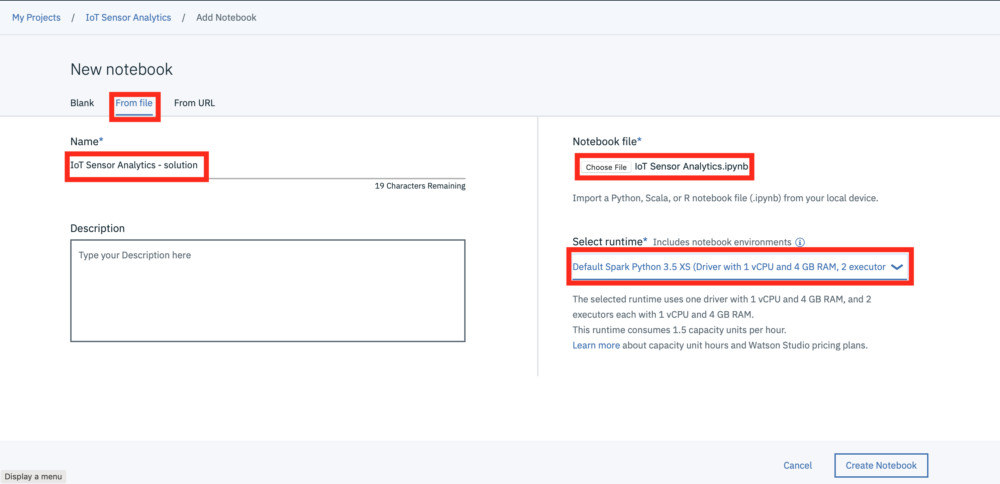

*Quick links :*
[Home](/README.md) - [Part 1](../part1/README.md) - [Part 2](../part2/README.md) - [Part 3](../part3/README.md) - [**Part 4**](../part4/README.md)
***
**Part 4** - [Watson Studio](STUDIO.md) - [Training Data](TRAINING.md) - [**Notebooks**](JUPYTER.md) - [ESP8266 model](MODEL.md) - [Summary](SUMMARY.md)
***

# Run a Jupyter Notebook in Watson Studio

## Lab Objectives

In this lab you will read IoT data into a Watson Studio Project Jupyter Notebook and perform some analytics.  You will learn:

- How to use Jupyter Notebooks
- How to read data from a Cloudant DB into Spark
- How to manipulate the data within the notebook environment
- How to create a model to be able to classify the IoT data to determine what is happening.

## Introduction

Jupyter Notebooks are a web-based computational environment for interactive data science and scientific computing. A Jupyter Notebook document is a JSON document, following a versioned schema, and containing an ordered list of input/output cells which can contain code, text (using Markdown), mathematics, plots and rich media, usually ending with the ".ipynb" extension. A Jupyter kernel is a program responsible for handling various types of request (code execution, code completions, inspection), and providing a reply.

The steps below will build up the Jupyter notebook, there is a solution notebook at the end to use if you need assistance to complete any step.

## Step 1 - Cloudant Credentials

Before we can read the ESP8266 IoT temperature and humidity data into a Jupyter notebook we need to create credentials for the Cloudant database where the training data is stored.

- Open a new browser tab.
- Return to the [IBM Cloud dashboard](https://cloud.ibm.com) and your IoT Starter application. **Click** on the cloudantNoSQLDB service connection (1). 
- Read about the Cloudant Storage service and click on the **Service credentials** menu item in the left menu bar. 

- Click on **New credential** 

- Give your credential a name: **Credentials-DSX**
- Click on **Add**
- Expand the **View credentials** twistie
- The Cloudant hostname, user and password credentials will be displayed.
- Keep this browser tab open or copy the credentials to your text editor, as you will use these credentials in the next Step.

### Step 2 - Loading Cloudant data into the Jupyter notebook

When using the lite account on the IBM Cloud there are some restrictions on services.  One restriction is a limit on the number of requests that can be run in a second (5 database actions per second).  To overcome this we need to ensure that data is extracted from Cloudant at a suitable rate, not to hit this limit.  The code below uses the **jsonstore.rdd.partitions** configuration option to ensure this limit is not exceeded.

- Return to the Watson Studio browser tab and open the **IoT Sensor Analytics** notebook. 

- Make certain you are in **Edit** mode by clicking on the Pencil icon. 
- Copy the following code into the first cell in the notebook and update the credentials with the values from your cloudant database credentials (created in **step 1**).  The values are from the host, username and password properties in the credentials:

```python
### TODO Please provide your Cloudant credentials in this cell

#Please don't modify this function
def readDataFrameFromCloudant(database):
    cloudantdata=spark.read.load(database, "com.cloudant.spark")
    cloudantdata.createOrReplaceTempView("washing")
    spark.sql("SELECT * from washing").show()
    return cloudantdata

spark = SparkSession\
    .builder\
    .appName("Cloudant Spark SQL Example in Python using temp tables")\
    .config("cloudant.host",'XXXX')\
    .config("cloudant.username", 'XXXX')\
    .config("cloudant.password",'XXXX')\
    .config("jsonstore.rdd.partitions", 1)\
    .getOrCreate()
```

- Press the **Run** button in the toolbar to run the cell 
- Move the focus to the next cell and copy in the following python, which calls the function defined in the first cell to load the data from Cloudant training database *(this assumes you used the database name **training** when capturing training data, if not, modify the database name)*:

```python
df=readDataFrameFromCloudant('training')
```

Run the cell by pressing ther run button in the toolbar.  You should see the data from the database.  You can validate that you have the correct data format by checking you have the **class**, **humidity**, **index** and **temperature** columns in the loaded data: 

If you want to clear out the data created by previously run steps then you can use the kernel menu option to clear out and restart the notebook, or clear out and run all steps: 

If you clear output then you can select the first cell and press run, which will run the cell then move to the next cell in the notebook.  Keep pressing run to run each cell in turn, ensure you wait for each cell to complete (At the left side of the cell the indicator **[*]** turns to **[n]**, where n is a number) before running the next step.

## Step 3 - Work with the training data

Within the notebook you are able to manipulate the data. In this section we will use SQL to create the data frames needed to verify and visualise the training data.  You usually need to examine the training data and maybe clean it up before creating the model.  This section shows some of the techniques available.

- In the next empty cell enter the following code then run the cell.  This code enables you to use SQL statements to manipulate the data, even though it came from a NoSql database. Those are so-called Apache Spark DataFrames able to wrap SQL, NoSQL and file data sources:

```python
# Enable SQL on the data frame
df.createOrReplaceTempView('df')
```

- Now we will create a new data frame for each training class.  In the next cell enter then run the following:

```python
df_class_0 = spark.sql('select time, temp, humidity, class from df where class = 0')
df_class_1 = spark.sql('select time, temp, humidity, class from df where class = 1')
df_class_0.createOrReplaceTempView('df_class_0')
df_class_1.createOrReplaceTempView('df_class_1')
```

For the rest of this section feel free to explore the different options available.  Enter each of the code samples in a cell in the notebook then run the cell to see the results.

- You may want to see the contents of the DataFrame:

```python
# examine the data
df_class_0.select('temp', 'humidity').distinct().show()
```

- You can verify the database schema:

```python
df.printSchema()
```

- You can verify the number of records available for each training class and if necessary correct any skew in the number of records available for each class:

```python
spark.sql('select class, count(class) from df group by class').show()
```

If your training data had double the number of entries for class 0 as class 1 then you can create an adjusted data frame to use for training using the following code : ```df_skew_fixed = df_class_0.sample(False, 0.5).union(df_class_1)```, which selects 50% of the records for class 0 and joins them with the records for class 1, so now both classes will have a similar number of records.  However, this should not be necessary as we ensured we captured a similar number of records for each class when training.

- The pixiedust package provides the ability to visualise data in a number of different ways.  Before using the package you need to import it:

```python
# visualisation package for python
import pixiedust
```

- Now you can use the capability of pixiedust to visualise or chart your data:

```python
display(df_class_0)
```

## Step 4 - Creating the binary classifier model

Once you are confident you have the correct training data available you can proceed to creating the model.

The approach adopted in this exercise is a common approach for machine learning, where a pipeline of operations or algorithms is constructed to implement the required functionality, in our case generating a model to classify data.

- Before we can access the Spark functionality we need to import a number of packages:

```python
# Imports for modelling
from pyspark.ml.feature import StringIndexer, OneHotEncoder
from pyspark.ml.linalg import Vectors
from pyspark.ml.feature import VectorAssembler
from pyspark.ml.feature import Normalizer
from pyspark.ml import Pipeline
from pyspark.ml.classification import LogisticRegression
from pyspark.ml.evaluation import MulticlassClassificationEvaluator
```

- Now we build the pipeline of operations to generate the model.  Here we need to create vectors from our data and pass them through a logistic regression algorithm.  The ```pipeline.fit(...)``` and ```model.transform(...)``` functions run the previously defined pipeline:

```python
# create binary classifier model
vectorAssembler = VectorAssembler(inputCols=["humidity","temp"],
                                  outputCol="features")
lr = LogisticRegression(maxIter=1000).setLabelCol("class")
pipeline = Pipeline(stages=[vectorAssembler, lr ])
model = pipeline.fit(df)
result = model.transform(df)
```

- Once the model is trained we need to extract the model parameters (coefficients and the intercept values in the case of logistic regression), so we can implement the model on the ESP8266.  You will need these values for the next part of the workshop, so make a note of them now:

```python
model.stages[1].coefficients
```

```python
model.stages[1].intercept
```

## Step 5 - Test the model

Once you have built the model you will want to verify how accurate the model is, so there are a number of ways we can do this.  The first one is to use an evaluator to get a measure of how good the model is.  A value of 1.0 represents 100% accuracy over the training data:

```python
#evaluate classification accuracy (1.0 = 100% accurate)
binEval = MulticlassClassificationEvaluator().setMetricName("accuracy").setPredictionCol("prediction").setLabelCol("class")
binEval.evaluate(result)
```

- You can also apply the model to additional data you may have (needs to be in the same format as the training data, but without the class property).  

    The following code shows how to read data from a database and apply the model to it.  The prediction column shows how the model classified the data.  As this example uses the training data, we have the class property available, so you can see that the prediction should line up with the class.

```python
# test the model
#re-read data from cloudant
new_df = readDataFrameFromCloudant('training')
result = model.transform(new_df)
result.createOrReplaceTempView('result')
spark.sql("select humidity, temp, class, prediction from result").show(50)
```

(Optionally) If you want to test your model try recording another set of data without the class property - the historic data you are collecting is in the correct format for this.  Within the dataset have records with the sensor in your hand and records where the sensor is not being held.  See how your model performs, especially in transition cases, where the sensor has just been released or has been held a short amount of time.  *Note: remove **class,** from the select statement if you are using data without the class property*:

```python
#read historic data from cloudant
new_df = readDataFrameFromCloudant('historicaldata1')
result = model.transform(new_df)
result.createOrReplaceTempView('result')
spark.sql("select humidity, temp, prediction from result").show(50)
```

## Sample solution

There is a sample solution for this part provided in the [notebooks](notebooks) folder.  If you have an issue and want to see the solution then within the IoT Sensor Analytics project select to add a new notebook.  Select to create a notebook from file and give the notebook a name - here **IoT Sensor Analytics - solution** has been used.  This assumes you have the file locally on your machine.  Select choose file and locate the **IoT Sensor Analytics.ipynb** file.  Finally ensure you have the Default Spark Python 3.5 XS runtime selected then press **Create Notebook**
  

Alternatively, you can select to import from URL and set the URL to : [https://raw.githubusercontent.com/binnes/esp8266Workshop/master/en/part4/notebooks/IoT%20Sensor%20Analytics.ipynb](https://raw.githubusercontent.com/binnes/esp8266Workshop/master/en/part4/notebooks/IoT%20Sensor%20Analytics.ipynb)

***
**Part 4** - [Watson Studio](STUDIO.md) - [Training Data](TRAINING.md) - [**Notebooks**](JUPYTER.md) - [ESP8266 model](MODEL.md) - [Summary](SUMMARY.md)
***
*Quick links :*
[Home](/README.md) - [Part 1](../part1/README.md) - [Part 2](../part2/README.md) - [Part 3](../part3/README.md) - [**Part 4**](../part4/README.md)
