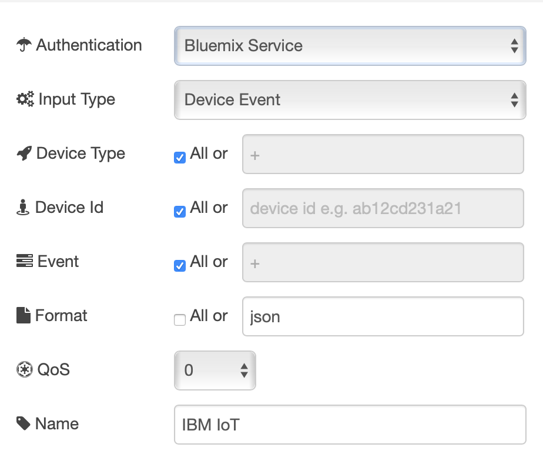
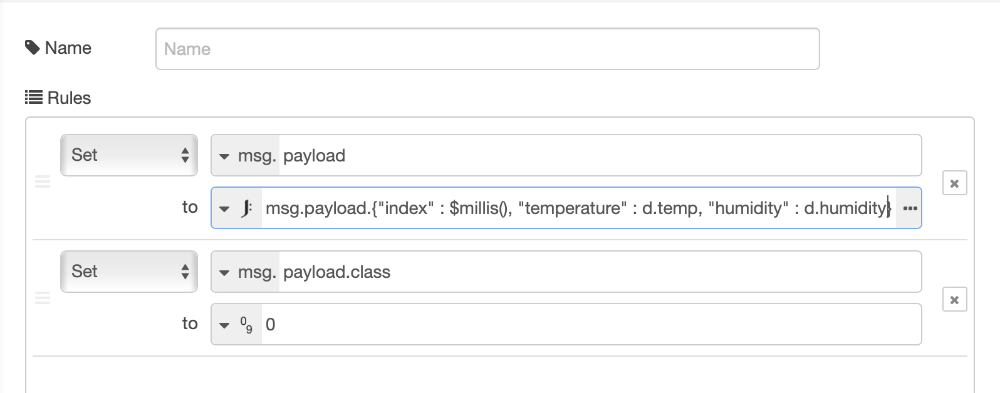
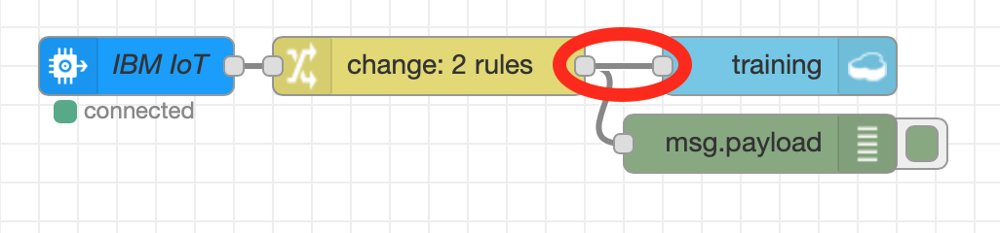
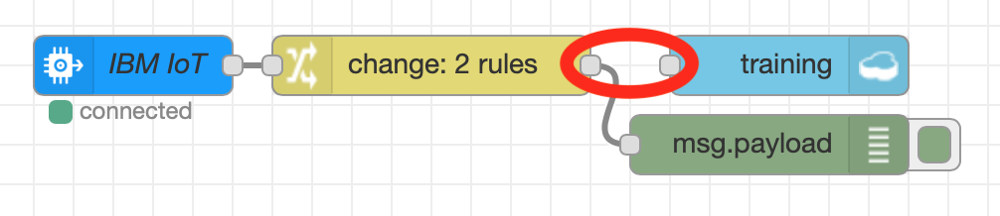
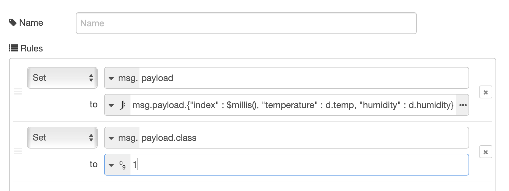
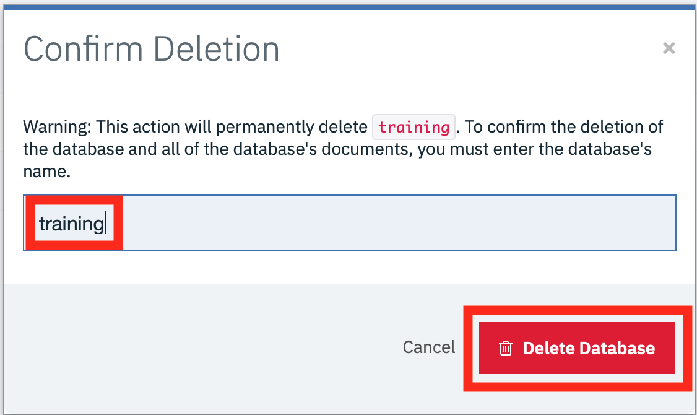

*Quick links :*
[Home](/README.md) - [Part 1](../part1/README.md) - [Part 2](../part2/README.md) - [Part 3](../part3/README.md) - [**Part 4**](../part4/README.md)
***
**Part 4** - [Watson Studio](STUDIO.md) - [**Training Data**](TRAINING.md) - [Notebooks](JUPYTER.md) - [ESP8266 model](MODEL.md) - [Summary](SUMMARY.md)
***

## Lab Objectives

In this section we will create the training data needed to train a model.  You will learn:

- How to format data into an appropriate format for training
- How to capture the data required to create the data model
- How to reset the database if invalid data has been captured

# Create training data

To train the model we need to identify 2 different situations:

- the DHT sensor is not being held
- the DHT sensor is being held in a closed hand

It is important to ensure the training data is of good quality, so we are going to create a new database to hold the training database and carefully manage what data is added to the training database.

The database we need to create needs to have the following contents:

- index.  This is a unique index for each record.  We can use a timestamp for this field
- class.  This is an indication of which training class this data point represents.  0 for not held and 1 for held
- temperature.  The temperature value
- humidity.  The humidity value

To get the data into the database we will create a Node-RED flow, but will only connect up the database when we want data to be recorded.

## Node-RED flow to create the training data

To create the flow, open up the Node-RED editor running on the IBM Cloud (as used in part 3 of this workshop).

1. Create a new tab in the editor then add the following nodes:
   - **ibmiot** node from the input section of the palette
   - **change** node from the function section of the palette
   - **debug** node from the output section of the palette
   - **cloudant out** node from the storage section of the palette
2. Connect the **ibmiot** node to the **change** node and then the **change** node to the **debug** node.  DO NOT connect the **cloudant out** node yet.
3. Configure the **ibmiot** node to use the cloud service and listen to all JSON data from all devices as shown: 
4. Configure the **change** node to have 2 set rules.  The first rule reformats the data received from the IoT platform, to flatten it and add a timestamp.  The second rule adds the class property and initially sets it to class 0:
   - set msg.payload to JSONata expression ```msg.payload.{"time" : $millis(),"temp" : d.temp, "humidity" : d.humidity}```
   - set msg.payload.class to number 0  
   as shown : 
5. Configure the **cloudant out** node to use the cloud service and set the database name to training and ensure the operation is set to insert and to only store msg.payload object as shown: 

You should have a flow that looks like this: 

If your flow is not working then you can import the sample flow, which is also available in the [flows](flows) folder in part4 of the repo :

```JSON
[{"id":"f46b4c67.73cb2","type":"ibmiot in","z":"deb0d57.1c46528","authentication":"boundService","apiKey":"","inputType":"evt","logicalInterface":"","ruleId":"","deviceId":"","applicationId":"","deviceType":"+","eventType":"+","commandType":"","format":"json","name":"IBM IoT","service":"registered","allDevices":true,"allApplications":"","allDeviceTypes":true,"allLogicalInterfaces":"","allEvents":true,"allCommands":"","allFormats":"","qos":0,"x":130,"y":100,"wires":[["e09fb3f3.79f538"]]},{"id":"e09fb3f3.79f538","type":"change","z":"deb0d57.1c46528","name":"","rules":[{"t":"set","p":"payload","pt":"msg","to":"msg.payload.{\"time\" : $millis(), \"temp\" : d.temp, \"humidity\" : d.humidity} ","tot":"jsonata"},{"t":"set","p":"payload.class","pt":"msg","to":"0","tot":"num"}],"action":"","property":"","from":"","to":"","reg":false,"x":280,"y":100,"wires":[["84be0f97.8f672"]]},{"id":"84be0f97.8f672","type":"debug","z":"deb0d57.1c46528","name":"","active":true,"tosidebar":true,"console":false,"tostatus":false,"complete":"false","x":450,"y":140,"wires":[]},{"id":"5a8d3b21.87bb3c","type":"cloudant out","z":"deb0d57.1c46528","name":"","cloudant":"","database":"training","service":"bi-ESP8266WorkshopCourse-cloudantNoSQLDB","payonly":false,"operation":"insert","x":460,"y":100,"wires":[]}]
```

This flow creates the following output, which we will write to the database:

```JSON
{
    "time":1546969694969,
    "temp":20,
    "humidity":51,
    "class":0
}
```

## Creating the training data

To create the training data you may want to use the interval dashboard to set the interval to something like 5 seconds, to reduce the time needed to gather the required data.  We are aiming to have a similar number of data points for each class in the training data.

1. Ensure the ESP8266 is working and you can see the debug output as shown above.
2. As we want to record class 0 data, leave the DHT sensor alone and wait 30 seconds to ensure the data is stable.  Then connect up the **cloudant out** node and deploy the flow: 
3. Wait until about 20-30 records have been written then delete the connection to the **cloudant out** node and deploy the flow to stop any more records being written: 
4. Edit the **change** node configuration to set the class to 1 : 
5. Hold the DHT sensor in your hand, ensuring you don't dislodge any of the connecting cables.  Wait a while to let the readings settle down
6. Connect the **change** node to the **cloudant out** node and deploy the flow.  Ensure you remain holding onto the DHT sensor
7. Wait until about 20-30 records have been written *(try to get the same number of database records as you created for class 0)* then delete the connection to the **cloudant out** node and deploy to stop recording any more data.  You can release the DHT sensor now

## Reset the training database

**Don't do this unless you have invalid data in your training database**

It is important that you have clean training data, so if you need to restart recording the training database you can easily delete the database from cloudant:

1. Ensure the connection between the **change** node and the **cloudant out** node has been deleted, so no data is being written to the database
2. From the Application overview page in the IBM Cloud console select the cloudant database from the connections section: 
3. Select the alias link : 
4. Launch the console : 
5. In the databases section select the bin icon next to the training database : 
6. Enter the database name in the text box then press the delete button to delete the database : 

You can now start creating the training data again - the database is automatically created when the Node-RED flow is next deployed

Once you have your training data recorded you can move to the [next section](JUPYTER.md)
***
**Part 4** - [Watson Studio](STUDIO.md) - [**Training Data**](TRAINING.md) - [Notebooks](JUPYTER.md) - [ESP8266 model](MODEL.md) - [Summary](SUMMARY.md)
***
*Quick links :*
[Home](/README.md) - [Part 1](../part1/README.md) - [Part 2](../part2/README.md) - [Part 3](../part3/README.md) - [**Part 4**](../part4/README.md)