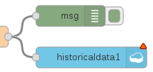
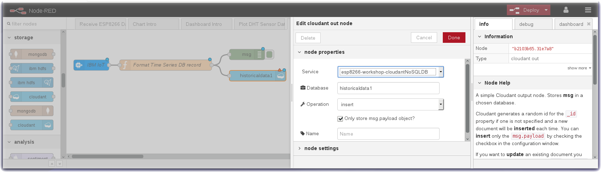
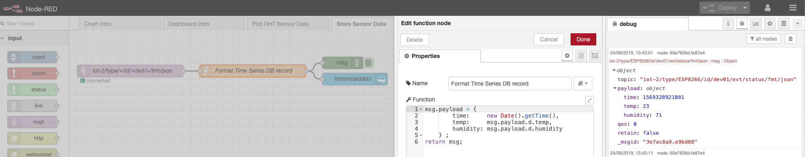
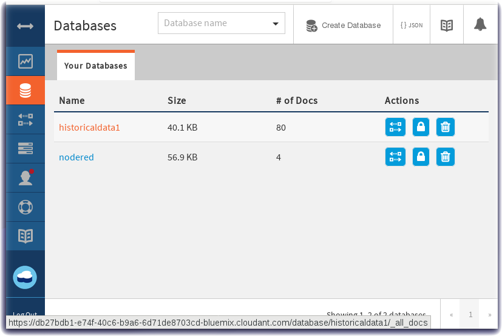
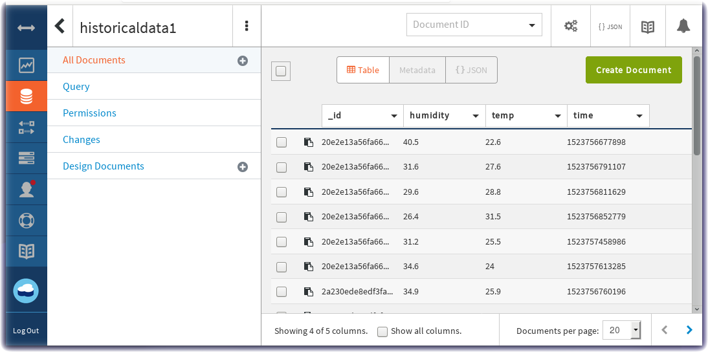

*Quick links :*
[Home](/README.md) - [Part 1](/part1/README.md) - [Part 2](/part2/README.md) - [**Part 3**](/part3/README.md) - [Part 4](/part4/README.md)
***
**Part 3** - [Intro to Node-RED](/part3/NODERED.md) - [Receive Sensor Data](/part3/DHTDATA.md) - [Plot Data](/part3/DASHBOARD.md) - [**Store Data**](/part3/CLOUDANT.md) - [Historical Data](/part3/HISTORY.md) - [Control Interval](/part3/INTERVAL.md) - [Control LED](/part3/DISPLAY.md)
***

# Store Data in Cloud Storage for Historical Data Analytics

## Lab Objectives

In this lab you will store the ESP8266 DHT environmental sensor data in a Cloudant database in IBM Cloud.  You will learn:

- How to create a Node-RED flow that uses the Cloudant node
- How to format a time series database record
- How to view Cloudant databases

### Introduction
While real-time charts of sensor data and threshold alerts are useful, the power of IoT becomes significant when data analytics techniques, Machine Learning and AI are applied to the IoT historical datasets.  The first and necessary step toward data analytics is storing the incoming data in a Cloud data storage database for later statistical modeling.

### Step 1 - Import the Node-RED Cloudant Storage Flow
Open the “Get the Code” github URL listed below, mark or Ctrl-A to select all of the text, and copy the text for the flow to your Clipboard. Recall from a previous section, click on the Node-RED Menu, then Import, then Clipboard. Paste the text of the flow into the Import nodes dialog and press the red Import button.

<p align="center">
  <strong>Get the Code: <a href="flows/NR-Cloudant-DHTSensorData.json">Node-RED Cloud Storage Flow</strong></a>
</p>

### Step 2 - Store IoT Sensor Data with Node-RED
In this Step you will use Node-RED to store IoT Sensor data from the ESP8266 DHT environmental sensors in a Cloudant database.

* When the flow is imported there will be a misconfigured Cloudant node – indicated by a red triangle.
 
* To associate the **Cloudant** database node with your IBM Cloud instance, click on the historical data Cloudant node and press the red Done button. The red error triangle will turn blue.
 

* The *Format Time Series DB Record* function node recasts the ESP8266 DHT JSON object. As required by any time series dataset, the Node-RED function node adds a timestamp to the record before writing it to the Cloudant storage. Note in the screenshot, the debug sidebar shows a ```msg.payload``` that includes the Epoch timestamp (milliseconds since Jan 1 1970)
 
* Click the **Deploy** button on the top of menu bar to deploy the Node-RED flow.
* The ESP8266 DHT environmental sensor data is now being recorded in a Cloudant database.

### Step 3 - Observe Sensor Data being added to the Cloudant database
* Return to the [IBM Cloud dashboard](https://console.bluemix.net/dashboard/apps/) and your IoT Starter application. **Click** on the cloudantNoSQLDB (1) service connection.
 
* Read about the Cloudant Storage service and press the **Launch** button.
 
* The IoT Sensor device data is stored in the Cloudant service.
 
* Click on historicaldata1 and then observe the **table** view of temperature, humidity and timestamp data.
 


Proceed to the next section - [**Historical Data Charts**](/part3/HISTORY.md)

*Quick links :*
[Home](/README.md) - [Part 1](/part1/README.md) - [Part 2](/part2/README.md) - [**Part 3**](/part3/README.md) - [Part 4](/part4/README.md)
