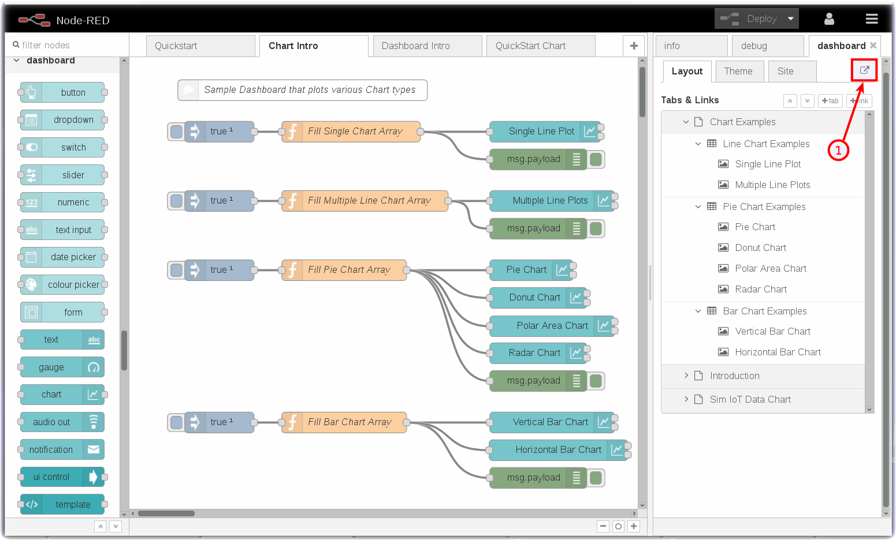
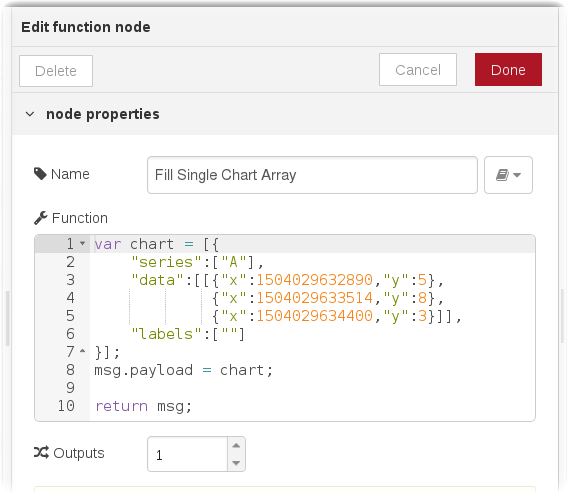
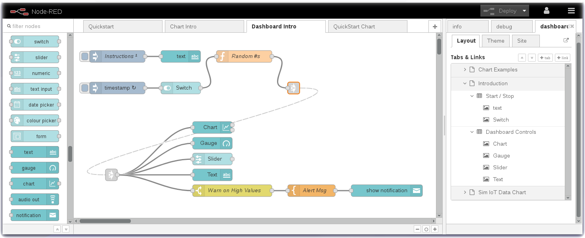
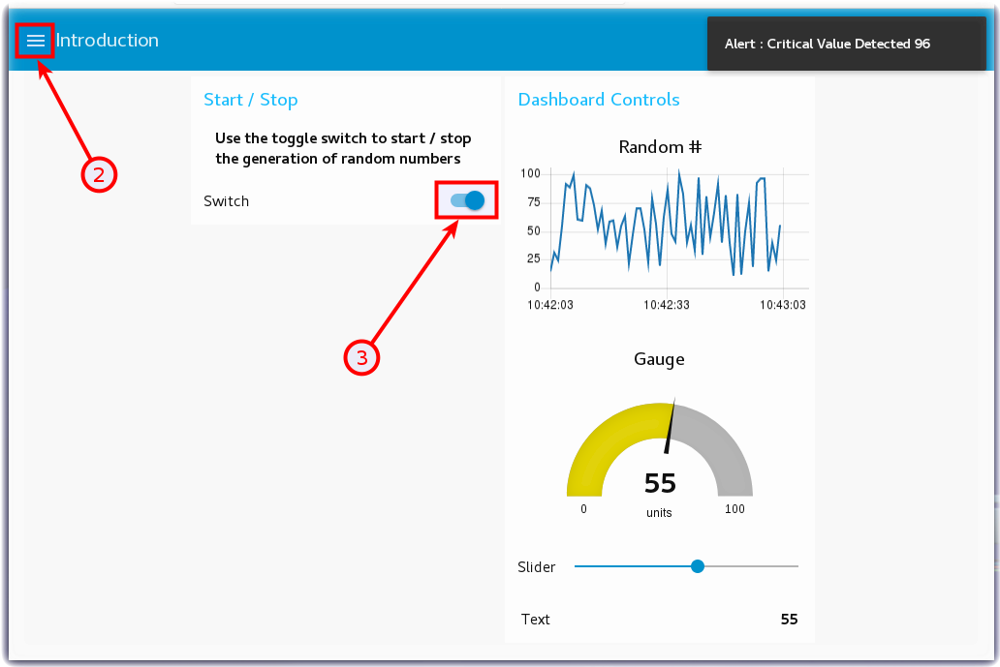
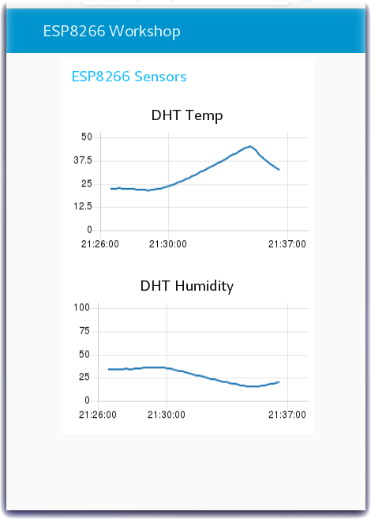

*Quick links :*
[Home](/README.md) - [Part 1](/part1/README.md) - [Part 2](/part2/README.md) - [**Part 3**](/part3/README.md) - [Part 4](/part4/README.md)
***
**Part 3** - [Intro to Node-RED](/part3/NODERED.md) - [Receive Sensor Data](/part3/DHTDATA.md) - [**Plot Data**](/part3/DASHBOARD.md) - [Store Data](/part3/CLOUDANT.md) - [Historical Data](/part3/HISTORY.md) - [Control Interval](/part3/INTERVAL.md) - [Control LED](/part3/LED.md)
***

# Node-RED Dashboard Charts - Plot DHT Sensor Data

## Lab Objectives

In this lab you will import Node-RED flows which create Dashboard Charts. After learning about Node-RED Dashboard Charts, you will be able to display temperature and humidity graphs of the ESP8266 DHT environmental sensors.  You will learn:

- How to create a Node-RED Dashboard
- Experiment with Chart types
- Plot Real Time sensor data
- Trigger alerts when the real-time sensor data exceeds a threshold value

### Introduction
In this section you will learn about Node-RED Dashboard Charts and then create a chart to graph the sensor data arriving from the ESP8266.

### Step 1 - Import the Node-RED Dashboard Chart Flows
Open the “Get the Code” github URL listed below, mark or Ctrl-A to select all of the text, and copy the text for the flow to your Clipboard. Recall from a previous section, click on the Node-RED Menu, then Import, then Clipboard. Paste the text of the flow into the Import nodes dialog and press the red Import button. Finally, click on the red **Deploy** button in the upper right corner.

<p align="center">
  <strong>Get the Code: <a href="flows/NRD-Charts-DHTSensorData.json">Node-RED Dashboard Charts</strong></a>
</p>

### Step 2 - Learn about various Node-RED Dashboard Chart types

- You might have noticed that the flow import in the prior step actually created three tabs.  These are called Node-RED flows.
- The **Chart Intro** flow introduces you to the various Node-RED Dashboard Chart types that are available.  You can create Line charts, various Pie chart styles – Pie, Donut, Polar Area, Radar - and vertical and horizontal Bar charts.
 
- For illustration, the **Fill Single Chart Array** function node above fills an array of static sample data and sends the data to the **Chart** node to visualize.

<p align="center">

</p>

- The Node-RED flow is not nearly as interesting as the charts that it renders.  To launch the Node-RED Dashboard, in the Node-RED sidebar, turn to the **dashboard** tab and click on the **Launch** button (1) [See two pictures above].
 

### Step 3 – Generating and Displaying data in Node-RED Dashboards

The next Node-RED flow - **Dashboard Intro** - uses a variety of UI widgets to display data in the Node-RED Dashboard.  There is a Switch node that turns On/Off a random number generator function node.  The simple random numbers are sent to a line Chart node, a Gauge node, a Slider node, a Text node and, if the number exceeds a threshold, will display an alert notification message.
 
- Turn to the Node-RED Dashboard browser tab that you launched in Step 2, click on the menu tab (2) in the upper left corner, and select the Introduction tab.
- On the Introduction dashboard, turn on the **Switch** (3) to start the data visualization.
- Experiment with / observe the Dashboard controls.
 


### Step 4 - Plot ESP8266 DHT Environmental Sensor Data

Now that you have learned about Node-RED Dashboard and Chart types, you are ready to plot the real-time ESP8266 DHT environmental sensor data.
- Turn to the next flow - **Plot DHT Sensor Data**
- The **IBM IoT** node is already configured to receive *status* Device Events from the ESP8266 Device Type.
- The **Change** nodes extract the ```msg.payload.d.temp``` and ```msg.payload.d.humidity``` values from the JSON object sent over MQTT from the ESP8266 DHT sensor to Watson IoT Platform.
- The environmental sensor values are sent to two charts to plot Temperature and Humidity.
 
- Turn to the Node-RED Dashboard browser tab that you launched in Step 2, click on the tab in the upper left corner, and select the **ESP8266 Workshop** tab.
<p align="center">

</p>

### Step 5 - Trigger Alerts when Real-Time Sensor Data Exceeds a Threshold Value

Often IoT devices and sensors are deployed so that alerts can be triggered when the real time sensor data exceeds a threshold value.  In this last Step, the flow checks the temperature values and, if the temperature exceeds the threshold, triggers a Node-RED Dashboard notification.
- In the prior step, the flow included three nodes that have not yet been discussed.
- A **Switch** node is configured to *Warn on High Values* by testing if ```msg.payload.d.temp``` is greater than 30C.
- A **Template** node is configured to construct a sentence ```Alert : Critical Value Detected {{payload.d.temp}}```
- The Alert message is sent to a **Node-RED Dashboard Notification** node to display in the browser.
- This flow could be extended to call a **Twilio** node to send a SMS message.  It could raise an alarm in another system by triggering a REST API call to the manufacturing production operations systems.

 

 - Return to the Node-RED Dashboard **ESP8266 Workshop** tab and increase the temperature of your DHT sensor above 30C.

 <p align="center">
 
 </p>

***
**Part 3** - [Intro to Node-RED](/part3/NODERED.md) - [Receive Sensor Data](/part3/DHTDATA.md) - [**Plot Data**](/part3/DASHBOARD.md) - [Store Data](/part3/CLOUDANT.md) - [Historical Data](/part3/HISTORY.md) - [Control Interval](/part3/INTERVAL.md) - [Control LED](/part3/LED.md)
***
*Quick links :*
[Home](/README.md) - [Part 1](/part1/README.md) - [Part 2](/part2/README.md) - [**Part 3**](/part3/README.md) - [Part 4](/part4/README.md)
