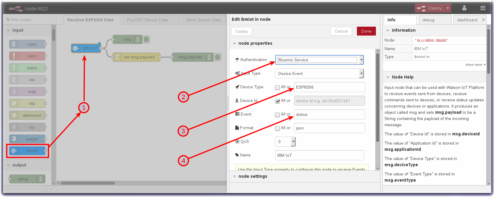

*Quick links :*
[Home](/README.md) - [Part 1](/part1/README.md) - [Part 2](/part2/README.md) - [**Part 3**](/part3/README.md) - [Part 4](/part4/README.md)
***
**Part 3** - [Intro to Node-RED](/part3/NODERED.md) - [**Receive Sensor Data**](/part3/DHTDATA.md) - [Plot Data](/part3/DASHBOARD.md) - [Store Data](/part3/CLOUDANT.md) - [Historical Data](/part3/HISTORY.md) - [Control Interval](/part3/INTERVAL.md) - [Control LED](/part3/LED.md)
***

# Receive Device Environmental Sensor Data in Node-RED

## Lab Objectives

In this lab you will build a flow that receives Device environmental temperature and humidity sensor data.  You will learn:

- How to create a new Node-RED flow and configure IoT Nodes
- How to output the Device environmental temperature and humidity data.
- How to work with JSON data and observe the sensor results in the Debug sidebar.

### Introduction

In just a few nodes, Node-RED can receive the data that was transmitted from the device over MQTT to Watson IoT Platform.  This simple exercise will be the foundation for the next several sections that plot the data in a dashboard, trigger Real Time threshold alerts, store the data in Cloud Storage and allow for data analytics and anomaly detection.

### Step 1 - Configure an IoT in Node

- From the Input category of the left Node-RED palette, select an **ibmiot node** and drag it onto your Node-RED flow (1).
- Double-click on the IBM IoT node. An **Edit ibmiot in node** sidebar will open.
- Configure the Authentication dropdown to **Bluemix Service** (2).
- Uncheck All and set the Device Type to **ESP8266** (3).
- Uncheck All and set the Event **status** (4).
- Click on the red **Done** button.
 

### Step 2 - Extract the Temperature from the JSON Object

- Recall that the environmental sensor data was transmitted in a JSON object

 ```{ "d": {"temp":X, "humidity":Y }}```

- Node-RED passes data from node to node in a *msg.payload* JSON object.
- The **Change** node can be used to extract a particular value so that it can be directly output or manipulated (for instance in a Dashboard chart which we will take advantage of in the next section).
- From the Function category of the left Node-RED palette, select a **Change** node and drag it onto your Node-RED flow (5).
- Double-click on the Change node. An **Edit change node** sidebar will open.
- Configure the "to" AZ dropdown to msg. and set it to *payload.d.temp* (6).
- Click on the red **Done** button.
 

## Step 3 - Node-RED Debug Nodes

- Debug nodes can be used to print out JSON object values and help you validate your program.
- From the Output category of the left Node-RED palette, drag two **debug nodes** onto your Node-RED flow (7).
- Double-click on one of them. An **Edit debug node** sidebar will open.
- Configure the Output to print the *complete msg object* (8).
- Click on the red **Done** button.
 

### Step 4 - Wire the Node-RED nodes together

- Wire the Node-RED nodes together by click / dragging your mouse from nodelet to nodelet as show in the screenshot.
- Click on the red **Deploy** button in the upper right corner.
 - Observe the DHT sensor data in the **debug** tab of the Node-RED right sidebar.  You can expand the twisties to expose the JSON object information. Hover over a debug message in the right sidebar and the node that generated the message will be outlined in orange.
  

***
**Part 3** - [Intro to Node-RED](/part3/NODERED.md) - [**Receive Sensor Data**](/part3/DHTDATA.md) - [Plot Data](/part3/DASHBOARD.md) - [Store Data](/part3/CLOUDANT.md) - [Historical Data](/part3/HISTORY.md) - [Control Interval](/part3/INTERVAL.md) - [Control LED](/part3/LED.md)
***
*Quick links :*
[Home](/README.md) - [Part 1](/part1/README.md) - [Part 2](/part2/README.md) - [**Part 3**](/part3/README.md) - [Part 4](/part4/README.md)
