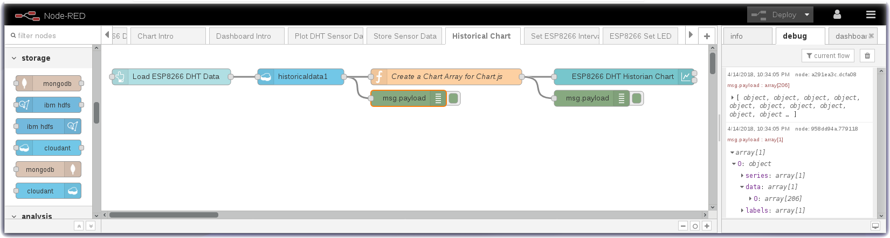
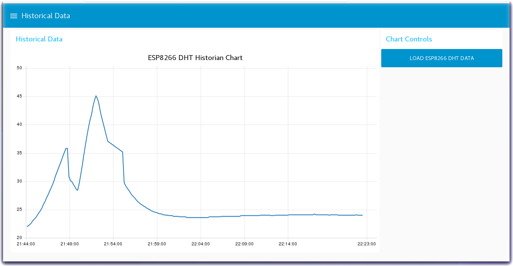

*Quick links :*
[Home](/README.md) - [Part 1](/part1/README.md) - [Part 2](/part2/README.md) - [**Part 3**](/part3/README.md) - [Part 4](/part4/README.md)
***
**Part 3** - [Intro to Node-RED](/part3/NODERED.md) - [Receive Sensor Data](/part3/DHTDATA.md) - [Plot Data](/part3/DASHBOARD.md) - [Store Data](/part3/CLOUDANT.md) - [**Historical Data**](/part3/HISTORY.md) - [Control Interval](/part3/INTERVAL.md) - [Control LED](/part3/LED.md)
***

# Node-RED Charts of Historical Sensor Data

## Lab Objectives

In this lab you will read the historical sensor data from a Cloud storage database and create a graph of prior readings.  You will learn:

- How to read datasets from a Cloudant database
- How to create a chart of historical data

### Introduction
The previous section stored the ESP8266 DHT environment sensor data into a Cloudant DB.  This section will read the historical sensor data from a Cloud storage database and create a graph of prior readings.

### Step 1 - Import the Node-RED Historian Chart Flow
* Open the “Get the Code” github URL listed below, mark or Ctrl-A to select all of the text, and copy the text for the flow to your Clipboard. Recall from a previous section, click on the Node-RED Menu, then Import, then Clipboard. Paste the text of the flow into the Import nodes dialog and press the red Import button.

  <strong>Get the Code: <a href="flows/NRD-DHTSensorData-HistorianChart.json">Node-RED Historian Chart Flow</strong></a>

* Click on the **Cloudant** node on the Historical Chart flow to confirm that it is configured to your IoT Platform Cloudant service instance.
* Click the **Deploy** button on the top of menu bar to deploy the Node-RED flow.

### Step 2 - Graph Historical IoT Sensor data stored in a database using Node-RED
* The Historical Chart flow reads the IoT Sensor Device data from the Cloudant database and formats it into a Chart array before sending the data to a Node-RED Chart node.

### Step 3 - Historian Charts of ESP8266 DHT data
* Turn to the Node-RED Dashboard browser tab, click on the menu tab in the upper left corner, and select the Historical Data tab.
* On the Historical Data dashboard, click on the **LOAD ESP8266 DHT DATA** button to start the data visualization.
* The button will trigger the read of the historian DB records created in the previous section.
* In the *Create a Chart Array for Chart.js* function node the time series temperature data from the ESP8266 DHT sensor is formatted into a Chart Array and sorted chronologically.
* The Chart Array is passed to the Node-RED Chart node to render the graph.

Proceed to the next section - [**Control ESP8266 Reporting Interval**](/part3/INTERVAL.md)

*Quick links :*
[Home](/README.md) - [Part 1](/part1/README.md) - [Part 2](/part2/README.md) - [**Part 3**](/part3/README.md) - [Part 4](/part4/README.md)
