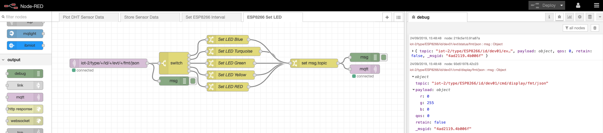
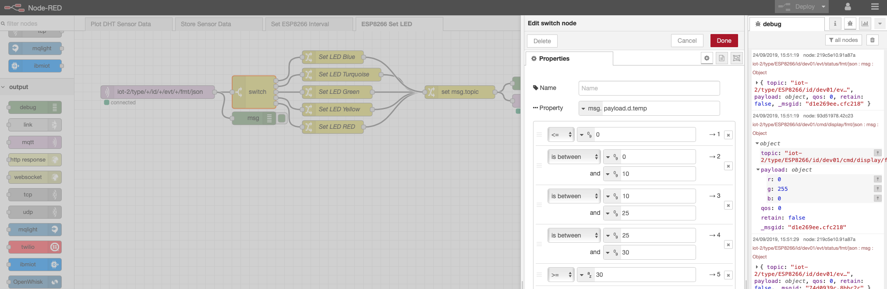

*Quick links :*
[Home](/README.md) - [Part 1](/part1/README.md) - [Part 2](/part2/README.md) - [**Part 3**](/part3/README.md) - [Part 4](/part4/README.md)
***
**Part 3** - [Intro to Node-RED](/part3/NODERED.md) - [Receive Sensor Data](/part3/DHTDATA.md) - [Plot Data](/part3/DASHBOARD.md) - [Store Data](/part3/CLOUDANT.md) - [Historical Data](/part3/HISTORY.md) - [Control Interval](/part3/INTERVAL.md) - [**Control LED**](/part3/LED.md)
***

# Control your ESP8266 LED Colors via Node-RED

## Lab Objectives

In this lab you will modify the ESP8266 Arduino program to receive MQTT commands from the IBM Cloud and build a Node-RED flow to dynamically change the LED color of the ESP8266 based on Alert thresholds.  You will learn:

- How to send MQTT commands from the IBM Cloud to your ESP8266
- How to receive MQTT commands within your ESP8266 Arduino program / sketch.
- How to work with JSON data on the ESP8266

### Introduction
Remote management and control of IoT Devices is critical to managing the flow of sensor data to the Cloud. Hardcoded values in the IoT Device should be replaced by dynamically controlled logic in the Cloud.

This section will build a Node-RED flow where you can change the LED color and temperature thresholds.  A MQTT command will be published from the IBM Cloud to the ESP8266 device. The ESP8266 will receive the display update and set the LED color.

### Step 1 - Import the Node-RED Dashboard Reporting Interval Form Flow
* Open the “Get the Code” github URL listed below, mark or Ctrl-A to select all of the text, and copy the text for the flow to your Clipboard. Recall from a previous section, click on the Node-RED Menu, then Import, then Clipboard. Paste the text of the flow into the Import nodes dialog and press the red Import button.

  <strong>Get the Code: <a href="flows/NR-SetLED-Threshold.json">Node-RED Set LED Threshold Flow</strong></a>

* Click the **Deploy** button on the top of menu bar to deploy the Node-RED flow.

### Step 2 - Node-RED Set LED flow
* The Node-RED flow receives the DHT environmental sensor data from the IBM IoT in node.
* A **Switch** node checks the temperature and depending on the value, chooses the Threshold color.
* Several **Change** nodes set the RGB color values.
* The RGB values are sent using a MQTT *display* device command to the ESP8266

### Step 3 - Temperature Threshold
* Double-click on the Switch node. An **Edit switch node** sidebar will open.
* The **Switch** node checks the temperature and depending on the value, chooses the Threshold color.

* Press the Cancel button when you have finished reviewing the switch node.

### Step 4 - Send MQTT Commands using IBM IoT Node
* Double-click on the IBM IoT node. An **Edit ibmiot out node** sidebar will open.
* The **IBM IoT out** node is configured to send a **Device Command** to your ESP8266 device Id.
* The **Command Type** will be named *display*.
* Press the red Done button.

### Step 5 - Inspect ESP8266 program which handles Display Device Commands
* Return to the Arduino IDE
* The prior section already deployed the updated program to your ESP8266 and included the code to handle *display* commands to set the RGB LED colors.
* Inspect the section of code that sets the LED colors.

Proceed to [**Part 4**](/part4/README.md)

*Quick links :*
[Home](/README.md) - [Part 1](/part1/README.md) - [Part 2](/part2/README.md) - [**Part 3**](/part3/README.md) - [Part 4](/part4/README.md)
