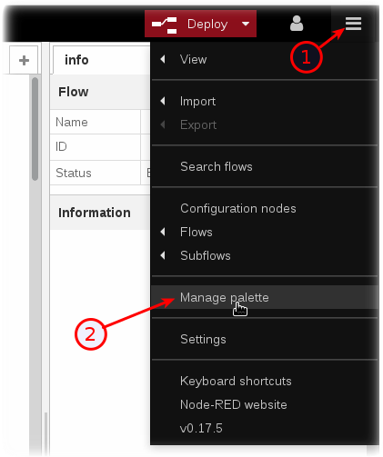
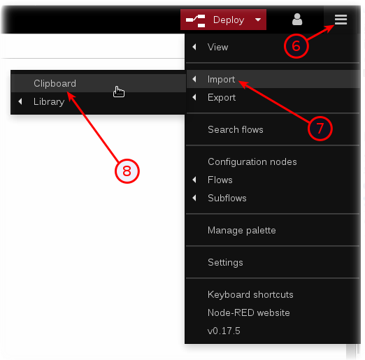
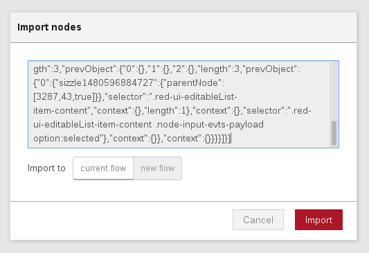

*Quick links :*
[Home](/README.md) - [Part 1](/part1/README.md) - [Part 2](/part2/README.md) - [**Part 3**](/part3/README.md) - [Part 4](/part4/README.md)
***
**Part 3** - [**Intro to Node-RED**](/part3/NODERED.md) - [Receive Sensor Data](/part3/DHTDATA.md) - [Plot Data](/part3/DASHBOARD.md) - [Store Data](/part3/CLOUDANT.md) - [Historical Data](/part3/HISTORY.md) - [Control Interval](/part3/INTERVAL.md) - [Control LED](/part3/LED.md)
***

# Node-RED Set up and Configuration in IBM Cloud

## Lab Objectives

In this lab you will set up Node-RED in your Watson IoT Starter application created at the end of Part 1.  You will learn:

- Node-RED Visual Programming
- How to secure your Node-RED Editor in IBM Cloud
- How to install additional Node-RED nodes
- How to import a prebuilt flow from GitHub

### Introduction
Node-RED is an open-source
Node.js application that provides a visual programming editor that makes it easy to wire together flows.

### Step 1 - Node-RED Visual Programming
Recall that in Part 1, you created a IoT Starter Application. Once the Green **Running** icon appears, click the **View App URL** button (1)

### Step 2 - How to secure your Node-RED Editor in IBM Cloud
A new browser tab will open to the Node-RED start page. Proceed through the setup pages by selecting a username / password to access the Node-RED editor. Remember your username / password. Click the red button **Go to your Node-RED flow editor** to launch the editor.

* The Node-RED Visual Programming Editor will open with a default flow.
* On the left side is a palette of nodes that you can drag onto the flow.
* You can wire nodes together to create a program.
* The sample IoT Starter flow is not applicable to this workshop and can be deleted.

* Click the **+** icon (7) to add a new tab.  Double Click on the **Flow 2** tab header (8).
Rename this tab from **Flow 2** to Receive ESP8266 Data (9)

* Double Click on the **Flow 1** tab header (10).  Press the **Delete** button. (11)

### Step 3 - How to install additional Node-RED nodes
* The IoT Starter Application deployed into IBM Cloud includes just a small subset of Node-RED nodes. The Node-RED palette can be extended with over one thousand additional nodes for different devices and functionality. These NPM nodes can be browsed at http://flows.nodered.org
* In this Step, you will add the **Node-RED Dashboard** nodes to your Internet of Things Starter Application.
* Click on the Node-RED **Menu** (1) in the upper right corner, then **Manage palette** (2)

* Turn to the **Install** tab (3), type node-red-dashboard (4) and press the **Install** button (5).

*  Press the **Install** button in the next dialog.

### Step 4 - How to import a prebuilt flow from GitHub
In this step, you will learn how to Import a prebuilt flow from GitHub
* Since configuring Node-RED nodes and wiring them together requires many steps to document in screenshots, there is an easier way to build a flow by importing a prebuilt flow into your IoT Starter Application.
* Not here in Step 4, but in several sections below, there will be a **Get the Code** link.
* When instructed in those later sections, open the Get the Code github URL, mark or Ctrl-A to select all of the text, and copy the text for the flow to your Clipboard.
* Click on the Node-RED Menu (6), then Import (7), then Clipboard (8).

* Paste the text of the flow into the **Import nodes** dialog and press the red **Import** button.

* The new flow will be imported into a new tab in the Node-RED Editor.
* Click the **Deploy** button on the top of menu bar to deploy the Node-RED flow.

***
**Part 3** - [**Intro to Node-RED**](/part3/NODERED.md) - [Receive Sensor Data](/part3/DHTDATA.md) - [Plot Data](/part3/DASHBOARD.md) - [Store Data](/part3/CLOUDANT.md) - [Historical Data](/part3/HISTORY.md) - [Control Interval](/part3/INTERVAL.md) - [Control LED](/part3/LED.md)
***
*Quick links :*
[Home](/README.md) - [Part 1](/part1/README.md) - [Part 2](/part2/README.md) - [**Part 3**](/part3/README.md) - [Part 4](/part4/README.md)
