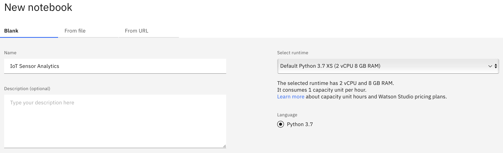
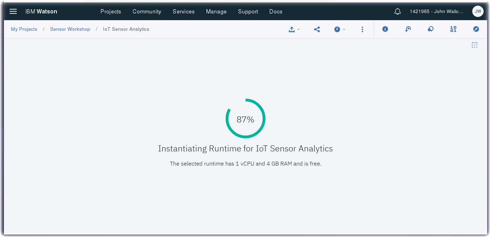
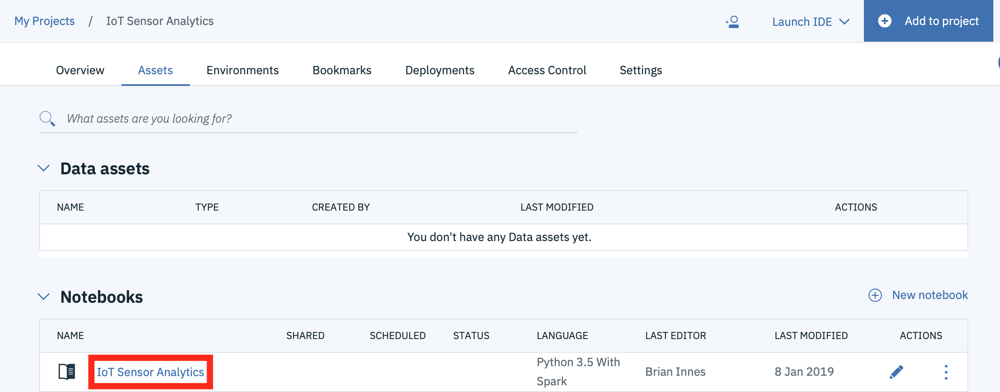

*Quick links :*
[Home](/README.md) - [Part 1](/part1/README.md) - [Part 2](/part2/README.md) - [Part 3](/part3/README.md) - [**Part 4**](/part4/README.md)
***
**Part 4** - [**Watson Studio**](/part4/STUDIO.md) - [Notebooks](/part4/JUPYTER.md)
***

# Watson Studio Set up and Configuration in IBM Cloud

## Lab Objectives

In this lab you will set up Watson Studio with a new Project.  You will learn:

- Watson Studio
- How to set up a new Watson Studio Project
- How to create a Jupyter Notebook

### Introduction
Watson Studio accelerates the machine and deep learning workflows required to infuse AI into your business to drive innovation. It provides a suite of tools for data scientists, application developers and subject matter experts, allowing them to collaboratively connect to data, wrangle that data and use it to build, train and deploy models at scale. Successful AI projects require a combination of algorithms + data + team, and a very powerful compute infrastructure.

- Learn more from the Experts - [Introducing IBM Watson Studio](https://medium.com/ibm-watson/introducing-ibm-watson-studio-e93638f0bb47)

### Step 1 - Watson Studio
- Visit Watson Studio at http://dataplatform.ibm.com
- Login with your IBM Cloud account

- Click on **New project**
- Give your Project a name - **ESP8266**
- Press the **Create** button.

- Walk through the introductory tutorial to learn about Watson projects
 - Projects are your workspace to organize your resources, such as assets like data, collaborators, and analytic tools like notebooks and models
 - We will get started with Tools

### Step 2 - Create a Notebook

- From the top menu, select **Tools**, and then **Notebook**
- Select **from URL**
  - Give the notebook a name: **ESP8266 DHT IoT Sensor Analytics**
  - Import the notebook from this URL
https://raw.githubusercontent.com/binnes/esp8266Workshop/master/part4/notebooks/ESP8266-DHT-IoT-Sensor-Analytics.ipynb
  - Scoll down to the **Select runtime** dropdown and choose **DSX-Spark**

  - Click on **Create Notebook**

  - Before running this notebook, an additional connector notebook needs to be installed.

## Step 3 - Create an Apache Bahir Connector Notebook
This will install the Apache Bahir connector within your Project/Apache Spark service. If you restart the kernel or start a new notebook in the same project you can use Apache Bahir for connecting to the Cloudant/Apache CouchDB service.

- From the top menu, select **Tools**, and then **Notebook**
- Select **from URL**
  - Give the notebook a name: **Apache Bahir**
  - Import the notebook from this URL
https://raw.githubusercontent.com/romeokienzler/developerWorks/master/coursera/bahir_setup.ipynb
  - Scoll down to the **Select runtime** dropdown and choose **DSX-Spark**
  - Click on **Create Notebook**
  - Once it loads, click on the **> Run** button twice.
  

### Step 4 - Cloudant Credentials

- Open a new browser tab.
- Return to the [IBM Cloud dashboard](https://console.bluemix.net/dashboard/apps/) and your IoT Starter application. **Click** on the cloudantNoSQLDB service connection.
- Read about the Cloudant Storage service and click on the **Service Credentials** menu item in the left menu bar.
 

- Click on **New Credential**
 

- Give your credential a name: **Credentials-DSX**
- Click on **Add**
- Expand the **View credentials** twistie

### Step 5 - Run Jupyter Notebook

- Return to Watson Studio and open the *ESP8266 DHT IoT Sensor Analytics** notebook.
 
- Make certain you are Edit mode by clicking on the Pencil icon.
- You will now copy the Cloudant credentials to your **ESP8266 DHT IoT Sensor Analytics** notebook cell 5
- Click on the Run button to run each cell.

*Quick links :*
[Home](/README.md) - [Part 1](/part1/README.md) - [Part 2](/part2/README.md) - [Part 3](/part3/README.md) - [**Part 4**](/part4/README.md)
