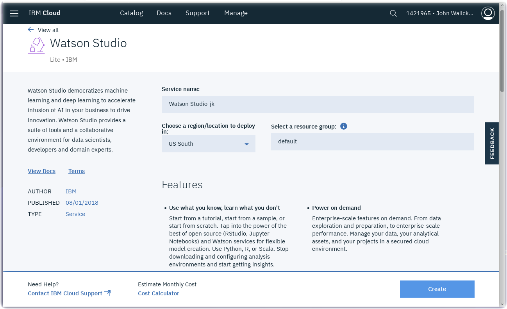
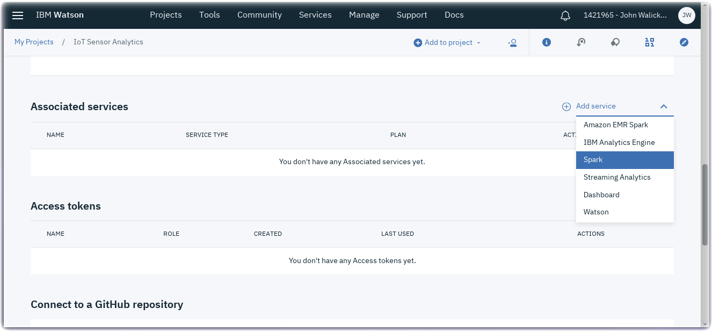

*Quick links :*
[Home](/README.md) - [Part 1](/part1/README.md) - [Part 2](/part2/README.md) - [Part 3](/part3/README.md) - [**Part 4**](/part4/README.md)
***
**Part 4** - [**Watson Studio**](/part4/STUDIO.md) - [Notebooks](/part4/JUPYTER.md)
***

# Watson Studio Set up and Configuration in IBM Cloud

## Lab Objectives

In this lab you will set up Watson Studio with a new Project.  You will learn:

- Watson Studio
- How to set up a new Watson Studio Project
- How to create a Jupyter Notebook

### Introduction
Watson Studio accelerates the machine and deep learning workflows required to infuse AI into your business to drive innovation. It provides a suite of tools for data scientists, application developers and subject matter experts, allowing them to collaboratively connect to data, wrangle that data and use it to build, train and deploy models at scale. Successful AI projects require a combination of algorithms + data + team, and a very powerful compute infrastructure.

- Learn more from the Experts - [Introducing IBM Watson Studio](https://medium.com/ibm-watson/introducing-ibm-watson-studio-e93638f0bb47)

### Step 1 - Watson Studio Setup
#### Create **Cloud Object Storage**
- Create a Cloud Object Storage instance by visiting the [IBM Cloud Catalog](https://console.bluemix.net/catalog/?search=object)
- Search on **Object** in the IBM Cloud Catalog
- Click on the **Object Storage** service tile

- Click on the **Create** button

#### Create a Watson Studio service instance
- Create a **Watson Studio** service instance from the [IBM Cloud Catalog](https://console.bluemix.net/catalog/?search=studio)
- Search on **Studio** in the IBM Cloud Catalog

- Click on the **Watson Studio** service tile

- Click on the **Create** button.
- After the Watson Studio service is created, click on **Get Started** or visit Watson Studio at http://dataplatform.ibm.com

- Login with your IBM Cloud account
- Walk through the introductory tutorial to learn about Watson Studio

### Step 2 - Create a New Project
Projects are your workspace to organize your resources, such as assets like data, collaborators, and analytic tools like notebooks and models
#### Create a New Project
- Click on **New project**
- Select the **Complete** tile and press the **OK** button.

- Give your Project a name : **IoT Sensor Analytics**
- The Cloud Object Storage instance created in Step 1 should be prefilled.
- Press the **Create** button.

#### Add an Apache Spark Service
- We need to add an Apache Spark service to the project.
- Press the **Settings** tab.

- Scroll down to the **Associated services** section and click on the **Add service** dropdown
- Select **Spark** from the dropdown

- In the **Apache Spark** service panel, select the **Lite** plan and press the **Create** button.  Press the **Confirm** button.

- Now an Apache Spark service has been added to your Project.

### Step 3 - Create a Notebook

- From the top menu, select **Tools**, and then **Notebook**
- Select **From URL**
- Give the notebook a name : **IoT Sensor Analytics**
- Select **From URL**
- Import the notebook from this URL
https://raw.githubusercontent.com/binnes/esp8266Workshop/master/part4/notebooks/ESP8266-DHT-IoT-Sensor-Analytics.ipynb
- Scoll down to the **Select runtime** dropdown and choose your **Spark** runtime

- Click on **Create Notebook**

- Before running this notebook, an additional connector notebook needs to be installed.

## Step 4 - Create an Apache Bahir Connector Notebook
This will install the Apache Bahir connector within your Project/Apache Spark service. If you restart the kernel or start a new notebook in the same project you can use Apache Bahir for connecting to the Cloudant/Apache CouchDB service.

- From the top menu, select **Tools**, and then **Notebook**
- Select **From URL**
- Give the notebook a name: **Apache Bahir**
- Import the notebook from this URL
https://raw.githubusercontent.com/romeokienzler/developerWorks/master/coursera/bahir_setup.ipynb
- Scoll down to the **Select runtime** dropdown and choose your **Spark** runtime
- Click on **Create Notebook**
- Once it loads, click on the **> Run** menu button twice.
- Once it reloads, click on the **Kernel** menu and select **Restart & Run All** button.
  

You are now ready to analyze the IoT sensor historical dataset using a Jupyter notebook and Spark.

***
**Part 4** - [**Watson Studio**](/part4/STUDIO.md) - [Notebooks](/part4/JUPYTER.md)
***
*Quick links :*
[Home](/README.md) - [Part 1](/part1/README.md) - [Part 2](/part2/README.md) - [Part 3](/part3/README.md) - [**Part 4**](/part4/README.md)
