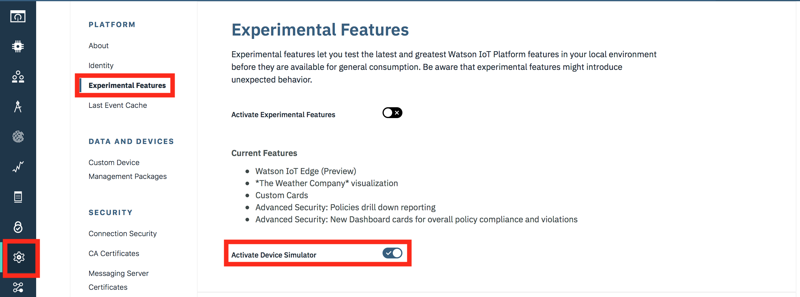
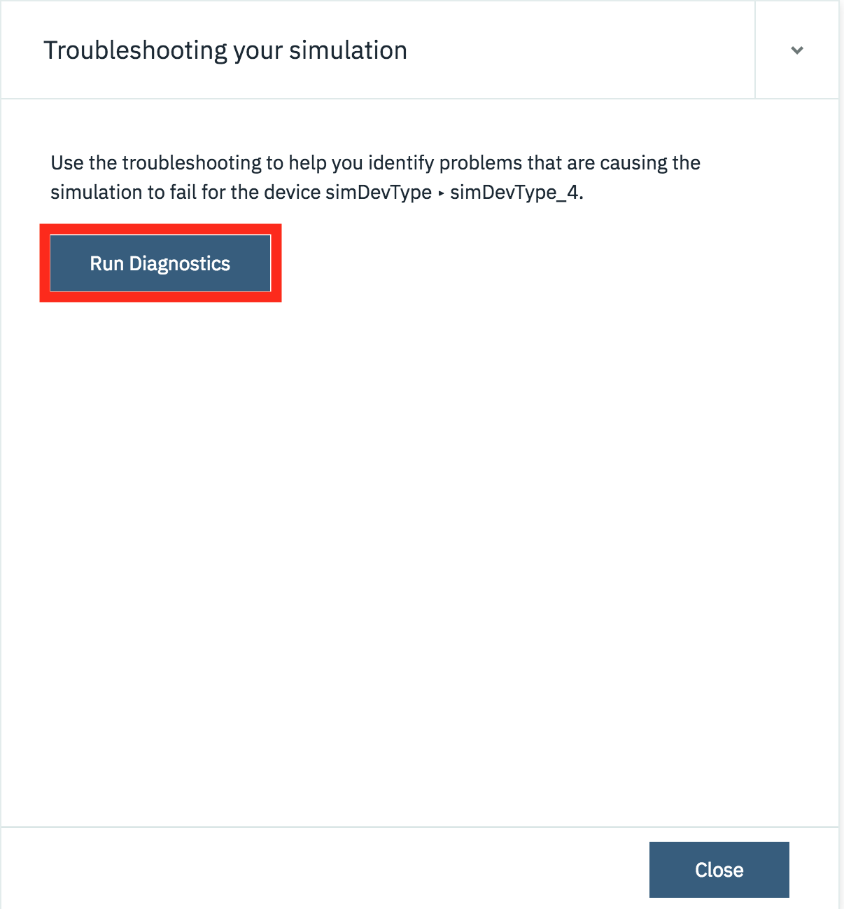

# O Simulador de Dispositivos do Watson IoT Platform

A plataforma IBM Watson para Internet das Coisas contém um simulador de dispositivos que pode ser usado para postar dados sem que um dispositivo real seja conectado. O simulador pode ser usado para criar dados para vários dispositivos e tipos de dispositivos, ele também pode postar dados para um dispositivo real e registrado.

O simulador é útil para testar quando um dispositivo real não está disponível ou para testar condições difíceis de replicar usando um dispositivo real, como condições de falha.

## Objetivos de aprendizado

Depois de concluir este guia, você será capaz de:

- Habilite o simulador de dispositivos em sua instância do Watson IoT Platform
- Crie dispositivos simulados e seja capaz de iniciar e parar os dispositivos
- Gere os dados necessários dos simuladores de dispositivos

## Pré-requisitos

Antes de trabalhar com este guia, você deve ter um conhecimento básico da plataforma Watson Internet of Things e entender a relação entre dispositivos e tipos de dispositivos. Você também precisa ter uma instância do Watson IoT Platform implementada no IBM Cloud.

Você pode descobrir sobre a plataforma Watson IoT [here](https://console.bluemix.net/docs/services/IoT/iotplatform_overview.html#about_iotplatform) e aprenda como implantar uma instância da plataforma seguindo o guia [here](https://developer.ibm.com/code/howtos/create-an-internet-of-things-starter-boilerplate).

## Tempo estimado

Você pode concluir essa tarefa em no máximo 20 minutos.

## Passos

Depois de executar sua instância do Internet of Things, inicie o console do Watson IoT Platform. Para ativar o console, selecione o serviço no painel do IBM Cloud e selecione o botão **Inicie** na página do serviço Watson IoT Platform. Quando o console da IoT estiver aberto, conclua as etapas abaixo:

### 1. Ativar o simulador de dispositivos

Por padrão, o simulador de dispositivos não está habilitado na plataforma. Para habilitá-lo:

1. Alterne para a seção de configurações do console do Watson IoT Platform.
2. Navegue até a área de configurações **Recursos Experimentais**.
3. Ative o simulador de dispositivos.



Você deverá ver o painel do simulador de dispositivos na parte inferior do console da IoT.


Você pode abrir o simulador clicando no painel e feche o simulador usando o twisty na parte superior da janela do simulador


#### 2. Configurando um Simulador de Dispositivo

Criar um simulador é um processo de 2 partes:

1. Crie uma simulação selecionando ou crie um tipo de dispositivo e, em seguida, modele os dados que devem ser lançados quando a simulação estiver em execução.
2. Crie uma ou mais instâncias do simulador de dispositivo para essa simulação.

Para adicionar sua primeira simulação, pressione o botão **Adicionar Primeira Simulação**.


Clique no campo **Selecione ou crie um tipo de dispositivo ...** mostrará todos os tipos de dispositivos existentes. Você pode escolher um dos tipos de dispositivos existentes ou inserir um nome de tipo de dispositivo aqui para criar um novo tipo de dispositivo.


Uma vez que o tipo de dispositivo foi selecionado ou criado, você é apresentado com o painel para configurar os dados para a simulação.


Existem 3 áreas, conforme mostrado na imagem acima:

#### 1. Eventos

O simulador fornece a capacidade de definir vários eventos diferentes que um dispositivo simulado pode publicar. Por exemplo. Se você tiver um dispositivo que envia dados de temperatura a cada 30 segundos e dados de qualidade do ar a cada 10 minutos, é possível configurar dois eventos. 1 para a temperatura e 1 para a qualidade do ar.

Por padrão, um único evento é criado quando uma nova simulação é criada, mas eventos adicionais podem ser criados usando o botão **Novo evento**.

Cada evento tem seu próprio agendamento e conteúdo de carga útil, mas todos os eventos são executados quando a simulação está em execução. Não é possível ativar e desativar eventos individuais. Se você quer essa funcionalidade, então você precisa criar várias simulações.

À medida que você adiciona mais eventos, a lista de eventos aumenta. Você pode expandir e recolher os eventos individuais usando o twisty.


#### 2. Nome do Tipo de Evento

Quando os dados são enviados de um dispositivo para a plataforma, eles são enviados como uma mensagem de evento de dispositivo com um tipo de evento como um dos campos da mensagem. Aqui você pode definir o tipo de evento que será enviado com a carga útil para este evento

#### 3. Período do tipo de Evento

Quando você expande a seção de um evento, pode especificar com que frequência uma mensagem é enviada e qual conteúdo é enviado como carga útil.

A programação permite que você selecione um determinado número de mensagens a serem enviadas a cada minuto ou a cada hora. As mensagens são enviadas em intervalos regulares, portanto, duas mensagens por minuto resultarão em mensagens enviadas a cada 30 segundos.

A seção de carga útil permite que você defina o formato da mensagem que será enviada. Você pode definir uma mensagem estática, em que cada mensagem terá exatamente o mesmo conteúdo:

``` json
{
  "sampleObject": {
    "xcord": 32.514,
    "ycord": 151.521
  }
}
```

ou use uma das duas opções para adicionar variação aos dados enviados

- janela(0,100), irá gerar um número aleatório entre os dois parâmetros
- $counter, será conter o número total de dispositivos adicionados no simulador para este tipo.

``` json
{
  "randomNumber": range(0, 100),
  "total" : $counter,
  "sampleObject": {
    "xcord": 32.514,
    "ycord": 151.521
  }
}
```

Depois de definir todos os eventos, com o agendamento e o conteúdo de dados corretos, pressione **salvar** para salvar a simulação.

### 3. Adicionando Dispositivos Simulados

Depois de definir a simulação, você pode criar dispositivos simulados para a simulação. Um dispositivo pode ser configurado para simular um dispositivo real configurado e existente ou registrar um novo dispositivo na plataforma.


Para adicionar um dispositivo, pressione o botão **Criar dispositivo simulado** ou, se quiser simular um dispositivo existente, pressione o botão **Usar dispositivo registrado** (isso só será ativado se houver um dispositivo registrado disponível do deviceType correto Simular). Uma vez que o dispositivo é adicionado, o dispositivo simulado começará imediatamente a enviar dados de acordo com as configurações da simulação.

Você pode adicionar quantos dispositivos desejar (até o limite exibido)


Você pode controlar a simulação no nível superior usando os controles de tipo de dispositivo ou gerenciar cada dispositivo expandindo o menu do dispositivo.


Aqui você pode iniciar e parar dispositivos individuais, configurar dispositivos individuais ou excluir um dispositivo simulado. Você pode personalizar cada dispositivo para que todos sejam diferentes da configuração de simulação. No entanto, se você modificar a configuração de simulação, poderá optar por redefinir todos os dispositivos de volta para a configuração de simulação.

### 4. Monitoring simulated devices

Você pode ver o estado dos dispositivos simulados da mesma maneira que você pode monitorar dispositivos reais usando a seção de dispositivos do console IoT.


Você pode ver quando um simulador está ativo como ele é mostrado como um dispositivo conectado e, em seguida, expandindo o dispositivo, é possível selecionar a seção ** Eventos recentes ** para ver os eventos individuais que estão sendo recebidos.

## Salvando a configuração de simulação

A plataforma permite exportar sua configuração de simulação para a área de transferência ou baixá-la como um arquivo JSON. Você pode importar uma configuração do simulador da área de transferência ou arquivo. Isso permite que você compartilhe uma configuração do simulador, para que outros possam replicar sua configuração do simulador.


Ao importar uma configuração de dispositivo, o deviceType e os dispositivos não são criados automaticamente, portanto, é necessário criá-los antecipadamente ou usar a opção de solução de problemas para que os dispositivos e os deviceTypes sejam criados:

Para abrir a seção de solução de problemas, clique na seção de informações do evento na parte inferior do painel do simulador:


Esse documento irá mostrar um registro de eventos e oferecer uma solução de problemas de eventos com falha:


Selecione o botão **Solucionar problemas** ao lado de um dos eventos com falha e você terá a opção de diagnosticar o problema. Pressione o botão **Executar Diagnóticos** para obter o simulador para determinar a causa do erro:



O resultado do diagnóstico será mostrado e, se houver dispositivos e dispositivos de dispositivos ausentes, a plataforma oferecerá a criação da configuração ausente:


Você pode repetir isso para todos os dispositivos importados para o simulador.

Para limpar o log de eventos do simulador, você pode entrar no painel de configurações e desabilitar e habilitar o simulador. A configuração não será perdida, mas o simulador será reiniciado, limpando o log de eventos.

## Limitações do simulador de dispositivos

O Simulador ainda é um recurso experimental na IoT Platform, portanto, há algumas limitações.

- TAqui está um limite para o número de dispositivos simulados concorrentes que podem ser executados. Isso é mostrado no topo do painel de simulação
- Você não pode ter várias simulações em execução simultaneamente para o mesmo dispositivo.
- TO simulador não funcionará quando os certificados de usuário forem adicionados à configuração da plataforma IoT. Se você tiver certificados configurados ou mesmo apenas enviados, o simulador não conseguirá se conectar. Se você quiser remover certificados, vá para a seção de configurações do console do Watson IoT Platform e siga as etapas a seguir:
  - Vá para a seção **Conexão Segura** e selecione **Abrir Politica de Segurança de Connectividade**. Certifique-se de que nenhuma regra esteja configurada para usar certificados. **O TLS com Token Authentication** ou **TLS Opcional** deve ser selecionado para todas as regras.
  - Vá para a seção **Certficados de Servidores de Mensagem** das configurações da plataforma e verifique se o certificado padrão está selecionado como o certificado ativo. Você pode selecionar qualquer certificado importado e excluí-los.
  - Vá para a seção **Certificados CA** das configurações da plataforma e exclua todos os certificados importados.

## Resumo

Este guia mostrou como ativar o simulador de dispositivos e configurar simuladores para criar dados do dispositivo. O simulador de dispositivos é uma ótima ferramenta para testar condições de erro ou falha que são difíceis de criar usando dados ao vivo de um dispositivo real.

Lembre-se de desativar os simuladores quando não for necessário para garantir que você não use limites livres no IBM Cloud ou incorra em despesas adicionais se estiver em um plano pago.