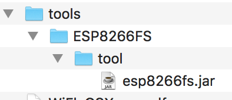

*Links Rápidos :*
[Início](/README.pt.md) - [Parte 1](part1/README.md) - [Parte 2](part2/README.md) - [Parte 3](part3/README.md) - [Parte 4](part4/README.md)
***
**Parte 1** - [Configuração](PREREQ.md) - [Primeira App](FIRSTAPP.md) - [WIFI](WIFI.md) - [LED](LED.md) - [**DHT**](DHT.md) - [Cloud](IOTCLOUD.md)
***

# Instalando o software de pré-requisito e obtendo a configuração da sua conta de nuvem

## Objetivos

Este laboratório garantirá que você tenha todos os recursos e software necessários para concluir o laboratório instalado. Você deve seguir as instruções para o seu sistema operacional e concluir todas as seções da configuração antes de avançar com o laboratório.

## Desenvolvimento ESP8266

Para poder concluir o workshop, você precisa adquirir o hardware necessário e instalar o software necessário em seu laptop ou estação de trabalho. Você também precisa de uma conta ativa do IBM Cloud e de um ambiente Wi-Fi adequado:

### WiFi

O ESP8266 pode se conectar a uma rede de 2,4 GHz com suporte para 802.11 b / g / n. O ESP8266 não funcionará com freqüências de 5GHz (802.11 ac).

Como não há capacidade de iniciar um navegador no ESP8266, não é possível trabalhar com redes WiFi que precisem de um navegador para inserir credenciais, que é um mecanismo usado com frequência em espaços públicos, como hotéis.

O workshop não suporta autenticação avançada, como o uso de LDAP ou certificados para autenticar na rede. Você deve ter uma rede que use um token / senha de acesso, como WPA / WPA2 - isso é o que a maioria dos pontos de acesso WiFi domésticos fornece.

Muitas redes corporativas são difíceis de conectar dispositivos IoT, pois podem ser bem protegidos, muitas vezes exigindo a instalação de certificados.

Se uma rede adequada não estiver disponível, os pontos de acesso do smartphone podem ser usados ​​para fornecer conectividade. O workshop não requer grandes quantidades de dados para o ESP8266, portanto, é adequado para usar um hotspot de telefone.

Não há portas de entrada necessárias para a oficina, mas o ESP8266 precisa ser capaz de se conectar via protocolo MQTT sobre TCP às portas 1883 e 8883. A oficina também precisa de acesso à Web através das portas TCP 80 e 443. A porta final necessária é para Network Time Protocol (NTP), que usa uma conexão UDP de saída na porta 123.

### Adquirindo o hardware necessário

Você precisa adquirir o seguinte hardware para trabalhar na oficina. As instruções da oficina usam o sensor de temperatura e umidade DHT11. Isso pode ser substituído pelo sensor DHT22, que possui a mesma pinagem, mas oferece um sensor mais preciso. DHT11 é preciso dentro de 2C, enquanto o DHT22 é preciso dentro de 0,5C.

- ESP8266, (procure  por **NodeMCU ESP8266 v3** ou **v2**)
- NeoPixel RGB LED (ou qualquer outro LED RGB / RGBW de cadeia baseado em chips ws2812b ou sk6812), como [este da Adafruit](https://www.adafruit.com/product/1734) (Procure por **Neopixel 8mm or 5mm** - muitas vezes vendido em embalagens de 5)
- Sensor de Temperatura / Umidade DHT11 (procure por **DHT11 ou DHT22**)
- 6 x fios de jumper fêmea para fêmea (procure por **dupont cable f2f or f-f** - geralmente vendido em embalagens de 40 cabos)
- Cabo MicroUSB (certifique-se de que é um cabo de dados, não apenas um cabo de alimentação)

## Instalando o software requerido

As instruções a seguir foram testadas em relação ao Linux (Ubuntu 18.04LTS e Fedora 27), MacOS (High Sierra) e Windows 10. Se você estiver usando um sistema operacional diferente, talvez seja necessário adaptar as instruções para corresponder ao sistema operacional instalado.

Você pode precisar de acesso de administrador à sua estação de trabalho para poder instalar o software e os drivers.

### Passo 1 - Instale os drivers necessários

Você pode precisar de um driver para que seu sistema operacional possa se comunicar com o chip USB para serial CH340G usado nos módulos ESP8266. Não faça o plugin do dispositivo até ter instalado o driver no Windows e Mac. Os drivers podem ser baixados de:

- [MacOS](http://www.wch.cn/download/CH341SER_MAC_ZIP.html)
- [**Win/Linux**](https://github.com/nodemcu/nodemcu-devkit/tree/master/Drivers)

Selecione o apropriado para o seu sistema operacional, baixe-o, descompacte-o e instale-o.

- *Note* : O Linux não deve precisar de um driver instalado, como já deveria estar instalado.
- *Note* : Se você tem seu próprio módulo ESP8266, então ele não pode usar o chip CH340G USB para serial. Outro chip muito popular é o CP2102, e os drivers para este chip podem ser encontrados [**aqui**](https://www.silabs.com/products/development-tools/software/usb-to-uart-bridge-vcp-drivers)

Quando o driver está instalado e o módulo NodeMCU está conectado, você pode testar se o driver está funcionando:

- Linux : Yvocê verá um dispositivo aparecer no comando `ls /dev/ttyUSB*`
- MacOS : Você verá um dispositivo adicional aparecer na saída do comando `ls /dev/tty.*`
- Windows : Você verá uma porta COM adicional na seção Portas do Gerenciador de Dispositivos.

### Etapa 2 - Instale o Arduino IDE

O workshop usará o Arduino IDE para criar aplicativos para o módulo ESP8266. Você precisa ter uma versão atualizada do IDE do Arduino, disponível [**aqui**](https://www.arduino.cc/en/Main/Software).  Selecione a versão para o seu sistema operacional, faça o download e instale-o:

- Linux : desarquivá-lo e, em seguida, executar `./install.sh` na pasta em que o download foi desarquivado. (pode precisar executar duas vezes se receber erros). Talvez seja necessário adicionar seu usuário aos grupos tty e dialout para poder usar a conexão com o dispositivo. Você pode fazer isso usando o comando `sudo usermod -a -G tty,dialout $USER`você terá que sair e fazer login novamente para obter as permissões adicionadas
- MacOS : basta arrastar o aplicativo Arduino para a pasta Aplicativos depois de descompactar)
- Windows : executar o aplicativo instalador baixado

### Etapa 3 - Instale o Plugin ESP8266 para o Arduino IDE

Fora da caixa, o Arduino IDE não suporta o desenvolvimento do ESP8266. Você precisa adicionar um plugin para adicionar suporte. Inicie o Arduino IDE e abra o painel de preferências do Arduino IDE:

- Linux : *Arquivo* -> *Preferências*
- MacOS : *Arduino* -> *Preferências*
- Windows : *Arquivo* -> *Preferências*

Cole o URL do plugin ESP no campo *URLs adicionais de gerenciadores de Placa*: `http://arduino.esp8266.com/stable/package_esp8266com_index.json`

Selecione OK para fechar o diálogo de preferências.

Select *Tools* -> *Board:* -> *Board Manager...* no menu, digite ESP na caixa de pesquisa. Isso deve revelar um item **esp8266 by ESP8266 community**. Clique dentro da caixa esp8266 e pressione Instalar para instalar o plugin mais recente. Uma vez instalado feche o gerenciador da placa.

### Etapa 4 - Instale a ferramenta de upload do sistema de arquivos para ESP8266

O ESP8266 possui memória flash que pode conter um sistema de arquivos. Existe um plugin para o Arduino que permite gerar um sistema de arquivos preenchido e carregá-lo na placa ESP8266. O plugin pode ser baixado [**aqui**](https://github.com/esp8266/arduino-esp8266fs-plugin/releases).  Você precisa criar um diretório de ferramentas dentro do diretório de esboço e extrair o conteúdo lá.



 (* Nota: você pode encontrar o local do diretório de esboço no painel de preferências do Arduino IDE *). A localização padrão do diretório de esboço é:

- Linux - **/home/< user name >/Arduino/tools/ESP8266FS**
- MacOS - **/Users/< user name >/Documents/Arduino/tools/ESP8266FS**
- Windows - **C:\Users\< user name >\Documents\Arduino\tools\ESP8266FS**

#### Etapa 5 - Utilitário SSL para Trabalhar com Certificados

Durante o workshop, você estará gerando seus próprios certificados autoassinados, portanto, é necessário ter o conjunto de ferramentas OpenSSL instalado. Siga as instruções para o seu sistema operacional abaixo:

- Linux : openssl é instalado como parte do sistema operacional para a maioria das distros, então não deve ter nada para fazer aqui. Se não estiver instalado, a maioria das distros tem um pacote openssl que pode ser instalado usando a ferramenta instalador de pacotes distro.

- MacOS : openssl é instalado como parte do sistema operacional, então nada para fazer aqui.

- Windows : TAqui estão 2 opções para instalar o OpenSSL no Windows. Você pode instalar uma distribuição binária para executar no Windows ou pode ativar o Windows Subsystem para Linux, que fornece um ambiente Linux no Windows:
  - **Windows Binario**: O site oficial do openssl fornece apenas fontes. Você pode optar por criar os binários a partir do código-fonte, mas há links para sites que hospedam binários pré-construídos, como [este site](https://slproweb.com/products/Win32OpenSSL.html) para 32 e 64 bits do Windows. Você deseja selecionar a versão 1.1x. Você só precisa de versão light para este workshop, mas você pode escolher a versão completa se quiser recursos adicionais para o desenvolvedor. Ao instalar, as opções de instalação padrão são OK.  A instalação padrão **NÃO**  adiciona o executável openssl ao PATH do sistema, portanto, você precisará especificar o caminho completo do binário ao inserir comandos, a menos que você o adicione ao PATH, por exemplo,`c:\OpenSSL-Win64\bin\openssl.exe`.  Note que este método não fornecerá o binário xxd, mas você não precisa dele para este workshop.
  - **Windows Subsystem para Linux**:  Esta opção instala uma distribuição do Linux dentro do Windows, para que você tenha acesso a todos os utilitários do Linux e possa instalar pacotes adicionais, como o openssl. Para ativar o Linux Services for Windows, siga as instruções [aqui](https://docs.microsoft.com/en-us/windows/wsl/install-win10).  Selecione Debian como a distribuição do Linux, então quando ele for instalado, execute o Debian e então execute os seguintes comandos no prompt de comando do Linux:

    ```bash
    sudo apt-get update ; sudo apt-get upgrade
    sudo apt-get install openssl
    ```

## Certifique-se de ter uma conta do IBM Cloud em funcionamento

O workshop usará serviços hospedados no IBM Cloud, portanto, você precisa garantir que tenha uma conta ativa. Se não, você pode se inscrever gratuitamente, sem precisar inserir nenhum cartão de crédito, seguindo [**este**](https://bluemix.net) link.  O workshop pode ser concluído usando a conta gratuita e gratuita.


***
**Parte 1** - [Configuração](PREREQ.md) - [Primeira App](FIRSTAPP.md) - [WIFI](WIFI.md) - [LED](LED.md) - [**DHT**](DHT.md) - [Cloud](IOTCLOUD.md)
***
*Links Rápidos :*
[Início](/README.pt.md) - [Parte 1](part1/README.md) - [Parte 2](part2/README.md) - [Parte 3](part3/README.md) - [Parte 4](part4/README.md)
